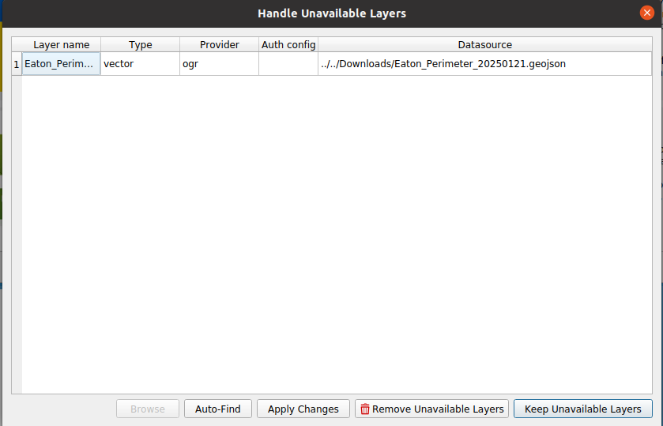

## Introduction
In this lab you will learn some important skills for working with computers that will be helpful in this class and for many others.  We will practice organizing data on a computer and extracting zipped archives.

In this lab you will also be introduced to using the terminal. Having some familiarity with using terminals to interact with computers is useful because it forces you to understand some basic aspects of computer organization, and if you continue after this class to pursue a career in GIS or any other computer intensive field, it is incredibly useful.  If you learn how to use the terminal well you will probably use it frequently.

That said, you will not have to be great at it for this class.  It will only be used for a couple of basic things, most importantly showing me how you are organizing your data.

For this lab you should create a text document (e.g. Word, LibreOffice, or Google docs, etc...) and add the Scrrenshot from Task 1 and answers from Task 2 (in steps 8, and 9),  on Canvas. You do not have to turn in anything for Task 2, but you will need to have your OneDrive configured properly for the rest of the quarter, so don't skip it!

## Task 1: Terminal Tutorial

Complete part 2, _Navigating Directories_, in [Terminal Tutor](https://www.terminaltutor.com/). Feel free to do the first part too if you want, it is worthwhile. Take a screenshot when you are done, include the screenshot in the document.

This introduces you to POSIX shells. If you are using Mac or Linux, your terminal will behave like the one in the tutorial, if you are on a Windows computer you can use use PowerShell, which in many ways behaves like a POSIX shell.  

For more useful commands see [the slides on using the terminal](terminal_cheatsheet.qmd#/table-of-some-basic-commands)

## Task 2: Exploring a Directory Structure and unzipping files

1. Download the toy data [here](https://github.com/kulpojke/nr218/blob/7a807fa1e06e8f338fc3b97b3277dcde6d02dbc7/assets/toy_data.zip) (Open the linkin a new tab and click the _Download raw file_ button on the right side). For now, save it in your Downloads folder. While it is possible to work with data that is in your Download directory, it is a bad habit, and will likely lead to mayhem and frustration.  For now, we will do just that, so unzip `toy_data.zip` right into the download folder (see @tip-zip for how to do this.).  

::: {#tip-zip .callout-tip}
## How do I unzip a zip archive? What is a zip archive?
__To unzip:__  

- Windows (GUI): In File Explorer, find the `.zip`, right-click → “Extract All…,” choose your desired destination folder, click Extract.
- macOS (GUI): In Finder, double-click the `.zip` to expand it, then drag/move the extracted folder into your destination folder.
- Linux (terminal): `cd ~/Downloads` (or wherever it landed), then run `unzip SPR_data.zip -d <destination directory>` (replace `<destination directory>` with your actual destination directory. Install unzip if missing: `sudo apt install unzip`).

__What is a zip file?__
A zip file is a compressed archive.  Zipping a folder full of sub-directories and files compresses the data (makes it take up less memory) while preserving the directory structure.  When you unzip, or extract the data you get back an uncompressed copy.  Zipped files are smaller, so they are good for transferring data, or long term storage when the data is not in use.  __Do not work directly with files compressed in a zip!__ .While QGIS and other applications _can_ read files from inside of a zip, it is a bad idea to do so.  There are many processing tools that cannot work with the compressed file.  Often you will get part of the way through a workflow and try some step of your analysis, only to get an error about unsupported file types.
:::

2. Create a directory, `nr218`, for your work in this class, in your home folder. Then create another directory inside called `lab_1`. You can do this either in your computers graphical file explorer (e.g. Finder, File Explorer, Files) or in the terminal (Encouraged!).

+ If you are not sure where your home folder is see @tip-home.
+ If you want to use the terminal to create `nr218` in your home directory but don't know how, see [this slide](terminal_cheatsheet.qmd#/table-of-some-basic-commands) and the slide after it for tips, also remember what you learned in the terminal tutorial in Task 1.  
+ If you are using a Mac, and you cannot see your home folder in Finder, see [this slide](tips_for_mac_users.qmd#making-your-home-directory-visible-in-finder)

::: {#tip-home .callout-tip}
## Where is my home folder?

- Windows: `C:\Users\<username>` (shows as “This PC > Windows (C:) > Users > <username>` in File Explorer).
- macOS: `/Users/<username>`; Finder shows it with a house icon under Go → Home.
- Linux: `/home/<username>` (or occasionally `/Users/<username>`); in a terminal it can also be called `~`, and file managers usually label it “Home.”
:::

3. Open QGIS and start a blank project.
  + Press `Ctrl+S`. This opens a dialogue for saving the QGIS project.  Navigate to the `nr218` directory you just created.  Name the project after you CalPoly email address (e.g. `mthuggin`. Note that this would be a terrible thing to actually name a project).  You have now saved a file containing the project.
  + Press `Ctrl+Shift+V`, this is the keyboard shortcut to open a vector file (Do not worry if you do not yet know what I mean by vector file). Navigate to `~/Downloads/toy_data/WellNamedFiles` and select `Eaton_Perimeter_20250121.geojson`. You should now see a polygon in the map (something like @fig-eaton)

  {#fig-eaton fig-alt="Image showing the eaton fire perimeter polygon within QGIS" fig-cap="You should se something like this after opening `Eaton_Perimeter_20250121.geojson. It is a polygon showing the Eaton Fire perimeter"}
  
4. Now Close the project (_Project -> Close_ in drop down menus).
5. Move the `toy_data` folder from your Downloads folder to `~/nr218/lab_1` (in file explorer, or terminal (again, see [this slide](terminal_cheatsheet.qmd#/table-of-some-basic-commands))  
6. Open the project you saved back in step 3 (_Project -> Open Recent_ in drop down menus).
  + Now QGIS cannot find the Eaton Fire perimeter data because the _relative path_ to the data has changed (see @tip-paths). A dialogue such as the one shown in @fig-unavailable will appear. Don't worry about trying to fix the problem yet.

{#fig-unavailable fig-alt="Image showing the handle unavailable data dialogue window in QGIS" fig-cap="When the relative path to data changes (or the data is deleted) QGIS cannot find it."}

7. Open a shell (macOS/Linux: Terminal; Windows: PowerShell) and navigate into the directory with the files, `cd ~/nr218`.
8. View the contents of the directory:
  - In the terminal (while in `~/nr218`) type `tree`. (on Windows, in PowerShell, `tree` omits files by default, so use `tree /F` where the F flag tells it to include files.)  If the command `tree` is not found, you will need to install it.
    - Mac OSX - see [this slide](tips_for_mac_users.qmd#installing-tree-command)
    - Linux - use `sudo apt install tree` (or your appropriate package manager). 
    - Windows PowerShell: `tree` should be present.  If it is not, or you just love typing you can use `Get-ChildItem -Recurse` instead.
  - In your text document answer the following questions.
    - 1) Copy the output of `tree` and paste it here as the answer to 1..
    - 2) Based on the contents of the directory, what do you think are some best practices for naming files?
    - 3) Why do you think working on files that are in your download folder is a bad idea?

You will use `tree` and `pwd` throughout the quarter to show me how you are organizing your data.  In order to do this you will also need to know how to navigate into your working directory (see @tip-paths).  

::: {#tip-paths .callout-tip}
## What is a Path?

A [___path___]{style="font-size:1.3em"} is a string that uniquely identifies an item in a file system. Generally, a path is composed of directory names, and optionally a filename, all separated by delimiters. 

QGIS, and other applications keep track of where data using _relative paths_, as opposed to _absolute paths_. An absolute (or full path) is the path to the file relative to the root directory, for example, on my laptop the directory for this class has an absolute path `/home/michael/CP/nr218`, where the root directory is just `/`. The directory called _home_ is directly below `/` in the hierarchy, thus the full path to home is `/home` (or `/home/`, a directory can be written with a trailing slash). Similarly the full path to the directory _michael_  is `/home/michael` (or `/home/michael/`, or using its alias `~`, see @tip-home).

A relative path is the position of a file relative to the position of the file that is looking for it.  For the QGIS project file in your `nr218` directory, the relative path to the `Eaton_Perimeter_20250121.geojson` _was_ `../Downloads/toy_data/WellNamedFiles/Eaton_Perimeter_20250121.geojson` (`../` means _parent directory_ or _up one level_).  When you moved it, the relative path changed to `WellNamedFiles/Eaton_Perimeter_20250121.geojson` (or `./WellNamedFiles/Eaton_Perimeter_20250121.geojson`, where `.` means the present directory).  When you re-opened the project after moving the data, QGIS read the project file which told it, "Load the Eaton perimeter file found at `../Downloads/toy_data/WellNamedFiles/Eaton_Perimeter_20250121.geojson`." QGIS looked at that relative location, and the file was missing, so it complained to you with the dialogue box.  __In order for an application to use a file, it must know the path to that file.__

In a (bash-like) terminal you can change directories using the `cd` command to navigate to a directory by giving ita path. You can use and absolute path, e.g. `cd  /home/michael/CP/nr218` or  equivalently `cd ~/CP/nr218`. Or you can use a relative path, `cd ../` to go to the parent directory, `cd ../../` to go up two levels in the directory hierarchy.  If you are in  `/home/michael`,  `cd CP/nr218` would do the same thing as `cd  /home/michael/CP/nr218`.
:::

## Task 3: Set Up OneDrive Sync (Cal Poly Account)

For this class you may want to use the OneDrive client (or rclone) for your platform to sync your Cal Poly OneDrive and move data between computers.

I do not recommend storing your nr218 directory in OneDrive. Editing GIS data directly from OneDrive can cause problems because QGIS data files often consist of several linked files, and cloud syncing may update or lock them at different times leading to broken layers, file corruption, or conflicts if QGIS is writing changes while OneDrive is still syncing.

Short directions for setting up OneDrive are given here, if you are having trouble refer to the [guide](https://calpoly.atlassian.net/wiki/spaces/CPKB/pages/732921936/Access+OneDrive+and+SharePoint+from+my+Computer).

### Windows (OneDrive client)

- Open OneDrive from the Start menu and sign in with your Cal Poly email; complete campus SSO/MFA.
- Choose a local folder location (default is fine) and finish setup.
- Confirm the OneDrive folder appears in File Explorer and shows sync status icons.
- Right-click a class folder → “Always keep on this device” to make sure it is offline-ready.

### macOS (OneDrive client)

- Install OneDrive from the Mac App Store (or Microsoft download if allowed).
- Launch, sign in with your Cal Poly email, and complete campus SSO/MFA.
- Pick the local sync folder location and finish setup.
- In Finder, confirm the OneDrive folder exists and shows status icons; choose “Always Keep on This Device” for the class folder.

### Linux (rclone)

- Install rclone (e.g., `sudo apt install rclone`).
- Run `rclone config` → `n` for new remote → name it (e.g., `calpoly-onedrive`) → storage type `onedrive`.
- Use the browser flow to sign in with your Cal Poly email and complete SSO/MFA when prompted.
- Create a local sync folder (e.g., `mkdir ~/CalPolyOneDrive`).
- One-time sync: `rclone sync calpoly-onedrive: ~/CalPolyOneDrive`.
- Optional mount for live access (requires FUSE): `rclone mount calpoly-onedrive: ~/CalPolyOneDrive --vfs-cache-mode writes &` (keep terminal open).
- Note any errors and how you resolved them (e.g., MFA prompts, permission issues).
- Alternately figure install this [OneDrive Client](https://github.com/abraunegg/onedrive/blob/master/readme.md), and tell me if it works out for you (I have not tried it).

You may have to ask the IT department to approve rclone to attach to your OneDrive (and wait for them to do so), if this is the case it will prompt you to do so. If you are having problems consult the [rclone documentation](https://github.com/rclone/rclone).
