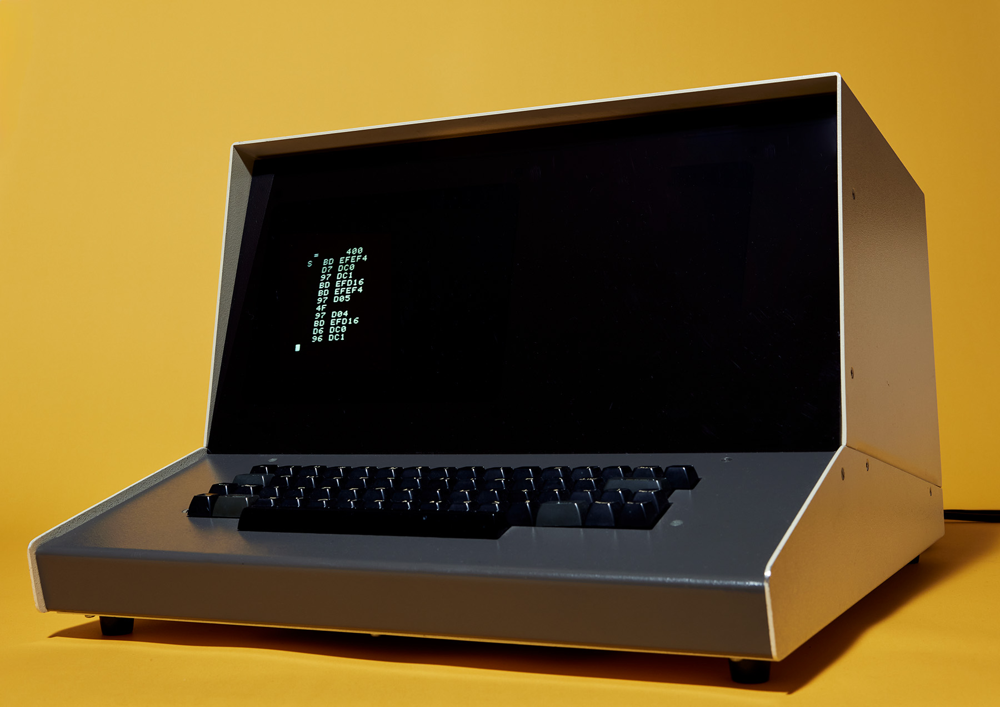
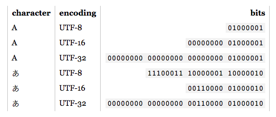
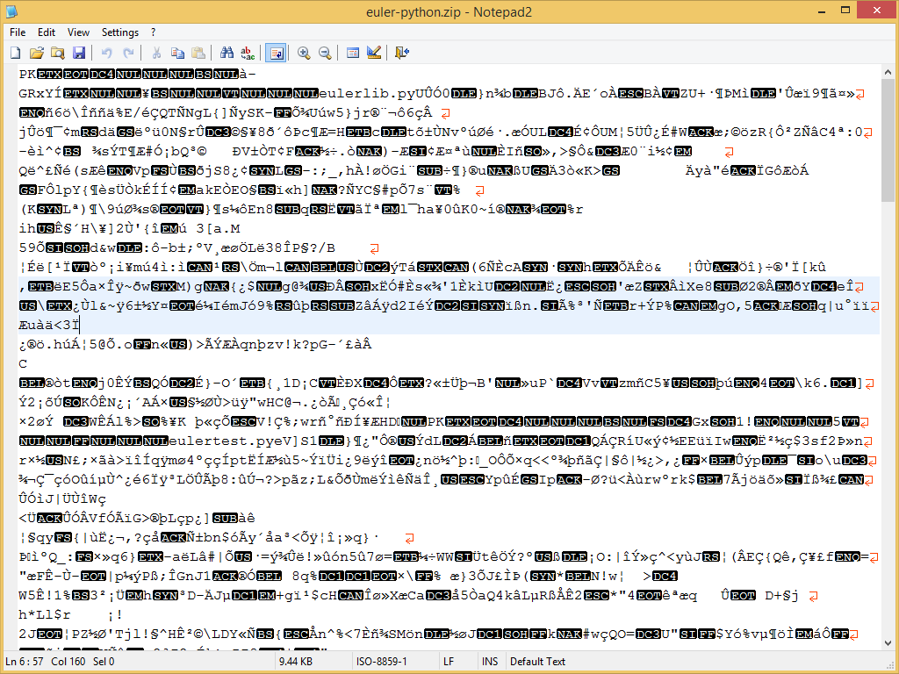
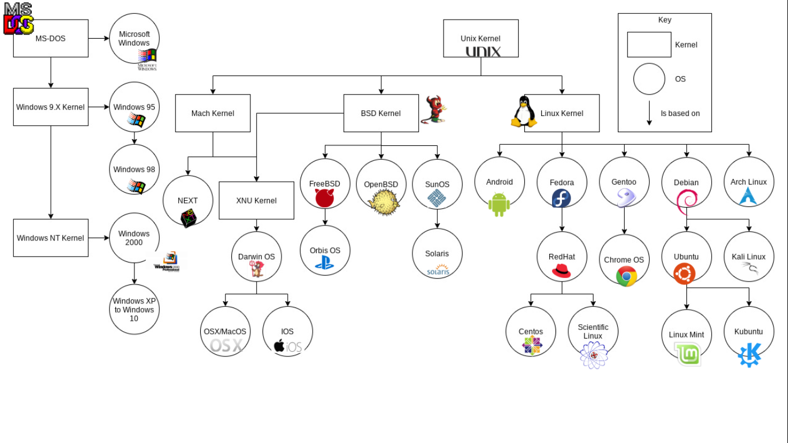
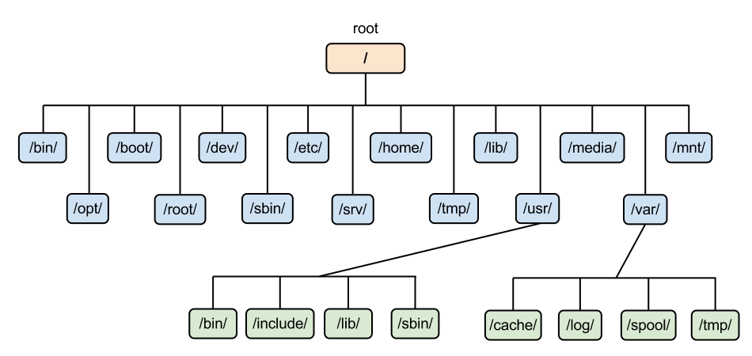
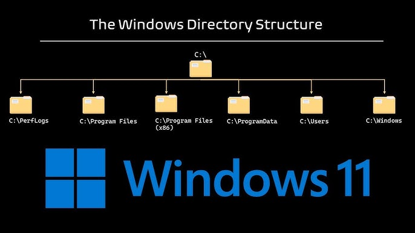
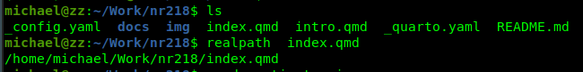
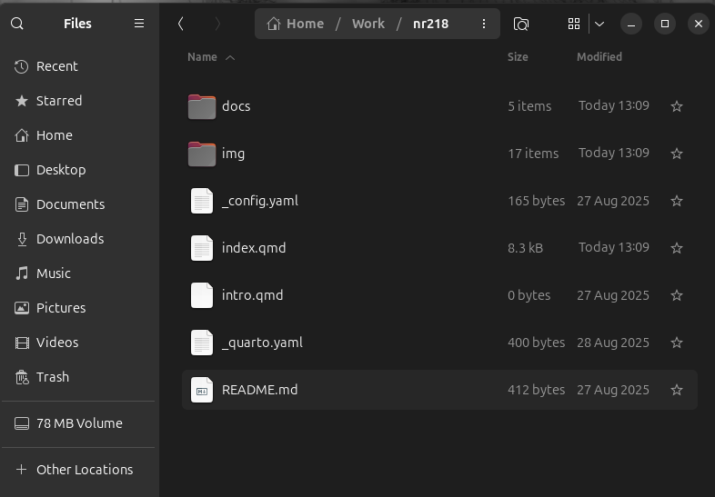

# Computers

## What is a computer {style="font-size:0.8em"}


::: {.columns}
::: {.column width="50%"}

::: { .r-stack style="width:100%; position: relative;"}

::: {.fragment .absolute data-fragment-index="1" style="left:0; right:0; width:100%; max-width:100%; box-sizing:border-box;"}
A machine that manipulates data following a list of programmed instructions
:::

:::


:::

::: {.column width="50%"}

::: { .r-stack style="width:100%; position: relative;"}

::: {.fragment .absolute  data-fragment-index="1" style="left:0; right:0; width:100%; max-width:100%; box-sizing:border-box;"}
{fig-alt="Image of an old but cool looking computer" fig-cap=""}

::: {.attribution style="font-size:0.4em"} 

Image Source: [Wikimedia commons](https://commons.wikimedia.org/wiki/File:Sphere_300_Computer.jpg) 
:::

:::

:::

:::
:::

## Data {style="font-size:0.7"}

::: {.r-stack}

::: {.fragment .absolute .fade-out data-fragment-index="1" style="left:0; right:0; width:100%; max-width:100%;box-sizing:border-box; font-size:0.7"}

+ "Related items of (chiefly numerical) information considered collectively, typically obtained by scientific work and used for reference, analysis, or calculation."
+ "Quantities, characters, or symbols on which operations are performed by a computer, considered collectively. Also (in non-technical contexts): information in digital form."
-OED  
:::

::: {.fragment .absolute .fade-in-fade-out data-fragment-index="1" style="left:0; right:0; width:100%; max-width:100%;box-sizing:border-box; font-size:0.7"}

::: {.columns}

::: {.column style="font-size:0.7em"}

+ Data is stored on a computer as zeros and ones .  
+ Data is stored at some physical location on the disk, and a pointer is saved which is later used to find the file.
+ The details of this are managed for you by applications or programming languages by representing this relationship as a path. 


:::

::: {.column}

{fig-alt="Schematic showing pointer to a file or memory address" fig-cap="" style="font-size:0.7em; "}

::: {.attribution style="font-size:0.4em"}

Image Source: [Wikimedia /Sven](https://commons.wikimedia.org/w/index.php?curid=8861432)

:::

:::

:::


:::

:::

## Data Storage{style="font-size: 0.5em"}
+ We store data in computer-readable format in files
  + Sometimes files store data as text (often called human readable files) 
  + Other times data is stored in a way only a program will understand (binary file)
  + Even the human readable files are ultimately stored as 1s and 0s ([more on that](https://www.totalphase.com/blog/2023/05/binary-ascii-relationship-differences-embedded-applications/?srsltid=AfmBOooKE_ehcrFst_V6Q5XtDbOnStzYrjjO0zrwIsDwYYa4M40rhBqW))


::: {r-stack}
::: {.fragment .absolute .fade-in-then-out}

:::

::: {.fragment .absolute .fade-in-then-out}
{style="height: 420px; width: auto;"}
:::

:::


##

{fig-alt="Schematic showing pointer to a file or memory address" fig-cap=""}

## File Paths and Directories

:::{r-stack}
:::{.fragment .fade-out data-fragment-index="1" style="position: absolute;"}

:::

:::{.fragment .fade-in-then-out data-fragment-index="1" style="position: absolute;"}

:::

:::{.fragment .fade-in data-fragment-index="2" style="position: absolute;"}

{width=600}
:::

:::{.fragment .fade-in data-fragment-index="3" style="position: absolute; top: 165px; left: 0; width: 325px; height: 20px; border: 2px solid red; background: rgba(255,0,0,0.2); pointer-events: none;"}
:::

:::

## File Extensions {style="font-size: 0.5em"}

_File extensions_ denote files readable by certain programs, for example:

| Extension | description       |
|------------------|------------|
| filename.txt     | text file |
| filename.doc     | Microsoft Word file |
| filename.pdf     | portable document file |
| filename.html    | hypertext markup language |
| filename.xml     | extensible markup language |
| filename.tif     | tagged image format |
| filename.json    | javascript object notation |
| filename.geojson | geographic json |
| filename.laz     | LASer zip |
| filename.parquet | compressed table |


## QGIS file extensions {style="font-size: 0.5em"}
+ Computer programs only read certain file formats.
+ Familiarity with different file types is helpful.
+ QGIS has several of its own file types
  - Project files: .qgz, .qgs
  - Styling/symbology: .qml
  - Layout templates: .qpt
  - Layer definitions: .qlr
  - Project companion database: .qgd

+ Common GIS data file types: .shp (along with its _sidecar files_ .prj, .shx, .dbf, etc), .kml, .tiff, .gpkg,
.json, .geojson, .txt, .hdf, .nc, .parquet and a few others

## Annoying File Explorer Defaults {style="font-size:0.7em"}

By Default Windows File Explorer hides file extensions. To fix this,

1. Open File Explorer
2. Click _View_ > _Show_ > _File name extenions_

On Mac, Finder, by default, does not make it easy to find your home folder see [this slide](tips_for_mac_users.qmd#making-your-home-directory-visible-in-finder).

## Terminals and Shells {style="font-size:0.7em"}

- **Linux**: terminals use; `/bin/bash`, `/bin/zsh`, or others under POSIX conventions.
- **macOS**: ships with Terminal.app and zsh by default; still Unix-like, so scripts often mirror Linux.
- **Windows**: historically lacked a POSIX shell; now offers multiple terminal hosts (Command Prompt, PowerShell, Windows Terminal) with different shells.

[POSIX - Portable Operating System Interface is a family of standards specified by the IEEE Computer Society for maintaining compatibility between operating systems
]{style="font-size:0.5em"}

## The Windows Terminal Dumpsterfire {style="font-size:0.7em"}

- **Command Prompt (`cmd.exe`)**: legacy DOS-style environment with limited scripting features.
- **PowerShell**: _Kind_ of acts like bash or zsh.
- **Git Bash / MSYS2**: provides GNU functionality inside Windows; paths need translation.
- **Environment-specific shells**: `Anaconda Prompt`, `Anaconda Powershell`, `OSGeo4W Shell`, etc., inject toolchains and custom env vars; each behaves slightly differently.

## Command Prompt (`cmd.exe`) is haggard {style="font-size:0.7em"}

::: {style="font-size:0.9em"}
- Command language rooted in DOS; minimal quoting, no pipelines beyond simple `|`.
- Lacks native concepts like environment exports.
- Encoding quirks (Code Page 437 vs UTF-8) cause unexpected character issues.
- File globbing and path separators differ (`\` vs `/`), breaking cross-platform scripts.
:::

## PowerShell vs Bash {style="font-size:0.7em"}
__In Many cases PowerShell behaves similarly to Bash__

- paths can be written using `/` as separator
- home directory can be reached using `~`

__but not always__ 

- PowerShell is object-oriented: pipelines pass .NET objects, not plain strings.
- Bash pipelines stream text; tools like `cat`, `grep`, `awk` compose seamlessly.
&nbsp;
    - Example (Bash):
```bash
cat access.log | grep "GET /api" | wc -l
```
    - PowerShell equivalent:
```powershell
Get-Content access.log | Select-String "GET /api" | Measure-Object | Select-Object -ExpandProperty Count
```


## Differences in `tree` command across platforms {style="font-size:0.7em"}

:::{r-stack}
:::{.fragment .fade-out data-fragment-index="1" style="position: absolute;"}
On Unix like systems, like Mac OSX and Linux, by default `tree` shows files.

```
.
├── PoorlyNamedFiles
│   ├── basin.geojson
│   ├── do not put spaces in filenames.geojson
│   ├── Junk
│   │   └── toadstools
│   └── xp23_99.csv
├── README.md
└── WellNamedFiles
    ├── cal_median_household.csv
    ├── Eaton_Perimeter_20250121.geojson
    └── san_simeon_creek_basin_4326.geojson

```
:::

:::{.fragment  .fade-in data-fragment-index="1" style="position: absolute;"}

In PowerShell, files are omitted by default

```
.
├── PoorlyNamedFiles
│   └── Junk
└── WellNamedFiles
```

In order to show files in PowerShell use the F flag, `tree /F`

```
├── PoorlyNamedFiles
│   ├── basin.geojson
│   ├── do not put spaces in filenames.geojson
│   ├── Junk
│   │   └── toadstools
│   └── xp23_99.csv
├── README.md
└── WellNamedFiles
    ├── cal_median_household.csv
    ├── Eaton_Perimeter_20250121.geojson
    └── san_simeon_creek_basin_4326.geojson
```

:::  

:::

## Zipped Files {style="font-size:0.5em"}


__What is a zip file?__
A zip file is a compressed archive.  Zipping a folder full of sub-directories and files compresses the data (makes it take up less memory) while preserving the directory structure.  When you unzip, or extract the data you get back an uncompressed copy.  Zipped files are smaller, so they are good for transferring data, or long term storage when the data is not in use.  

__Do not work directly with files compressed in a zip!__ .While QGIS and other applications _can_ read files from inside of a zip, it is a bad idea to do so.  There are many processing tools that cannot work with the compressed file.  Often you will get part of the way through a workflow and try some step of your analysis, only to get an error about unsupported file types.

__To unzip:__  

- Windows (GUI): In File Explorer, find the `.zip`, right-click → “Extract All…,” choose your desired destination folder, click Extract.
- macOS (GUI): In Finder, double-click the `.zip` to expand it, then drag/move the extracted folder into your destination folder.
- Linux (terminal): `cd ~/Downloads` (or wherever it landed), then run `unzip SPR_data.zip -d <destination directory>` (replace `<destination directory>` with your actual destination directory. Install unzip if missing: `sudo apt install unzip`).
