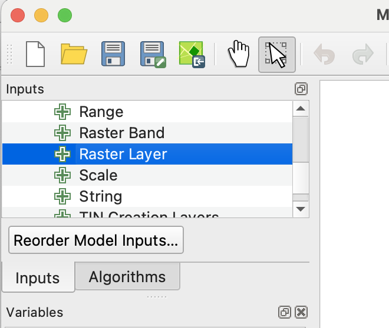
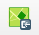
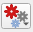
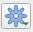

# Gran Chaco Land-Use Change Detection

## Goal

Detect land-use change and deforestation in the Gran Chaco using dry-season satellite image composites.

## Study Area

- Use the [Gran Chaco AOI GeoJSON](assets/gran_chaco_aoi.geojson) as the area of interest.
- The AOI covers dry forest and agricultural clearing near the Cerro Chovoreca frontier in northern Alto Paraguay.
- Dry-season imagery composites are used to avoid cloud cover and reduce seasonal differences.

## Data 

You are being provided with data for an area in Paraguay's [Gran Chaco region](https://en.wikipedia.org/wiki/Gran_Chaco). The AOI includes dry forest and more recent agricultural clearing near the Cerro Chovoreca frontier. The dataset includes annual dry-season median composites made from June-August imagery.

Sentinel-2 and Landsat 5, 7, 8 and/or 9 images were searched from June through August for the years 2000-2025 using Google Earth Engine. Images were filtered by date, area of interest, and sun angle; Sentinel-2 images were also filtered by scene-level cloudiness. Cloud and cloud-shadow masking and surface reflectance scaling functions were then mapped over the image collections. Finally, the images for each year were reduced to annual dry-season median composite images. If you would like to see how this was done, see [this notebook](assets/sentinel_gran_chaco.html).

The bands of the exported imagery are given in @tbl-exported-bands.

| Exported TIF band | Common name | Sentinel-2 band | Landsat 5/7 band | Landsat 8/9 band |
| --- | --- | --- | --- | --- |
| 1 | Blue | B2 | SR_B1 | SR_B2 |
| 2 | Green | B3 | SR_B2 | SR_B3 |
| 3 | Red | B4 | SR_B3 | SR_B4 |
| 4 | Near infrared | B8 | SR_B4 | SR_B5 |
| 5 | Shortwave infrared 1 | B11 | SR_B5 | SR_B6 |
| 6 | Shortwave infrared 2 | B12 | SR_B7 | SR_B7 |

: Exported image band order and source sensor bands. {#tbl-exported-bands}


## Change Detection Workflow

1. Choose comparison years.
   - Select one older image and one newer image.
   - Good starting pairs:
     - 2018 vs 2025 for Sentinel-2
     - 2000 vs 2025 for Landsat-based long-term change

2. Inspect false-color composites.
   - Use NIR, red, green to highlight vegetation.
   - Use SWIR1, NIR, red to highlight bare soil, clearing, and dry vegetation.

### Calculate vegetation or disturbance indices.

You will need to use QGIS Model Designer to calculate NDVI for each composite raster, and save the resulting file.  To do this first create an `ndvi` directory next to the QGIS project file. 

```
gran_chaco_project/
├── gran_chaco.qgz
├── rasters/
│   └── S2_2025_dry_season.tif
└── ndvi/
```

Next open Model Designer (_Processing --> Model Designer..._).  In the panel at the lower left set eh Model Name to "calc NDVI" and the model group to "calc index".  Now that the model is named you can start creating the workflow.

At the top of the left panel there should be an area that looks like what is shown in @fig-add-raster-layer.  While in the _Inputs_ tab find Raster layer and double click.  In the resulting dialogue popup add `input_image` as the description, check the _mandatory_ box, then close the dialogue.

{#fig-add-raster-layer .wrap-right style="--wrap-width:40%;" fig-alt="QGIS graphical modeler Inputs panel showing the Raster Layer option used to add a raster input."} 

After you have done this, press the "save model in project" button ({width="35px" style="vertical-align:middle;"}) to save the model. (If one were interested in using this model in another project one could save a model as a file using the _Save model as_ button.)  

Next we should insure that the raster is in the right CRS.  To do this, click the _Toolbox_ tab in the left panel (to access the Processing toolbox), and search for "Warp".  Click _Warp_ from _GDAL_ -> _Raster Projections_.  Change the description to "Warp to project crs". Use `input_image` as the input layer, and check the _Use project CRS_ box.  Change _Resampling method to use_ to bilinear, then close the dialogue.  Press the "save model in project" button.

In the next step you will actually calculate NDVI. Recall that the formulat for NDVI is

$$ 
\frac{NIR - Red}{NIR + Red}
$$

and from @tbl-exported-bands  you can see that NIR is band 4 and red is Band 3 in the input image.

From the toolbox add _GDAL -> Raster miscellaneous -> Raster calculator_. Add the description "calc NDVI". Under _Input layer A_ click the _Model input_ button ({width="35px" style="vertical-align:middle;"}) and change it to _Algorithm Output_. 

In the dropdown menu next to the _Algorithm output_ button, {width="35px" style="vertical-align:middle;"}, select __"Reprojected" from algorithm "Warp to project CRS"_  Under _Number of raster band for A_ put 4. Repeat the process for _Input layer B_, but use band 3.  In the _Calculation in gdalnumeric syntax using..._ enter `(A - B) / (A + B)`.

We want to be able to run this tool as a batch process and save the results to file. To do this we will enter an expression under _Calculated_ .  The button under calculated must be changed to _Pre-calculated Value_, then we can enter the following QGIS specific expression for creating an output filename based on the input file.

```
@project_folder || '/ndvi/' || base_file_name(decode_uri(@input_image, 'path')) || '_NDVI.tif'
```
For more on this the the Expression breakdown  tip box.

::: {.callout-tip}
## Expression breakdown

- `@project_folder` is a QGIS variable for the folder containing the current `.qgz` project
- `||` is a string concatenation, meaning “join these text pieces”
- `'/ndvi/'` is literal text
- `@input_image` is the model input variable; this must match the input name in Model Designer
- `decode_uri(@input_image, 'path')` extracts the filesystem path from the input raster/layer URI
- `base_file_name(...)` gets the file stem without folder or extension
- `'_NDVI.tif'` is the suffix to add
:::


   - NBR:
     - `(NIR - SWIR2) / (NIR + SWIR2)`
   - NDMI:
     - `(NIR - SWIR1) / (NIR + SWIR1)`

4. Subtract index rasters.
   - Calculate:
     - `newer_index - older_index`
   - Large negative values may indicate vegetation loss or clearing.
   - Large positive values may indicate vegetation recovery or crop growth.

5. Classify change.
   - Pick a threshold for likely clearing.
   - Example:
     - strong vegetation loss
     - little or no change
     - vegetation gain
   - Adjust thresholds after visually checking known cleared areas.

6. Clean the change map.
   - Remove small isolated patches.
   - Optional: polygonize the change raster.
   - Optional: calculate area of changed land.

7. Validate visually.
   - Compare the change map against the original before/after imagery.
   - Check several cleared fields and intact forest patches.
   - Note confusion between cropland cycles, bare soil, burned areas, and true forest clearing.

## Outputs

- Before and after dry-season composites.
- False-color maps showing land-cover patterns.
- Index difference raster.
- Classified change raster or vector layer.
- Summary table of changed area.
- Short interpretation of where and how land use changed.

## Notes

- Use the same months for each year to reduce seasonal bias.
- Median composites help, but they do not remove all phenology or crop-cycle differences.
- Sentinel-2 gives better spatial detail from 2018 onward.
- Landsat gives a longer historical record at coarser resolution.
