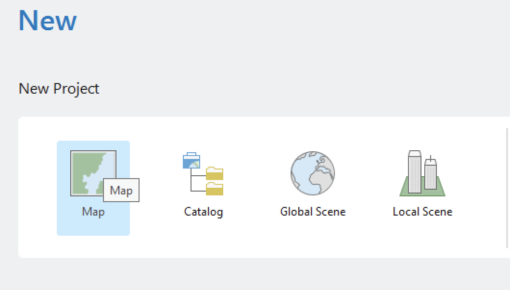
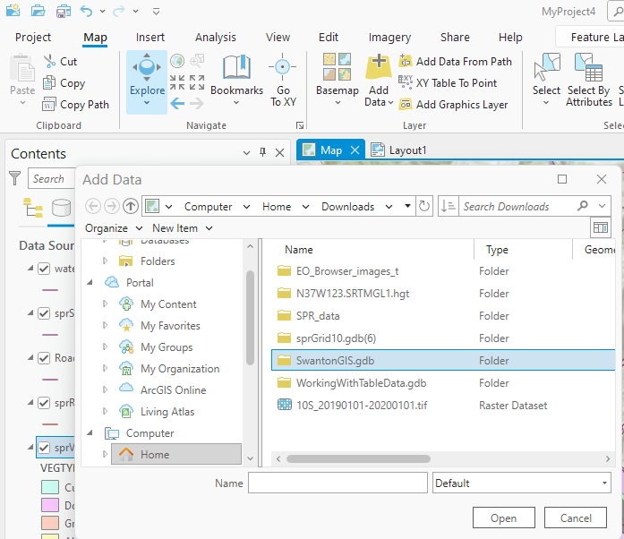
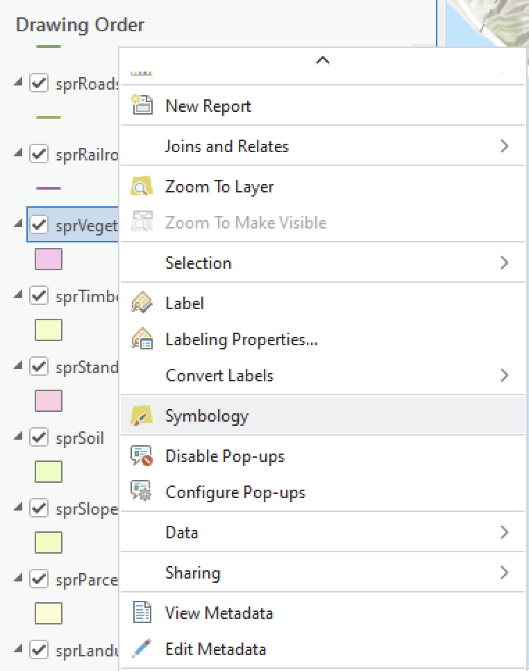
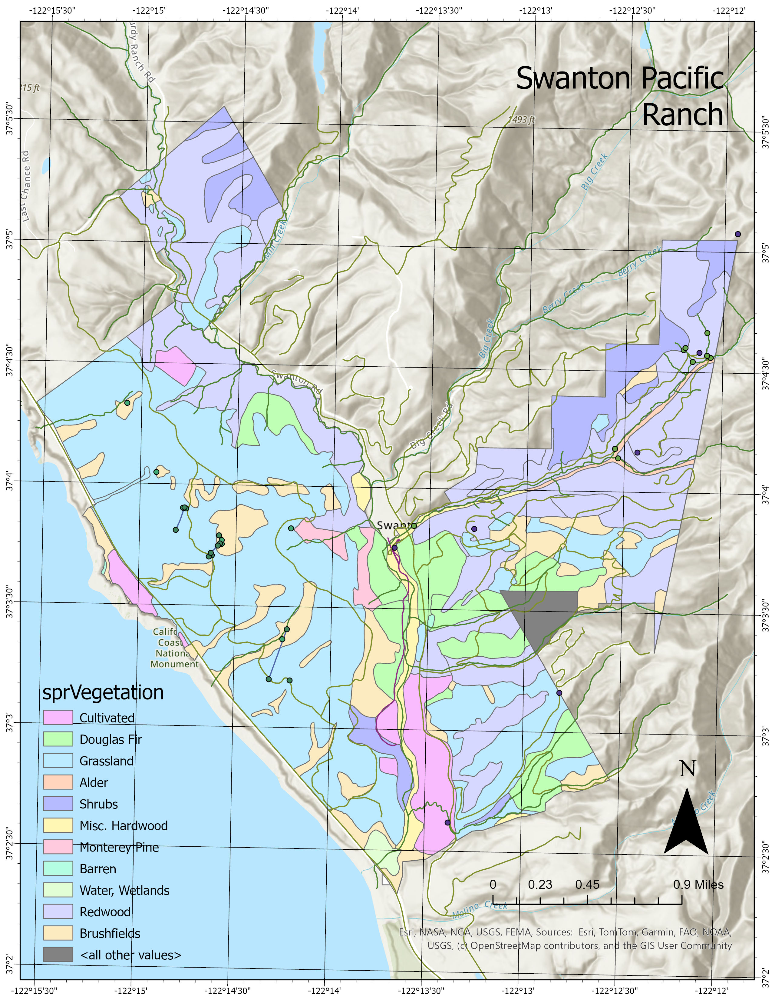
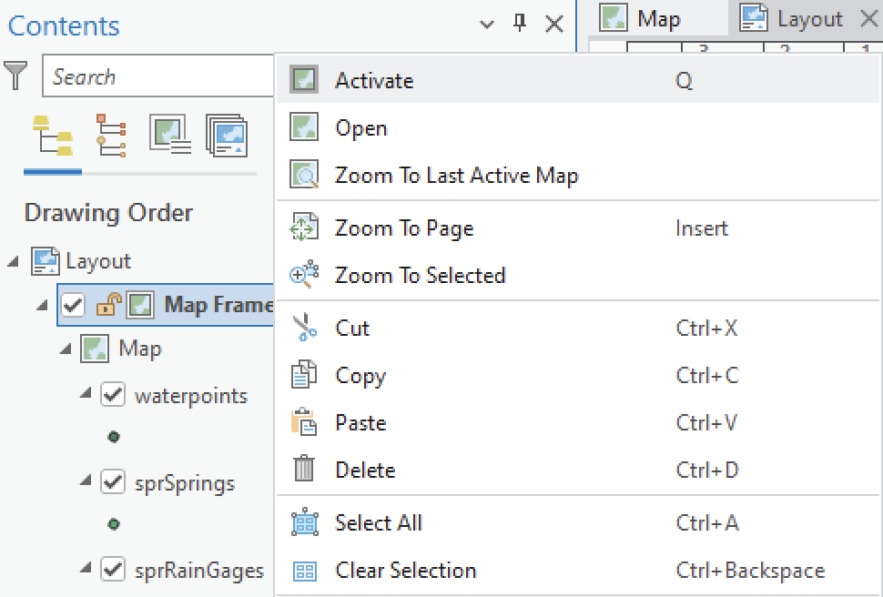

# An Introduction to the ESRI Ecosystem

## ArcGIS vs QGIS

::: {.r-stack}

::: {.fragment .fade-in-then-out}

QGIS is...

::: {style="font-size:0.7em"}
- Free, open source software
- Compatible with different operating systems (well, mostly)
- Customizable workflow design
:::

:::

::: {.fragment .fade-in}

ArcGIS is...

::: {style="font-size:0.7em"}
- Expensive, exclusive to Windows OS
- More user-friendly, designed for all skill levels
- Oriented towards organization-wide integration
:::

:::

:::

## The ESRI Suite

::: {.r-stack}

::: {.fragment .fade-in-then-out}

__ArcGIS Pro__

- Desktop GIS platform
- Best for advanced spatial analysis

:::

::: {.fragment .fade-in-then-out}

__ArcGIS Online__

- Cloud-based GIS platform
- Useful for sharing maps, layers, and datasets

:::

::: {.fragment .fade-in-then-out}

__ArcGIS Enterprise__

- Designed for organizations
- Private servers for data/map sharing
- Locally hosted version of ArcGIS Online

:::

::: {.fragment .fade-in}

__Additional Apps and Tools__

- StoryMaps: make map presentations and narratives
- Experience Builder: make GIS dashboards/web apps
- Survey123: integrate surveys with spatial analysis
- Field Maps: collect georeferenced data points

:::

:::

##

## Mini Lab: Exploring ArcGIS Pro

::: {.r-stack}

::: {.fragment .fade-in-then-out}

::: {.columns}

::: {.column width = "40%"}

Opening ArcGIS Pro

::: {style="font-size:0.7em"}
+ Use Cal Poly SSO
+ Click on Map
  + Make sure you know where the project is saved!
:::

:::

::: {.column width = "50%"}

:::

:::

:::

::: {.fragment .fade-in-then-out}

::: {.columns}

::: {.column width = "40%"}

Adding data

::: {style="font-size:0.7em"}
+ Download [SwantonGIS.gdb.zip](https://cpslo-my.sharepoint.com/personal/mthuggin_calpoly_edu/_layouts/15/onedrive.aspx?id=%2Fpersonal%2Fmthuggin%5Fcalpoly%5Fedu%2FDocuments%2Fnr218%5Ffiles%2FSwantonGIS%2Egdb%2Ezip&parent=%2Fpersonal%2Fmthuggin%5Fcalpoly%5Fedu%2FDocuments%2Fnr218%5Ffiles&ga=1) (new file type!)
+ Unzip the file, save the __whole .gdb__ to a new lab folder
+ Add the data to your ArcGIS project
  + Map > Add Data > Navigate to the GDB
:::

:::

::: {.column width = "50%"}

:::

:::

:::

::: {.fragment .fade-in-then-out}

::: {.columns}

::: {.column width = "40%"}

Adjusting symbology

::: {style="font-size:0.7em"}
+ Right click on sprVegetation
+ Go to Symbology
+ Primary Symbology > Unique Values
  + Field: VEGTYPE1
:::

:::

::: {.column width = "50%"}

:::

:::

:::

::: {.fragment .fade-in}

+ Try out a few symbologies for numerical data (use a different layer)
  + Symbology > Graduated Colors > KFACTOR
  + Symbology > Graduated Symbols > Depth
  + Symbology > Proportional Symbols > Slopemax

:::

:::

## Making a Map in ArcGIS Pro

::: {.r-stack}

::: {.fragment .fade-in-then-out}

:::

::: {.fragment .fade-in-then-out}

+ Insert > New Layout > 8.5x11 Letter
+ Insert > Map Frame

:::

::: {.fragment .fade-in-then-out}

::: {.columns}

::: {.column width = "40%"}

+ Right click on Map Frame > Activate
+ Right click on the sprVegetation layer __in the layout tab__ > Zoom to Layer

:::

::: {.column width = "50%"}

:::

:::

:::

::: {.fragment .fade-in-then-out}

+ When you're satisfied, Layout > Close Activation

:::

::: {.fragment .fade-in}

Other things we can add:

+ Legend, scale bar, north arrow
+ Latitude / longitude coordinates with `Grid`
+ Also worth looking through the options under `Dynamic text`

:::

:::

## ArcGIS Online

