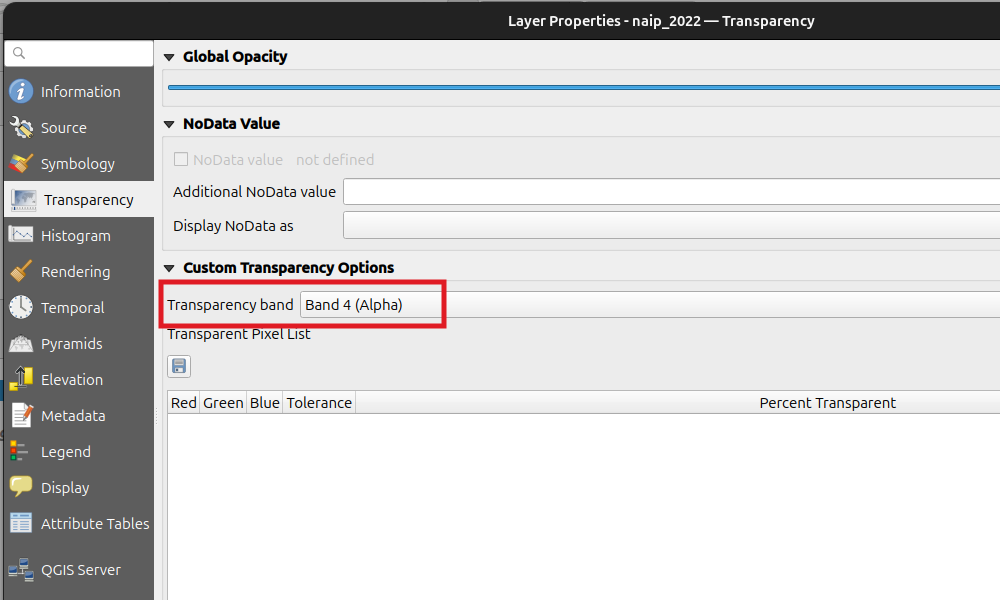

# A Quick Lesson in Multi-band Rasters Using NAIP

In this exercise you will explore some visualizations and calculate simple spectral indices using NAIP imagery (see @tip-naip).  You will also get some more practice performing spatial overlays and merging vectors.
 
## Data and directory structure
First we will need the data. Download the vector file of fire perimeters and the 2022 NAIP image below.

+ [fire perimeters](https://cpslo-my.sharepoint.com/:u:/g/personal/mthuggin_calpoly_edu/IQDiOQnn5iZ2SoC9RFOZXMQ6AYohr1UK1PuzRVCWknsOpLQ?e=XmKEES)
+ [NAIP image](https://cpslo-my.sharepoint.com/:i:/g/personal/mthuggin_calpoly_edu/IQCbn6SrRXfWTpTedYV781GaAf0KYHKhx3KR9q1ULPDs69g?e=G4GTkg) (This NAIP file has been clipped and slightly downsampled from 0.6 m resolution to 1 m resolution.)

[The fire perimeters data is a subset of polygons from California Historical Fire Perimeters dataset from [California Open Data Portal](https://data.ca.gov/group/fire)]{style="font-size:0.3.5em"}. 

::: {#tip-naip .callout-tip}
## What is NAIP

The National Agriculture Imagery Program (NAIP) acquires aerial imagery during the agricultural growing seasons in the United States. It is generally made available to governmental agencies and the public within a year of acquisition.

+ High-resolution aerial imagery of the continental United States
+ Collected during agricultural growing seasons
+ Typically 4-band: Red, Green, Blue, Near-Infrared (NIR)
+ 60 cm (or better) spatial resolution
+ Updated on a 2-3 year cycle for each state


:::


Create a working directory, called `lab_10`, for this lab in your `nr218` folder. Create a `data` folder and put the downloaded data inside. Then:

+ Open QGIS and start a new project
+ Change the project CRS to EPSG:6339
+ Save it in the `lab_10` folder as `coffee_fire.qgz`

Also create a text document (using Notepad, TextEdit, gedit, or similar), name it `answers.txt`, and save it in `lab_10`. Throughout this lab there will be questions included in the format of the text below. Answer the questions in `answers.txt`.

> Questions will be included in this format, with a sidebar and in grey, throughout the exercise.


You should now have a directory structure like this.

```
lab_10/
├── coffee_fire.qgz
├── data/
│   ├── subset_of_cal_hist_fires.geojson
│   └── naip_2022.tif
└── answers.txt
```

## Data Preparation

During this workflow, there is no need to save any file with _scratch_ in the name. You will want to save other files in your data directory.

1. Open `subset_of_cal_hist_fires.geojson` in QGIS.

2. Add a basemap.

> Question 1. Where are these fire perimeters?

{#fig-vectors  .wrap-right style="--wrap-width:40%;"}

>  Question 2. What CRS is `subset_of_cal_hist_fires.geojson` in? Is there something you should do regarding the CRS?  

3. Extract the perimeter of the Coffee Fire (`FIRE_NAME` is `COFFEE`). There are a few ways you can do this, your choice. Name the resulting layer `Coffee fire`. (I would recommend naming the file you save `coffee_fire.geojson`.)

4. Reduce the number of polygons in the fire perimeter layer, `subset_of_cal_hist_fires`, by selecting only fires that have happened since 2014 (Hint: extract by attribute), i.e. `YEAR_ > 2013`. Name the resulting layer `scratch_1`.

5. Use the "Extract layer extent" tool to get a polygon of the extent of the Coffee fire. Name the result `scratch_extent`.

6. Buffer `scratch_extent` by 1000 m, using mitered joint style. Name the buffered layer, our area of interest, `AOI`. @fig-vectors shows the layers that should have been created at this point (AOI is still called `Buffered` in the image).

> Question 3. Try buffering `scratch_extent` with the default joint style instead of mitered. What is the difference?

7. Now extract all of the polygons in `scratch_1` which _intersect_ `AOI` (Hint: "select by location"). Name the result `scratch_2`.

8. Clip `scratch_2` by `AOI`. Save the results as `fires_in_AOI`.

9. When you are satisfied that `fires_in_AOI` turned out correctly, you can delete `scratch_1`, `scratch_2`, and `scratch_extent`. (Now you should not have any temporary layers in your layer panel.)

{#fig-transparency .wrap-right style="--wrap-width:40%;"} 

10. Open `naip_2022`. If you have a basemap on, turn it off so that the NAIP imagery is over a white background. Notice that the image looks very pale. Open the Layer Properties dialog. Go to the Transparency tab on the left (see @fig-transparency). Change the transparency band to None. See the change that occurs.

> Question 4.  What just happened when you made that change.  What is band 4 in the image?   QGIS was interpreting it as a transparency band, why?

## Explore Visualizations and Spectral Indices
1. Now view the image as False color
    a. Recall from earlier, that means Near-Infrared to Red, Red to Green, and Green to Blue (i.e. band order is NIR, G, R) 
    b. Open symbology and change the band order
    c. Zoom in so that individual trees are visible.
    d. Save your QGIS project so the false-color visualization is preserved.

> Question 5.  Why do trees stand out from the ground using this false color image?  

2. Calculate Normalized Difference Vegetation Index (NDVI) using the Raster Calculator. Save the file as `NDVI.tif`

$$NDVI = \frac{NIR - Red}{NIR + Red}$$

   
__NDVI Values__   

| Value Range | Interpretation |
|-------------|----------------|
| -1 to 0 | Water, clouds, or non-vegetated surfaces.|
| 0 to 0.1 | Exposed rock, sand, or snow. |
| 0.2 to 0.5 | Sparse vegetation, |
| 0.6 to 0.9 | Dense Vegetation |


> Question 6. 
> a) How many bands does the NDVI raster have?  

3. Adjust the symbology to some color scheme you think is appropriate for displaying NDVI.

The Soil Adjusted Vegetation Index (SAVI) is useful when the soil is highly exposed in an image. Soil is often highly reflective across all bands, reducing the contrast between vegetation and soil. It is the same as NDVI with an adjustment factor, $L$, to compensate for soil.

$$
SAVI = \frac{(NIR - Red) \times (1 + L)}{NIR + Red + L} 
$$

4. Calculate SAVI. Use similar symbology rules you used for NDVI.

Where $L$ is often 0.5, but can be adjusted for more reflective exposed soil. The soil in the Klamath Mountains, where this data is from, tends to be highly reflective, which means a fairly high value of $L$ (close to 1) should be used. Experiment with values of $L$ to see if you can make a raster where contrast between trees and soil is higher than in your NDVI raster.

> Question 7.
> a) Were you able to improve upon NDVI using SAVI? 
> b) What value of $L$ did you end up using?  
> c) NDVI is defined on the interval [-1, -1], what about SAVI?

## Finding Zonal Statistics
1. Extract a separate `River fire` layer, for the River Complex,  from your `fires in AOI` layer.

2. Spatial Overlays:
    a. Find the difference between the `River fire` and `Coffee fire` layers, call it `river only`, 
    b. Find the difference between the `Coffee fire` and `River fire` layers, call it `coffee only`
    c. Find the intersection between the `Coffee fire` and `River fire` layers, call it `both`
    d. Use the AOI and the three layers you just found to make a polygon called `unburned`, i.e areas burned by neither fire.

3. Change the value of the `FIRE_NAME` attribute for each of the layers you created in the last step to match the layer name.

4. Use the _Merge vector layers_ tool to merge the four layers you just created (`river only`, `coffee only`, `both`, `unburned`). Save the merged layer as `treatments.geojson`. Change the symbology of the treatments layer to categorized. Remove `river only`, `coffee only`, `both`, and `unburned` layers.

> Question 8. One can think of the layer you just created as containing polygons representing four treatments in a natural experiment.  Describe what each of the polygons you created represents.


5. Use the zonal statistics tool to find mean, median, and standard deviation of NDVI in each treatment.

> Question 9. Paste the mean median and standard distributions from the zonal statistics. 

> Question 10.  Briefly describe the differences in NDVI between the four treatments.  Include a table showing the NDVI statistics you calculated (You can export the file as a csv with only the columns you want, and open it in Excel, then paste into your text file).

> Question 11. Use `tree` and paste output to show the structure of your working directory.

> Question 11. Describe how the steps taken here fit into the _Filter, Map, Reduce_ workflow.

## Submission

As usual, zip you lab_10 directory and submit to Canvas.  

+-----------------------------------+--------------------------------------------------------------+-------------+
| Part                              | Items                                                        | % of points |
+===================================+==============================================================+=============+
| Project Works                     | - Opens                                                      | 20%         |
|                                   | - Layers open without having to search for files             |             |
+-----------------------------------+--------------------------------------------------------------+-------------+
| Data preparation and vector       | - Correct CRS                                                | 25%         |
| workflow                          | - AOI layer                                                  |             |
|                                   | - `fires_in_AOI`                                             |             |
+-----------------------------------+--------------------------------------------------------------+-------------+
| NAIP visualization and            | - False-color display                                        | 20%         |
| spectral-index workflow           | - Correctly calculated and styled NDVI and SAVI rasters      |             |
+-----------------------------------+--------------------------------------------------------------+-------------+
| Spatial overlays and zonal        | - Merged treatment layer                                     | 20%         |
| statistics                        | - Proper symbology `                                         |             |
+-----------------------------------+--------------------------------------------------------------+-------------+
| `answers.txt`                     | - Complete, accurate responses to Questions 1-11             | 15%         |
+-----------------------------------+--------------------------------------------------------------+-------------+
