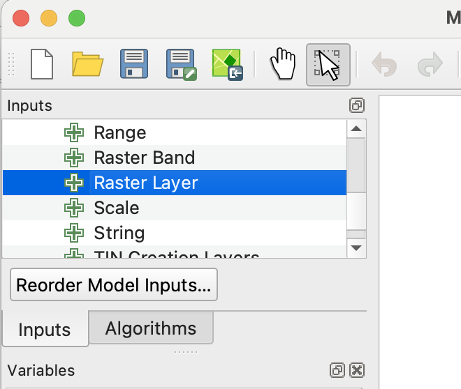
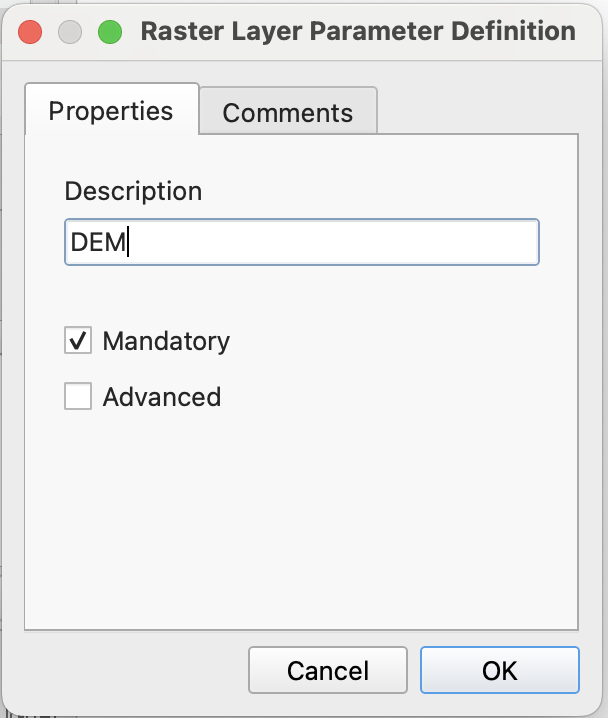
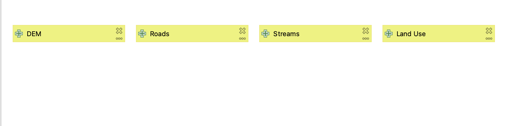
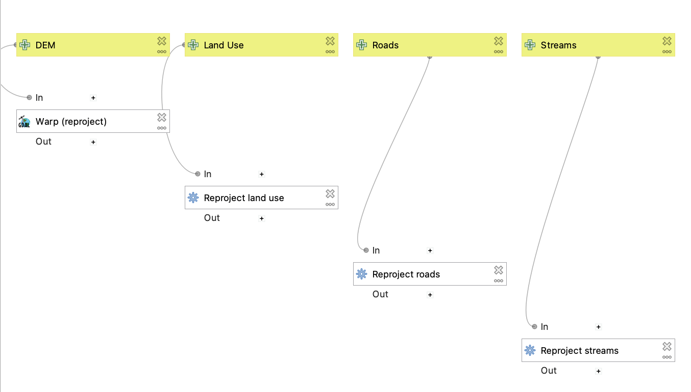
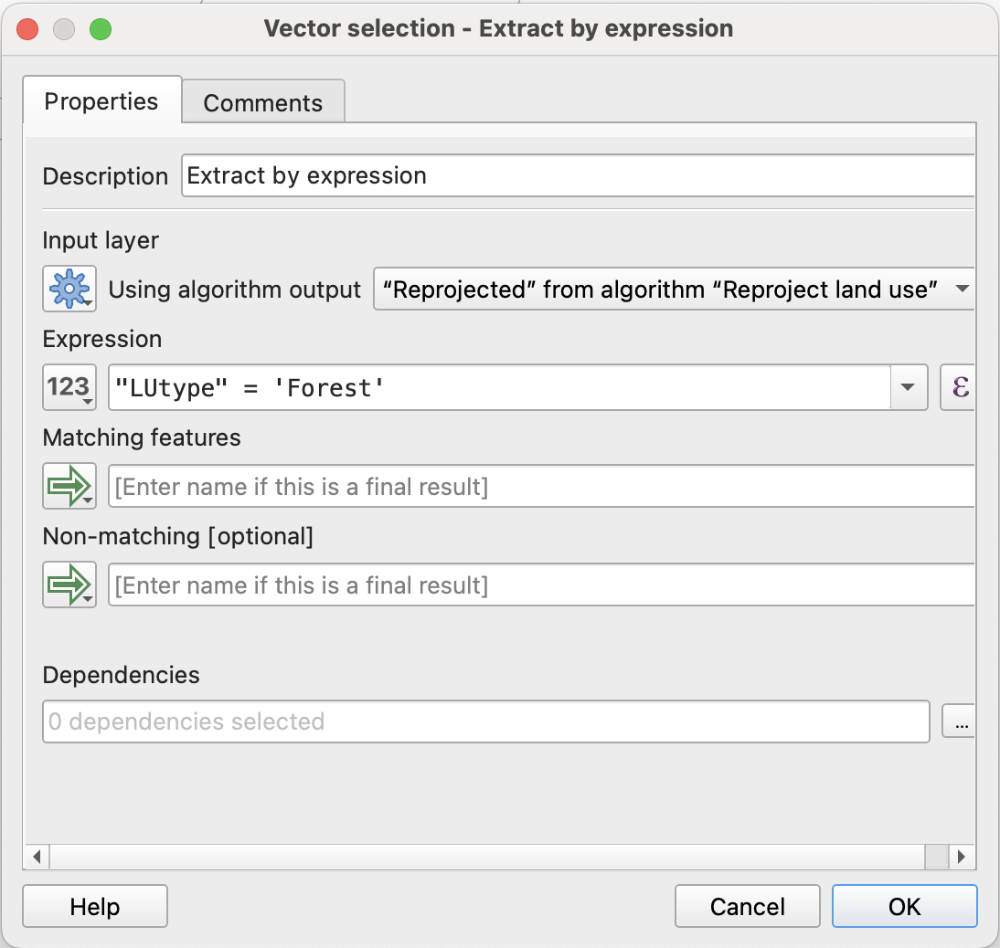
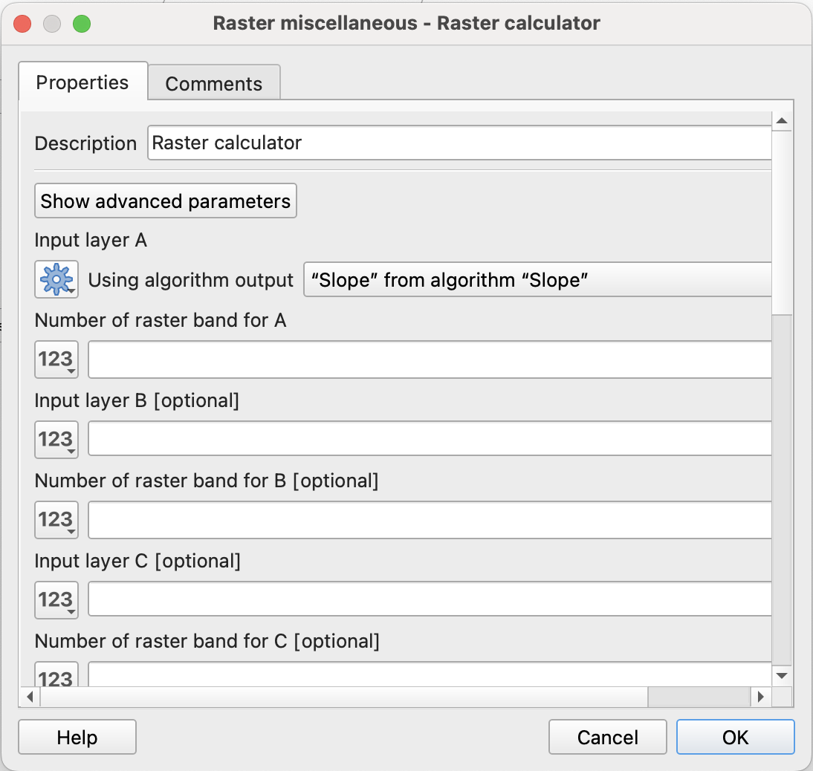
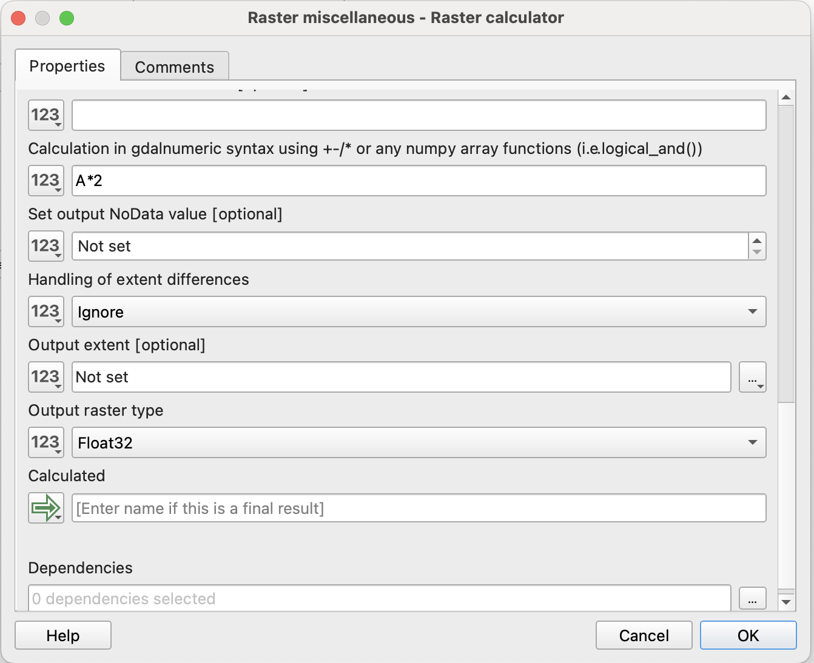
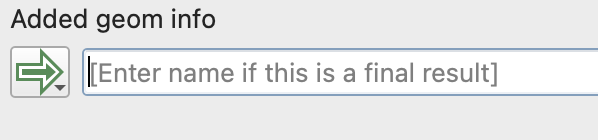
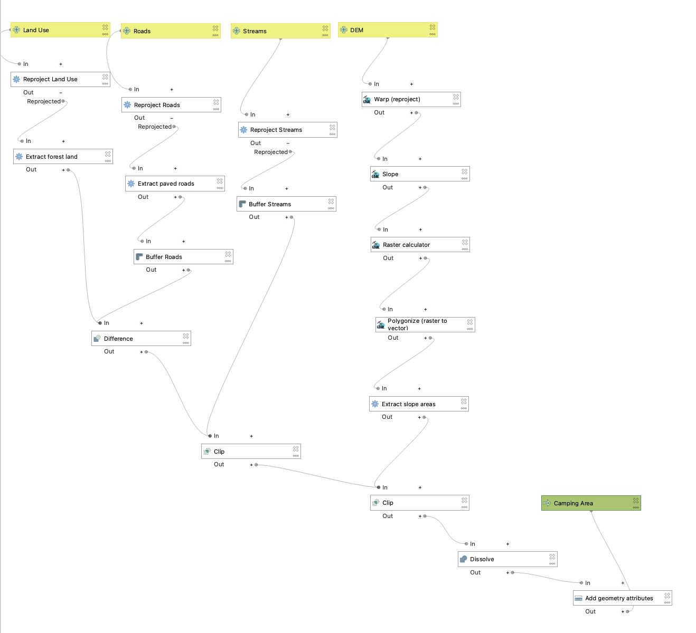
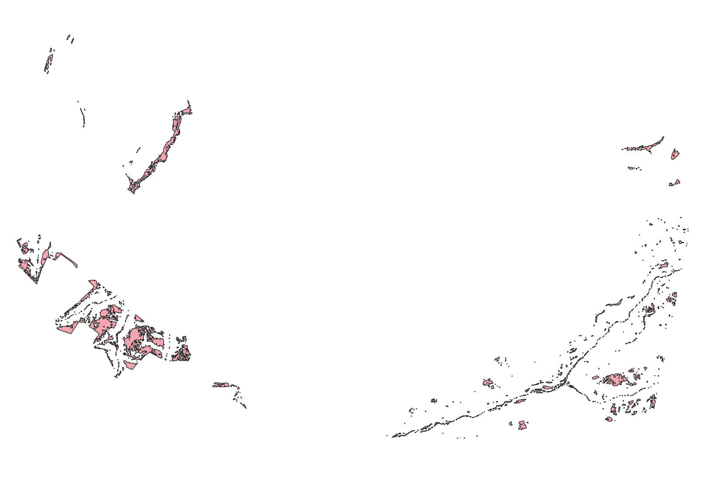

## What is the Model Designer?

From the QGIS documentation:

“The model designer allows you to create complex models using a simple and easy-to-use interface. When working with a GIS, most analysis operations are not isolated, rather part of a chain of operations. Using the model designer, that chain of operations can be wrapped into a single process, making it convenient to execute later with a different set of inputs. No matter how many steps and different algorithms it involves, a model is executed as a single algorithm, saving time and effort.”

Sometimes, we might be interested in quickly reproducing a workflow or analysis process with different inputs or parameters. While we could do this by re-running each tool manually, we can make our lives easier by creating “models” in QGIS that store our processing steps and automatically repeat them in the correct sequence.

Let’s say, for example, we want to compare ideal camping locations in Swanton Ranch. We are looking for spots that are:

+ Within a ‘Forest’ land use type
+ On a slope lower than 20 degrees
+ Within 500 ft of a stream
+ At least 1000 ft away from a paved road

We could do this using all of the individual tools we’ve explored so far in class. BUT we can also map out the entire workflow in a model, which would allow us to re-run our analysis much more efficiently.

# Using the Model Designer

## Project setup

1. Open a new project in QGIS, and save it the same way we’ve been saving projects throughout class (this is lab x).
2. Download these two subsets of SPR data: [SPR 1](https://cpslo-my.sharepoint.com/:u:/g/personal/dicorlet_calpoly_edu/IQAEc43rGKxSSo1poKyRPNumAf_n3-ZHOUmWthTO_sR4RgM?e=cuEZjA) and [SPR 2](https://cpslo-my.sharepoint.com/:u:/g/personal/dicorlet_calpoly_edu/IQDMfd7ptqE5TY18-MuCU7R4AUEganWVZmZ85mjdAEHeoR0?e=moGJdn). Extract all and add them to your data folder.
3. Add all of the layers SPR 1 to your QGIS project.
4. Go to Processing > Model Designer
5. Save your model and name it `spr_model`. By default it will save to `models` folder that is specific to QGIS - don’t change this!

## Adding Inputs

1. The first thing we need to specify are our inputs. For this example, we should have a separate input for each layer. First, make sure you are in the `Inputs` tab on the left side panel. To add a raster input, double click the `Raster Layer` option.

2. You should get a pop-up that looks like this:

3. In the description box, write `DEM`. Make sure the box next to `Mandatory` is checked, and then hit `Ok`. You should see a `DEM` input populate in the modeler canvas.
4. We can do the same for our vector inputs, but we’ll select the `Vector Layer` option instead. Make 3 new inputs: Streams, Roads, and Land Use. Make sure to specify the correct geometry type and check the `Mandatory` box for each input. Our final product should look something like this:

## Adding Algorithms
### Pre-processing

Now that we have our inputs, let’s design our workflow.

1. The first thing we should do is ensure that all of our layers are in the same CRS. Switch from the ‘Inputs’ tab to the 'Toolbox' tab (depending on version may be ‘Algorithms’ tab), and search for ‘Reproject Layer’ (this should look very similar to the processing toolbox that we’re used to searching in!). For each of our vector inputs, we want to reproject to EPSG:2227.

::: {#tip-rename_layers .callout-tip}
For each new ‘reproject’ step we add to the model you can coy and paste the first one you create, double click it, and change the parameters. rename it to reflect the corresponding input layer so you don’t get confused later on.
:::

2. We’ll do the same for our raster input, but make sure to use the ‘Warp’ tool instead. Once we’ve done that, our model should look something like this:

### Main processing steps

Now we can start setting up the links in our processing chain. For each step that we would run individually, we’re going to add a new algorithm to the model.
1. The first thing we should do is to extract the `Forest` polygons within the land use layer. We can do that using the `Extract by expression` tool:

Note that since we’ve already generated an intermediate output from the land use layer (our reprojected layer), we need to specify that that is the input rather than the original land use layer. We can type in our expression the same way we would when using the tool normally - but we’ll need to type the name of the field manually.

::: {#tip-connected_processes .callout-tip}
You can double check that processes are linked correctly by following the lines connecting algorithm boxes. In this case, it should go Land Use > Reprojected land use > Extract by expression.
:::

2. We also need to do this to our roads layer to isolate only paved roads. In this case, that corresponds to ‘ROADCLASS’ 1 and 2.
3. Next we’ll create some buffer algorithms for the streams and road layers. Buffer each of them by the extents listed above in the criteria. Again, make sure you’re using the correct ‘Reprojected’ layer as your input.
4. Lastly, we need to extract our slope criteria. We’ll need to do this in a few steps. First, let’s add an algorithm to generate a new slope layer (use the GDAL version, and make sure your reprojected DEM is the input).
5. Next, we’ll create a binary raster using the raster calculator. Within the model designer, the default raster calculator tool can be finicky, so we’re going to use the GDAL version of the tool instead. Once you open it up, you’ll notice the inputs are a little different than what we’re used to:

What we care about is just ‘input layer A’, which needs to be set to the output of our slope algorithm. Since the slope raster only has one band, we can put a ‘1’ in the ‘Number of raster band A’ box.

We’ll put our equation in the box labeled ‘Calculation in gdalnumeric syntax …’.

6. In order to clip our other criteria layers by our slope values, we need to convert our binary raster to a vector layer and select only the polygons that meet our slope criteria. Add two more algorithms to the model to achieve this (hint: think about our segmentation labs).

### Connecting processing steps together
Now that we have all of our “pre-processing” done we can start refining our land use polygons.

1. Remember, we want areas that are 1000 ft away from roads and within 500 ft of a stream. This means we’ll want to use the ‘Difference’ tool to remove our roads buffer, and then ‘Clip’ our remaining area to the streams buffer.
2. Finally, we can clip our output to the slope polygons. As an added step, let’s ‘Dissolve’ the final clipped output into one polygon and then ‘Add Geometry Attributes’ to get the total area of viable camping space in Swanton.
3. Since this is our last processing step, we need to specify what our model output should be. In this case, we want a new layer called 'Camping Area'. We can do this by typing that in to the box next to the green arrow:

::: {#tip-filepaths .callout-tip}
Note that, like with our inputs, we are not actually inputting a filepath for the output layer at this point! We are just telling QGIS that it will need to actually render a layer after this step. We'll be able to specify a filepath for the layer when we actually run the model.
:::

Your final model should look something like this:

Now let’s run it! Save your model and hit the green ‘play’ button. You’ll get a pop-up that looks like other tools we’ve run, but the inputs/outputs correspond to what you set for your model. This is where you will actually tell QGIS which layers to use in the model. You can opt to save 'Camping Area' to your computer, or just keep it as a temporary layer. Make sure you assign the correct layer to each input, and then hit ‘Run’.

Close the model designer window (make sure you saved!) and take a look at the output on your map. If done correctly, you should see a new 'Camping Area' layer - double check that it looks something like this:

Great! Now let's compare this half of Swanton to the other half. Add all of the layers from SPR2 to your map, and re-run the model (from your processing toolbox or re-open the model designer) using those layers instead. Which half has more area?

For your final submission, include a screenshot of your model and the total area of viable camping land for each half of Swanton (make sure to specify the correct unit based on our CRS!).

