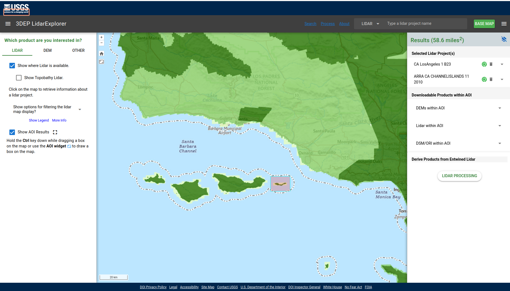
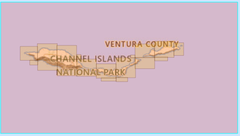
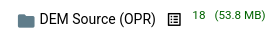
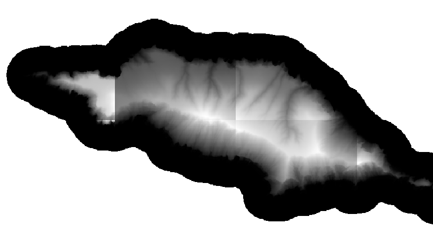
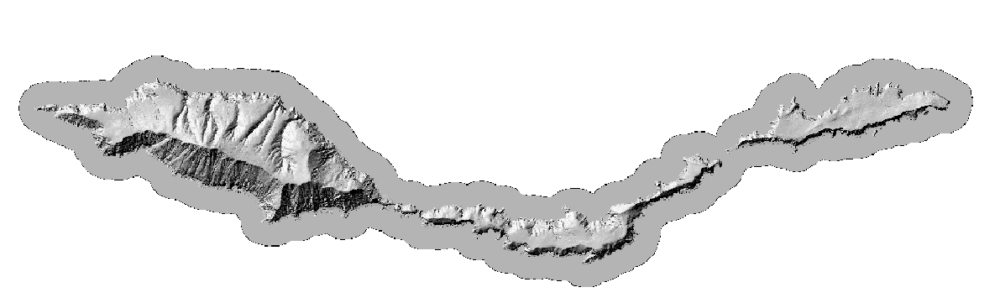
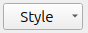

# Lab 8: DEMs


Now that you've learned a bit about what DEMs are and what they can be used for, get some practice working with them in QGIS.

__Quick file organization housekeeping:__

Make a new folder inside your `nr218` directory called `lab_8`. Inside that folder, make a `data` folder. All downloaded files will go in the `data` folder, and all generated outputs (more on this later) will go in `docs`. You should have a directory structure as shown below. 

```
nr218/
└── lab_8
    └── data
    

```

## Par 1: Finding Data Online

So far in this class you've been given files to work with. Today, you are going to practice acquiring some data on your own.

Generating DEMs, particularly at a high resolution, can be costly and time-consuming. Luckily, there are some great online resources for accessing existing imagery. One such resource is the [USGS LiDAR Explorer](https://www.usgs.gov/tools/lidarexplorer).

Follow the link above, and then click "Launch Application" to get to the interactive map (@fig-lidar1).

{#fig-lidar1 fig-alt="Image showing initial map that loads when launching the USGS LiDAR Explorer Application" fig-cap="Startup map of LiDAR Explorer"} 

You can navigate around the map by clicking and dragging with your mouse. Zooming is accomplished using your scroll wheel (or the "+" button at the top left of the map viewer, if you like your zooming to be painful). Orient your map view so that it's centered on San Luis Obispo.  There are three check boxes in the left panel. Try checking and unchecking them to see what happens. 

Next, define your __area of interest__ (AOI). This will return all of the available LiDAR and DEM downloads within a specified geographic area.  For this exercise you will look at [Anacapa Island](https://www.nps.gov/chis/planyourvisit/anacapa.htm){alt-text="Link to National Parks page on Anacapa Island"}. Click the _Define area of interest_ box and draw a box around Anacapa (by holding control and dragging , see @fig-lidar3), then check what pops up on the right side of the screen .

{#fig-lidar3 fig-alt="Image showing what an area of interest box looks like on the map" fig-cap="Defined area of interest"}

After you define the AOI, on the right panel, under _Downloadable Products within AOI_,  you should see dropdowns for DEM, LiDAR, and DSM/ORI products within the AOI. These dropdowns are populated with all of the downloadable files in the AOI.

In this case, you are interested in what DEMs are available, so expand that dropdown. Under _DEMs within AOI_ there should be:

+ DEM 1 Meter
+ DEM ~3m 1/9
+ DEM ~10m 1/3
+ DEM ~30m 1
+ DEM Source (OPR)

{#fig-anacapa-tiles fig-alt="Image showing The extent of the OPR tiles for Anacapa Island" .wrap-right style="--wrap-width:35%;"}


_DEMs 1 Meter_ holds Project-based bare-earth DEM, usually derived from lidar and included as part of the [USGS 3DEP program](https://www.usgs.gov/3d-elevation-program) after the USGS does quality control.


_DEMs ~10m 1/3_ are the seamless 3DEP elevation layer, blended across larger areas and distributed as a nationwide medium-resolution product. The resolution is 1/3 arc second (recall that sometimes lat/lon is written in degrees minutes seconds) which is _about_ 10 m ground distance, but the E/W ground distance varies with latitude at Anacapa the actual ground distance per pixel is  about 10.3 m N/S
and about 8.5 m E/W.

_DEM Source (OPR)_ are DEMs distributed at the source project's original resolution and projection


For Anacapa there should be 18 tiles under _DEM Source (OPR)_. If you hover over the titles of the slides, the extents of the tiles will be shown on the map, as can be seen in @fig-anacapa-tiles. You _could_ click each one and download it, it would be kind of a pain though.  If you were working on a larger area, clicking and downloading each file would not be practical.  Luckily, there is a download list which can be downloaded by pressing the _Download List_ button shown in @fig-download-list. The downloadlist __is not the DEM data__ but just a list of URLs where the data is stored (in an Amazon Cloud Bucket).  In order to get the data, you must download the actual DEM tif files . __For directions on downloading the data see__ @tip-wget.

{#fig-download-list fig-alt="Image showing the download list icon to the right of OPR" .wrap-right style="--wrap-width:35%;"}


```
nr218/
└── lab_8
    └── data
          ├──DEM_OPR   
          └──DEM_1arc
    

```
Before downloading the data, prepare your project directory.   You will be working with 2 DEM datasets for this project, the OPR DEM, and the 1 arc second DEM.  Make a subdirectory within data for each, as shown above.

<details>
<summary>Read this if Lidar Explorer is Broken</summary>

Bummer!  This happens sometimes these days. Hopefully it comes back soon. In the meantime, here is a [link to a copy of the download list](https://raw.githubusercontent.com/kulpojke/nr218/main/assets/anacapa_downloadlist.txt).

</details>

::: {#tip-wget .callout-tip}
## How to download files using the download list
The following commands fetch the DEMs from th URLs in `downloadlist.txt`.  Note that they are assuming that `downloadlist.txt` is in the directory where you are running the command.  If it is not, you can adjust the path to `downloadlist.txt`(e.g. to `~/Downloads/downloadlist.txt` if it sits in your Downloads folder)  

<details>
<summary>Windows</summary>

In `PowerShell`, first `cd` into the folder where you want the downloads to go (for example, `nr218/lab_8/data/DEM_OPR`). Then run:

This reads each URL from `downloadlist.txt` and downloads the files one by one into the current folder. It is a bit cumbersome on Windows because there is not a simple built-in command like `wget -i` for downloading a whole list of files at once. The following will download every file listed in `downloadlist.txt` into your current folder.
``` powershell
foreach ($url in Get-Content .\downloadlist.txt) {
  Invoke-WebRequest -Uri $url -OutFile (Split-Path $url -Leaf)
}
```
</details>

<details>
<summary>Mac or Linux</summary>

In `Terminal`, first `cd` into the folder where you want the downloads to go (for example, `nr218/lab_8/data/DEM_OPR`). Then run:

``` bash
wget -i downloadlist.txt
```

This tells `wget` to download each URL listed in the text file.
</details>


:::

After downloading the OPR tiles from the downloadlist,  you will need to download the ~30m DEMS.  Under the _DEM ~30m 1_ heading click the _Current_ button.  Once the button is clicked, there should be 2 tiles listed. Now click the download button next to each of the two files.  After they download, move them to `nr218/lab_8/data/DEM_1arc`

## Mosaicing Tiles and Reprojection

At this point you have the data you will need, however, each data set is in tiles, and they are in different projections. Before proceeding it is a good time to think about what projections the data is in and what projection you should use for the project.  If you were to look at the CRS (which you need not do currently), under information, in the layer properties window, you would see that,

+ The OPR DEMs are in a compound CRS (see @tip-crs to learn what that means, and be inundated with more info on reference systems) 
  + NAD83(2011) / UTM zone 11N = EPSG:6340
  + NAVD88 height = EPSG:5703
+ The 1 arc second DEM is in EPSG:4269, a geographic CRS.  

For this project you will use EPSG:6340. 

At this point you should:

1. Open QGIS.
2. Create a new project.
3. Set the project CRS to EPSG:6340.
4. Save the project (call it `anacapa.qgz` and save it in your lab_8 directory)

::: {#tip-crs .callout-tip}
## A deep dive on Coordinate Reference Systems
<details>
<summary> A deep dive on Coordinate Reference Systems</summary>

+ A __horizontal CRS__ tells QGIS how to locate positions on the earth in X and Y. For example, EPSG:4269 stores positions as latitude/longitude in NAD83, while EPSG:6340 stores them as UTM easting/northing in meters.
+ A __vertical CRS__ tells QGIS what the Z values mean. For DEMs this is the elevation reference surface. A vertical CRS might define height above an ellipsoid, or an orthometric height system such as NAVD88. 
  + If this is not yet sufficiently complicated to satisfy you read [this explanation](https://www.ngs.noaa.gov/GEOID/GEOID18/computation.html
) of how geoids are used to create a vertical datum.
+ A __compound CRS__ combines both pieces: one CRS for horizontal position and one CRS for vertical height. That is what the OPR DEMs are doing here: horizontal location in NAD83(2011) / UTM zone 11N plus vertical height in NAVD88.
+ Generally, when you reproject a layer that is in a compound CRS, you are just reprojecting the horizontal CRS.
+ The 1 arc second DEM only advertises EPSG:4269, so its file is clearly defining the horizontal part but not explicitly encoding the vertical CRS in the raster's CRS tag.
  + That does __not__ mean the heights are meaningless. For many DEM products, the vertical datum is documented in the metadata or product documentation rather than embedded in the CRS that software reads automatically. The height reference is often defined somewhere, but not always within the data's CRS description.
</details>

:::

### Mosaicing the OPR Data
{#fig-seems fig-alt="Image showing a section of the OPR DEM over Anacapa Island showing seams at the borders of the tiles" .wrap-right style="--wrap-width:45%;"}

Open the DEM tiles you saved to `nr218/lab_8/data/DEM_OPR` (you can highlight them all, and open them all at once, by clicking the top file, then holding control and clicking the bottom file in the browser). If you zoom in a little, you will be able to see seams at the borders of the tiles, similar to those shown in @fig-seems.  This does not occur because of sudden changes in elevation at the edges of the tiles, but rather is an artifact of the way a DEM is rendered in QGIS.  When QGIS opens a single band raster, by default it rescales the colors displayed, to the range in elevation of the tile.  This is done to maximize the contrast of the layer, but makes tiled data look bad.


To fix the seams, and to simplify further analysis, there are a couple of approaches available.  The first, mosaicing, is to join all of the tiles into a single tif file.  The other is to build a virtual raster (.vrt) which is a small sidecar file which indexes the existing tiles. You will use the virtual raster for the OPR dataset.  

To create a virtual raster, use the _Build Virtual Raster_ tool from the processing toolbox (under _GDAL_ > _Raster miscellaneous_). Click the browse button at the right side of _Input layers_. If the OPR DEM tiles are the only layers you have opened you can click the add all button on the right (or click each one manually).  Press the back button to go back to the previous page of the tool, then save the vrt file in the `DEM_OPR` directory alongside the DEMs. Once a vrt has been saved, the relative path between it and the tiles it has indexed must not change.

Since the OPR data is already in the project projection you need not worry about reprojecting it.

### Mosaicing and Reprojecting the Arc second DEMS


There are only 2 tiles for the Arc second resolution DEM.  You will join them by mosaicing.

1. Before you start, extract the extent of the vrt you just created using the _Extract layer extent_ tool (save the output as a scratch layer, you will not need it for long).
2. Next use the _Merge_ tool (_GDAL_ > _Raster miscellaneous_) to merge the arc second resolution tiles (save as scratch, again it is an intermediate file).
3. Clip the result using the extent created in step 1 (_Raster_ > _Extraction_ > _Clip Raster by Mask Layer_).
4. Reproject the result (Warp) to the project CRS.
5. Save the result as `nr218/lab_8/data/DEM_1arc/dem_arcsec`

## DEM derivative products

Next you will create a few different derivative products from your DEMs.  Some are useful as visualizations. Others are useful in analysis.

### Slope 

Slope maps are useful in various types of elevation.  They are OK as visualizations, but not great. Slope can be expressed as percent or degrees.

Use __Raster__ > __Analysis__ > __Slope__. 

Save your slopemap as a tif, into a new directory `nr218/lab_8/derivatives/slope.tif`

::: {#tip-hillshade .callout-tip}
## Azimuth and Z Factor

You can adjust the output of your hillshade by changing the values of the `azimuth` and `Z factor`. Take a moment to play around with the values for these parameters. What do you think each one does?

:::

{#fig-hillshade fig-alt="Image showing a hillshade render of a DEM" fig-cap="Hillshade" .wrap-right style="--wrap-width:45%;"}


### Hillshade

Hillshade is a useful visualization, but the pixel values are not meaningful from an analysis standpoint.

1. From the Raster menu, go to Analysis > Hillshade (or search Hillshade in the processing tools window).
2. Adjust the Z factor if you'd like. Keep the azimuth at its default for now.
3. Click on the 3 dots to the right of the `[Save to temporary file]` box and select `Save to file`. Navigate to your `data` folder and name the file something you can identify it by (i.e. include hillshade in the name). Before you hit `Save`, make sure the file format is `.tif`.
4. Leave all other parameters at their default and hit `Run`.

### Contour Lines

1. Now go to Raster > Extraction > Contour (or search Contour in the processing tools window).
2. Adjust the contour interval to 10 meters (this tool does not specify an index interval).
3. Save the layer as a new file the same way you did above. Make sure that the file type is `.geojson`.
4. Leave all other parameters at their default and hit `Run`.


### Combining DEM Visualizations

1. Open up the Symbology window for your original DEM and change the Render Type to `Singleband pseudocolor`. Choose any graduated color ramp from the dropdown.
2. Make sure your hillshade layer is above the DEM in the layer panel. In the Symbology window, change the `blending mode` to `multiply`. Locate the Transparency tab (one below Symbology), and adjust the layer opacity to your liking.
3. Make sure your contour layer is the topmost layer. Go to the Symbology window and adjust the color and thickness of your lines to your liking.


## Extracting Information from DEMs

So far you have focused on visualizing elevation data; now you will shift toward analyzing it.


### Slope and Aspect

You already created a slope layer. _Slope_ tells you how steep the terrain is (in degrees or percent change from horizontal). _Aspect_ tells you which direction each slope of the terrain faces.  
 
_Raster_ > _Analysis_ > _Aspect_

## Other Terrain Analysis

Together with hillshade and contours, slope and aspect are often categorized as _terrain analysis_. Other forms of  terrain analysis include:

+ Topographic position index (TPI), which classifies each pixel in relation to the altitude of its neighboring cells
+ Topographic wetness index (TWI) 
+ Topographic ruggedness index (TRI)
+ Geomorphons

## Geomorphons
+ In the toolbox, search for geomorphons, and select _r.geomorphon_ from under GRASS.
+ Use an outer search radius or 10, and an inner search radius of 2
+ Save the output to your `derivatives` directory as `geomorph_10_2.tif`
+ Right-click [this style definition file](https://raw.githubusercontent.com/kulpojke/nr218/main/assets/geomorph_style.qml) and use _save link as_ to download it.
+ In the symbology tab of the layer properties window for the geomorphons layer, there is a dropdown menu at the very bottom that looks like this .  Click it and add the file you downloaded in the last step.

## Sampling Raster Values

Sometimes one wants to know the value of a raster at one or more specific locations.  For instance you might want to know the slope, aspect, and elevation of locations where some kind of samples were collected on Anacapa. 

You can do this using a tool called _Sample Raster Values_. First, you will need some points, so download [this point dataset](https://raw.githubusercontent.com/kulpojke/nr218/main/assets/anacapa_sample_points.geojson) by right-clicking and using save link as.

Now use the _sample raster values_ tool on your OPR DEM.

1. In the processing tools window, search for `sample raster values`.
2. Select the point layer you just downloaded as the input, and your OPR DEM as the raster layer.
3. Change the `output column prefix` to "elevation_".

Examine the output of the tool by opening the attribute table. What did it do? Rename the output layer (called `Sampled` by default) to something more useful.

Now run the same steps as above, but this time use the output layer as your input and the slope as your raster (Change the `output column prefix` to "slope_" this time). You should now have a new point layer that includes the elevation and the slope. Open the attribute table and look at the values.

Repeat this process for aspect.

Save your final layer, with elevation, slope, and aspect attributes to your `derivatives` directory as `samples.geojson`


## Questions

Save a file `questions.txt` (use notepad or similar) in your `lab_8` directory with answers to the following.

1. You used EPSG:6340 for the project.  Why is this a good choice? Why not use EPSG:26911, or EPSG:4269?
2. In what units are the pixel values (i.e. elevation) of the OPR DEM?  How do you know? (F.Y.I., This is not a terribly simple answer.)
3. What is the resolution of the OPR DEM?
4. Why is the y resolution listed as negative?
5. What is the advantage of building a VRT instead of creating a full mosaic, and when would a mosaic be the better choice?
