# Remote Sensing!


## Remote sensing

::: {.columns}

::: {.column width="35%"}
::: {.r-stack style="position: relative; min-height: 400px;"}

::: {.fragment .absolute .fade-in-then-out data-fragment-index="1" style="max-width: 100%; font-size:0.6em;"}
__Remote sensing__ - Obtaining information about an object from a distance.
:::


::: {.fragment .absolute .fade-in-then-out data-fragment-index="2" style="max-width: 100%; font-size:0.6em;"}
What is the most basic form of remote sensing you can think of?
:::

::: {.fragment .absolute .fade-in-then-out data-fragment-index="3" style="max-width: 100%; font-size:0.8em;"}

[Looking at something!]{style="color: red;"}
:::


::: {.fragment .absolute .fade-in-then-out data-fragment-index="4" style="max-width: 100%; font-size:0.6em;"}
There are many different methods of remote sensing.

+ Some ground based
+ Some airborne
+ Some satellite based
:::


::: {.fragment .absolute .fade-in-then-out data-fragment-index="5" style="max-width: 100%; font-size:0.6em;"}
+ Most remote sensing relies on electromagnetic radiation
:::

::: {.fragment .absolute .fade-in-then-out data-fragment-index="6" style="max-width: 100%; font-size:0.6em;"}
Red band (0.63 - 0.69 µm)

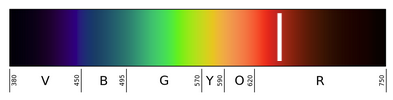

Useful for:  

+ Detecting bare soil, buildings, pavement
+ Chlorophyll absorption

:::

::: {.fragment .absolute .fade-in-then-out data-fragment-index="7" style="max-width: 100%; font-size:0.6em;"}
Green band (0.52 - 0.6 µm)

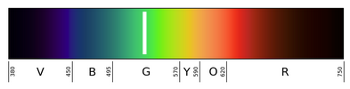

Useful for:  

+ phenology / vegetation dynamics
+ plant Health
+ algal Blooms
:::

::: {.fragment .absolute .fade-in-then-out data-fragment-index="8" style="max-width: 100%; font-size:0.6em;"}
Blue band (0.45 - 0.52 µm)

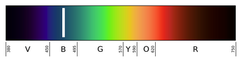

Useful for:  

+ water
+ clouds 
+ snow
+ aerosols

:::

::: {.fragment .absolute .fade-in-then-out data-fragment-index="9" style="max-width: 100%; font-size:0.6em;"}
NIR band (0.77 - 0.9 µm)


Useful for:  

+ biomass
+ vegetation detection
+ boundary detection
:::

::: {.fragment .absolute .fade-in-then-out data-fragment-index="10" style="max-width: 100%; font-size:0.6em;"}
A "True Color" image used Red, Green and Blue 


::: {style="font-size:0.5em"}
+ Pixels in display contain 3 sub-pixels
+ Each sub-pixels intensity is controlled by the intensity value in the image
+ Intensity values are stored as 8-bit unsigned integers (`uint8`) 
    + 8 bits = $2^{8}$ = 256 possible values
    + Range: 0 to 255 (256 values total)
    + Images are sometimes _stored_ with higher precision, but displayed with 8 bits
:::

```
(255, 0, 0)   = pure red
(0, 255, 0)   = pure green
(0, 0, 255)   = pure blue
(255, 255, 0) = yellow (red + green)
(0, 255, 255) = cyan (green + blue)
(255, 0, 255) = magenta (red + blue)
(255, 255, 255) = white (all combined)
(0, 0, 0)     = black (none)
```

:::


::: {.fragment .absolute .fade-in-then-out data-fragment-index="11" style="max-width: 100%; font-size:0.6em;"}
Combining bands on different ways is often useful.

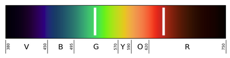

For example, False Color Image

+ Near-Infrared to Red, Red to Green, and Green to Blue (NIR, G, R)           
:::


::: {.fragment .absolute .fade-in-then-out data-fragment-index="12" style="max-width: 100%; font-size:0.6em;"}

+ Humans see only a small portion of the EM spectrum. 
+ Instruments on satellites capture more, but still only a small portion of the entire electromagnetic spectrum

[__Right__:  Reflectance of water, soil and vegetation in different wavelengths and Landsat TM channels.]{style="font-size:0.5em"}
:::

::: 
<!-- end r-stack -->
::: 
<!-- end column -->

::: {.column width="65%"}

::: { .r-stack}

::: {.fragment .absolute .fade-in-then-out data-fragment-index="3"}
{width="100%" style="max-width: 100%; height: auto; object-fit: contain;"}

::: {.attribution style="font-size:0.4em"}
Image Source: [Wikimedia](https://commons.wikimedia.org/wiki/File:Electromagneticwave3D.gif)
:::  
:::  

::: {.fragment .absolute .fade-in-then-out data-fragment-index="5"}
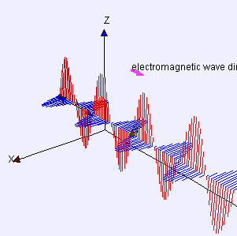{width="100%" style="max-width: 100%; height: auto; object-fit: contain;"}


::: {.attribution style="font-size:0.4em"}
Image Source: [Wikimedia](https://commons.wikimedia.org/wiki/File:Electromagneticwave3D.gif)
:::  
:::  

::: {.fragment .absolute .fade-in-then-out data-fragment-index="6"}
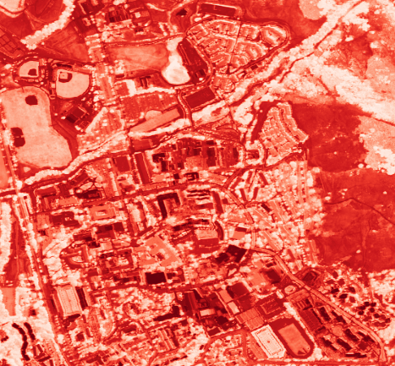
:::


::: {.fragment .absolute .fade-in-then-out data-fragment-index="7"}
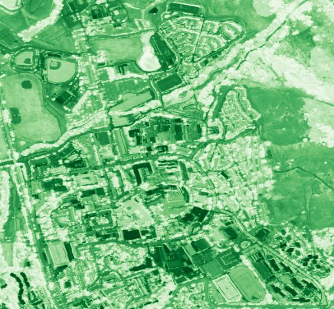
:::


::: {.fragment .absolute .fade-in-then-out data-fragment-index="8"}
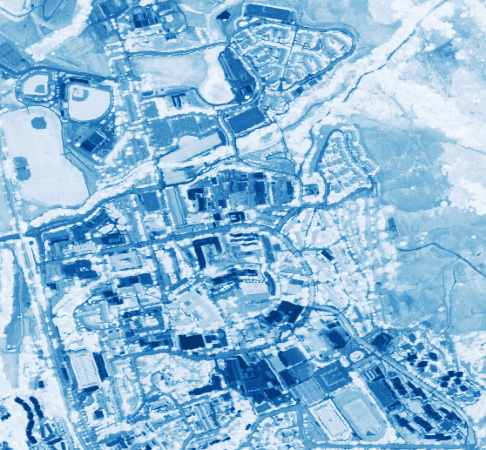
:::

::: {.fragment .absolute .fade-in-then-out data-fragment-index="9"}
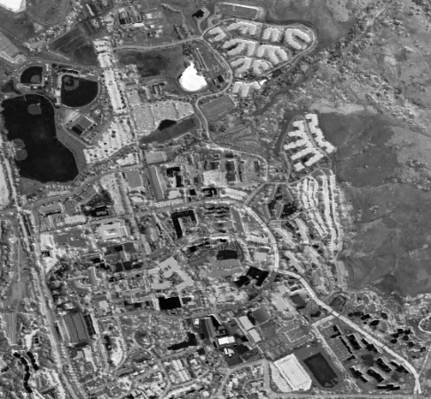
:::

::: {.fragment .absolute .fade-in-then-out data-fragment-index="10"}
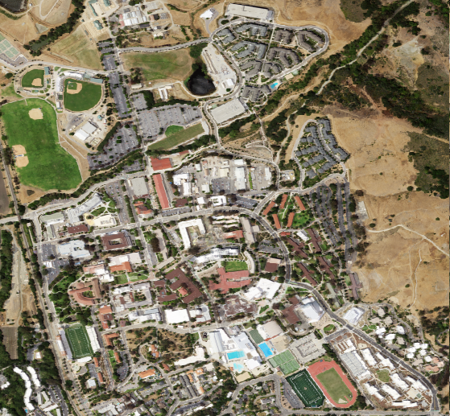
:::

::: {.fragment .absolute .fade-in-then-out data-fragment-index="11"}
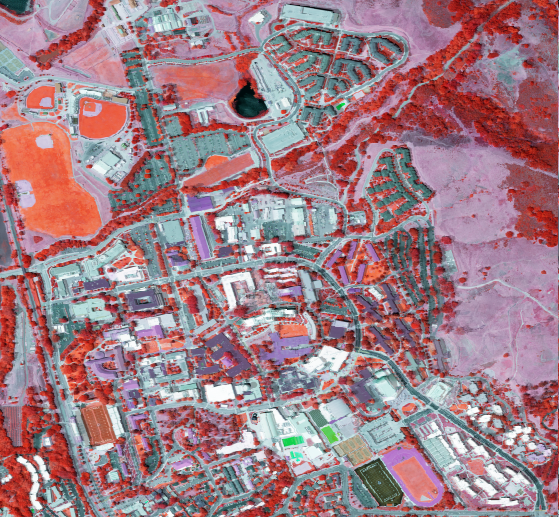
:::


::: {.fragment .absolute .fade-in-then-out data-fragment-index="12"}
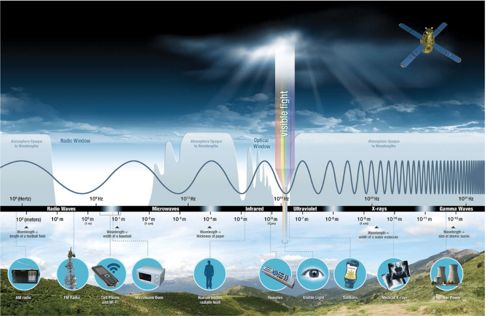{width="100%" style="max-width: 100%; height: auto; object-fit: contain;"}

::: {.attribution style="font-size:0.4em"}
Image Source: [NASA](https://appliedsciences.nasa.gov/sites/default/files/2022-11/Fundamentals_of_RS_Edited_SC.pdf)
:::
:::


:::
<!-- end r-stack -->
::: 
<!-- end column -->

:::
<!-- end columns -->

## Passive vs. Active

::: { .r-stack}

::: {.fragment .absolute .fade-in-then-out data-fragment-index="1"}
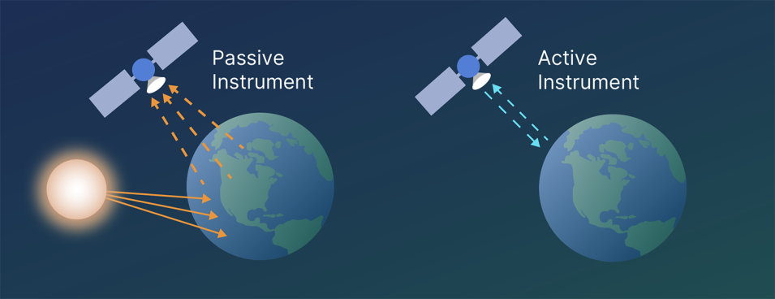

::: {.attribution style="font-size:0.4em"}
Image Source: [NASA Earthdata](https://www.earthdata.nasa.gov/learn/earth-observation-data-basics/remote-sensing)
:::

:::

::: {.fragment .absolute .fade-in data-fragment-index="2"}
+ The type of remote sensing we have been discussing so far is  _optical_ remote sensing. 
    + Optical remote sensing is a is passive 
    + Light from the sun bounces off of the earth and into the sensor (Eyeball, Camera, Radiometer)
+ _Radiometric_ sensing covers a wider spectral range, and may include active as well as passive techniques.

:::

:::

## NAIP Imagery

::: {.columns}
::: {.column style="font-size:0.5em"}
**National Agriculture Imagery Program (NAIP)**

+ High-resolution aerial imagery of the continental United States
+ Collected during agricultural growing seasons
+ Typically 4-band: Red, Green, Blue, Near-Infrared (NIR)
+ 60 cm (or better) spatial resolution
+ Updated on a 2-3 year cycle for each state

**Learn more:** [USDA NAIP Program](https://www.fsa.usda.gov/programs-and-services/aerial-photography/imagery-programs/naip-imagery/)
:::
::: {.column}

:::
:::

## Filter, Map, Reduce

+ Filter - Find the subset of data needed.
+ Map - Transform the raw data into useful data
+ Reduce - Extract needed information

## Spectral indices {.smaller}

Spectral index 

+ A mathematical equation that is applied on the various spectral bands of an
image on a per pixel basis
+ Maps multiple bands to a single band
+ Simple band ratios that highlight a specific process or property on the land
surface
+ Reduce effects of atmosphere, instrument noise, sun angle: allows for consistent
spatial and temporal comparisons [^nasa]

[^nasa]:  NASA ARSET slideshow _Spectral Indices for Land and Aquatic Applications_


## Spectral Response Curves {.smaller}

::: { .r-stack}

::: {.fragment .absolute .fade-out data-fragment-index="1"}
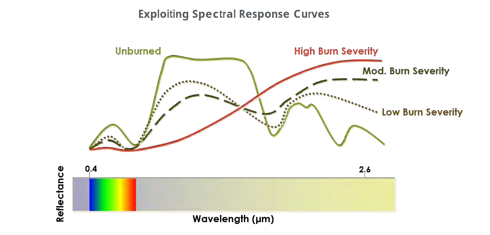

::: {.attribution style="font-size:0.4em"}
Image Source: [SEOS](https://seos-project.eu/classification/classification-c01-p05.html)
:::

:::

::: {.fragment .absolute .fade-in-then-out data-fragment-index="1" style="font-size:0.8em"}
$$
\text{NBR} = \frac{\text{NIR} - \text{SWIR-2}}{\text{NIR} + \text{SWIR-2}} = \frac{B_8 - B_{12}}{B_8 + B_{12}}
$$

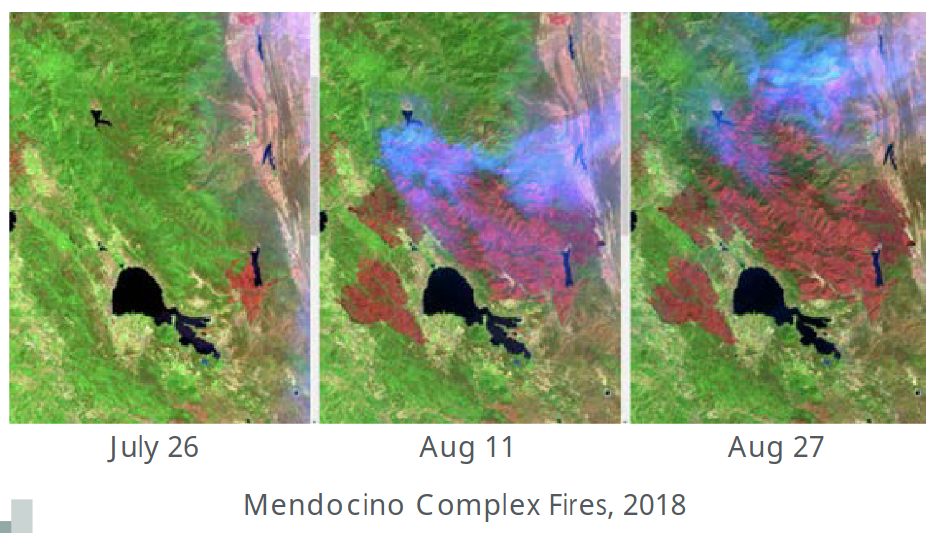{width="80%" style="max-height: 70vh; object-fit: contain;"}
:::

:::


## Common Spectral Indices {style="font-size:0.5em"}
| Index | Formula | Typical Use |
| --- | --- | --- |
| NDVI | $(\text{NIR} - \text{Red}) / (\text{NIR} + \text{Red})$ | Vegetation greenness/vigor |
| EVI | $2.5 \cdot (\text{NIR} - \text{Red}) / (\text{NIR} + 6\cdot\text{Red} - 7.5\cdot\text{Blue} + 1)$ | Dense vegetation, reduces soil/atmosphere effects |
| SAVI | $(1 + L)\cdot(\text{NIR} - \text{Red}) / (\text{NIR} + \text{Red} + L)$ | Vegetation with soil brightness correction ($L$ often 0.5) |
| NDWI | $(\text{Green} - \text{NIR}) / (\text{Green} + \text{NIR})$ | Surface water detection |
| MNDWI | $(\text{Green} - \text{SWIR-1}) / (\text{Green} + \text{SWIR-1})$ | Open water enhancement, reduced built-up/soil noise |
| NBR | $(\text{NIR} - \text{SWIR-2}) / (\text{NIR} + \text{SWIR-2})$ | Burn severity, fire impacts |
| NDMI | $(\text{NIR} - \text{SWIR-1}) / (\text{NIR} + \text{SWIR-1})$ | Vegetation moisture |


## NDVI

$(\text{NIR} - \text{Red}) / (\text{NIR} + \text{Red})$

::: {.fragment .absolute .fade-out data-fragment-index="1"  }
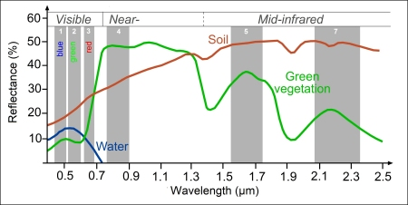
:::

::: {.fragment .absolute .fade-in-then-out data-fragment-index="1"}
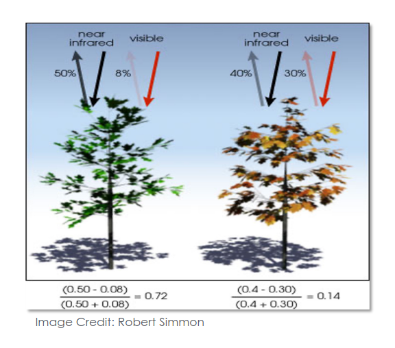

::: {.attribution style="font-size:0.4em"}
Image Source: [NASA ARSET](https://appliedsciences.nasa.gov/sites/default/files/2023-10/Spectral_Indices_Part1.pdf)
:::
:::


::: {.fragment .absolute .fade-in-then-out data-fragment-index="2"}
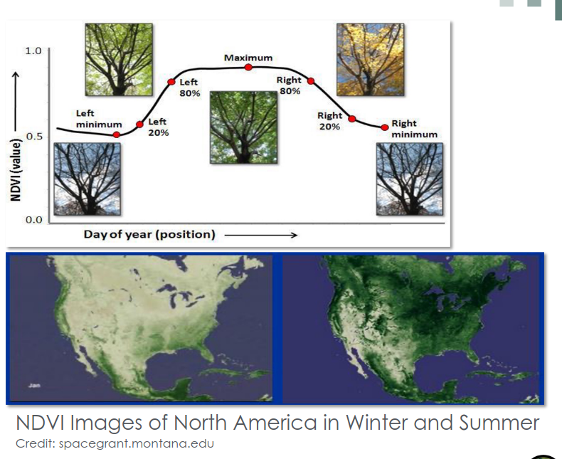
:::

::: {.fragment .absolute .fade-in-then-out data-fragment-index="3"}
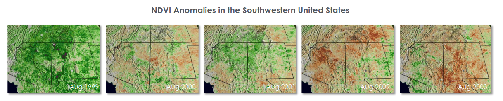

::: {.attribution style="font-size:0.4em"}
Image Source: [NASA ARSET](https://appliedsciences.nasa.gov/sites/default/files/2023-10/Spectral_Indices_Part1.pdf)
:::
:::

## Raster Calculator

- Applies map algebra to rasters, cell by cell
- Useful for band math, reclassification, masking, and thresholding
- Examples: 
    - `("naip@4" - "naip@1") / ("naip@4" + "naip@1")`
    - `elev > 2000`,
    - `landcover == "forest"`


## Extracting Zonal Statistics

::: { .r-stack}
::: {.fragment .absolute .fade-out data-fragment-index="1"}
Let’s say you want to determine the mean / median / minimum / max *elevation* or *slope*, or *NDVI* or anything else described by raster data, but for every feature in a polygon layer (e.g. for every county in CA)

How would you do that, knowing what we already know?
:::

::: {.fragment .absolute .fade-in data-fragment-index="1"}
Easier Way:

`Processing Toolbox` → `Raster Analysis` → `Zonal Statistics`


:::

:::
