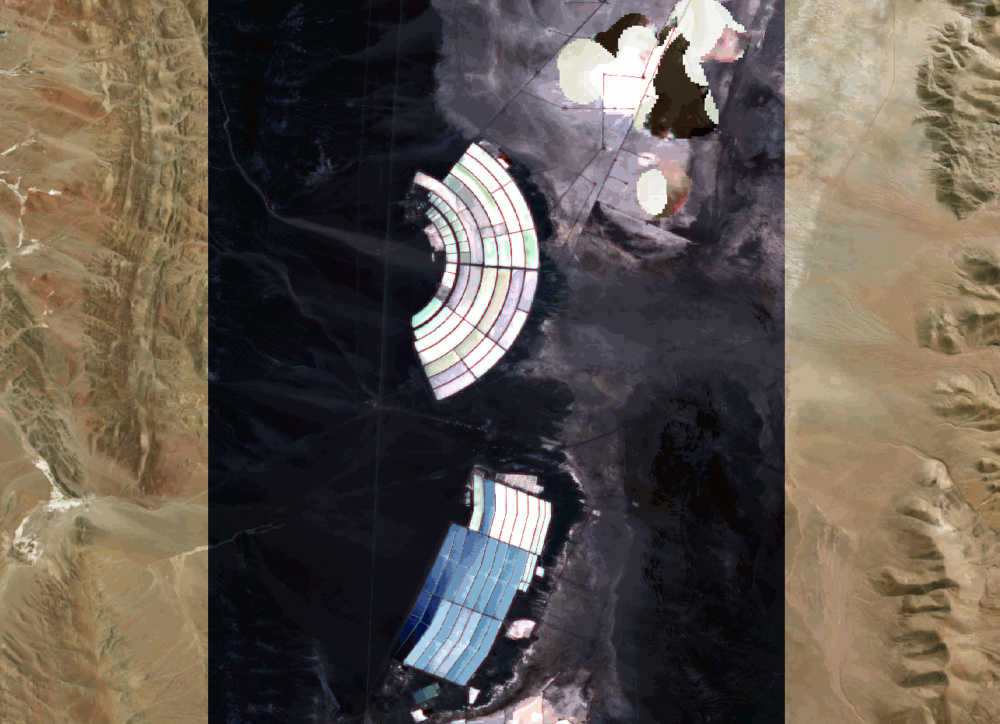
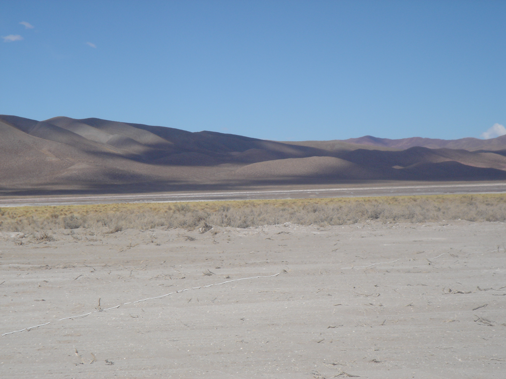
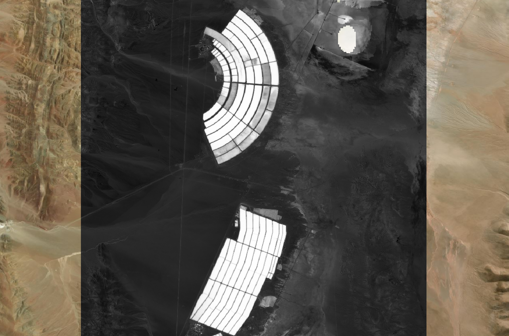
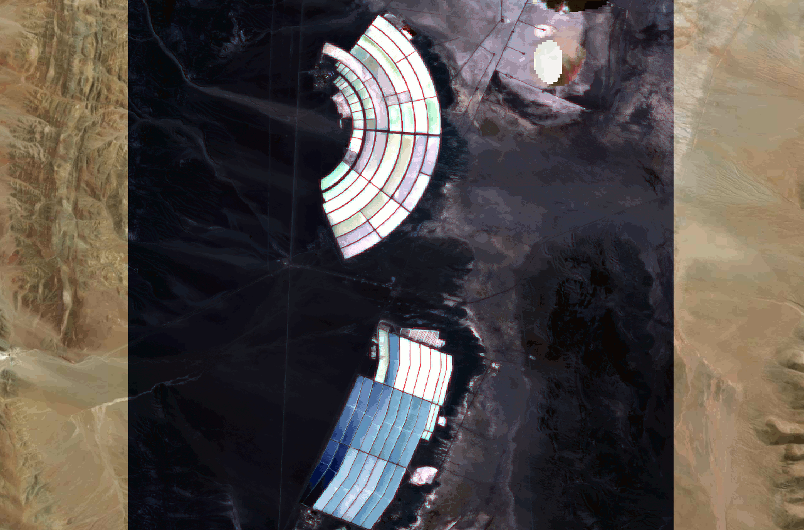
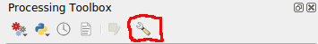

# Segmentation

## Data {style="font-size:0.7em"}

In Lab 11 you have been working with the two Sentinel 2 datasets.  You should already have them, but if not they can be downloaded with the links below.

+ [Sentinel-2 median composite image, near Susques, Argentina, 2025-04-01 to 2025-10-26](https://cpslo-my.sharepoint.com/:i:/g/personal/mthuggin_calpoly_edu/IQAJAFt9XMSYRKXWQJmE5hHHAUl5KfJND29B6mnwxG9aO1k?e=0Kfo2d)

+ [Sentinel-2 max composite image, near Susques, Argentina, 2025-04-01 to 2025-10-26](https://cpslo-my.sharepoint.com/:i:/g/personal/mthuggin_calpoly_edu/IQBB5gbdk0DfRosehfzXZXnIAbq2w9jLq_ez7EUw_YIxeWY?e=a7NpJK)

## What kind of information is needed to segment this image? {style="font-size:0.7em"}

::: {.columns}
::: {.column}

::: {.r-stack style="min-height: 9em; width: 100%; align-items: flex-start; justify-content: flex-start;"}

::: {.fragment .fade-out data-fragment-index="1" style="width: 100%; max-width: 100%; font-size:1.0em; text-align:left;"}
In Lab 11 you you are asked to segment the image to find lithium brine evaporation ponds near Susques Argentina.
:::

::: {.fragment .fade-in-then-out data-fragment-index="1" style="width: 100%; max-width: 100%; font-size:1.0em; text-align:left;"}
If you have looked at the images over a basemap, or searched for Susques on the internet, you may have learned that it is in the __Atacama desert__.  
:::  

::: {.fragment .fade-in-then-out data-fragment-index="2" style="width: 100%; max-width: 100%; font-size:1.0em; text-align:left;"}
The Atacama, being a desert, is __quite dry__ (actually, it is one of the driest places on Earth!).  
:::  

::: {.fragment .fade-in-then-out data-fragment-index="3" style="width: 100%; max-width: 100%; font-size:1.0em; text-align:left;"}
If you happened to google _lithium evaporation pond_, you probably know that they are used to evaporate lithium brine in order to extract lithium salts.
:::  

::: {.fragment .fade-in-then-out data-fragment-index="4" style="width: 100%; max-width: 100%; font-size:1.0em; text-align:left;"}
Given this information, one would expect these lithium ponds to be __wetter than their surroundings__. 

:::  

:::  
<!-- end r-stack -->

:::
::: {.column}

::: {.r-stack}

::: {.fragment .absolute .fade-in-then-out data-fragment-index="1" style="max-width: 100%; font-size:0.6em;"}

:::  

::: {.fragment .absolute .fade-in-then-out data-fragment-index="2" style="max-width: 100%; font-size:0.6em;"}

:::  

::: {.fragment .absolute .fade-in-then-out data-fragment-index="3" style="max-width: 100%; font-size:0.6em;"}
](img/lithium%20pond.jpg)
:::  

::: {.fragment .absolute .fade-in-then-out data-fragment-index="4" style="max-width: 100%; font-size:0.6em;"}
](img/Salinas_grandes.jpg)
:::  

:::  
<!-- end r-stack -->
:::
:::  
<!-- end columns -->

## There's An Index For That!

::: {.r-stack}

::: {.fragment .absolute .fade-in-then-out style="max-width: 100%; font-size:0.6em;"}
Normalized Difference Water Index 

$NDWI = \frac{G -NIR}{G + NIR}$

+ Water $\gtrapprox$ 0

:::

::: {.fragment .absolute .fade-in-then-out style="max-width: 100%; font-size:0.6em;"}
Modified Normalized Difference Water Index

$MNDWI = \frac{G -SWIR}{G + SWIR}$

+ Open water $\gtrapprox$ 0.1
+ Weat soil generally $\gtrapprox$ -0.1

:::
:::

## Which SWIR?
__SWIR1__  and __SWIR2__ are both absorbed heavily by water.

+ Both Bands are short wave infrared ($\lambda \approx 20 \text{m}$) 
+ SWIR1 (S2 band 10, 1610 nm), useful in for finding open water, determining vegetation moisture,   distinguishing snow from clouds
+ SWIR2 (S2 band 11, 2190 nm) - Useful for determining soil moisture.

## TODO: Here insert a slide with 4 images (1:img/1, 2:img/2, 3:img/3, 4:img/4, ) in 4x4 grid with caption for entire grid describing images (1:NDWI using SWIR1, 2: NDWI using SWIR2 3: MNDWI using SWIR1, 4: MNDWI using SWIR2) 

## Segmentation using Raster Calculator {style="font-size:0.7em"}

::: {.columns}
::: {.column}

::: {.r-stack style="min-height: 9em; width: 100%; align-items: flex-start; justify-content: flex-start;"}

::: {.fragment .absolute .fade-out data-fragment-index="1" style="max-width: 50%; font-size:0.8em;"}
In simple cases one can use the raster calculator.
:::

::: {.fragment .absolute .fade-in-then-out data-fragment-index="1" style="max-width: 50%; font-size:0.8em;"}
+ Calculate you index.
:::

::: {.fragment .absolute .fade-in-then-out data-fragment-index="2" style="max-width: 50%; font-size:0.8em;"}
+ Calculate you index.
+ Use Raster calculator to segment values above a threshold
:::

:::
:::

::: {.column}
::: {.r-stack style="min-height: 9em; width: 100%; align-items: flex-start; justify-content: flex-start;"}

::: {.fragment .absolute .fade-in-then-out data-fragment-index="1" style="max-width: 100%; font-size:0.8em;"}

:::

::: {.fragment .absolute .fade-in-then-out data-fragment-index="2" style="max-width: 100%; font-size:0.8em;"}

:::

:::
:::

:::

## Segmentation using segmentation tools

::: {.r-stack style="min-height: 9em; width: 100%; align-items: flex-start; justify-content: flex-start;"}

::: {.fragment .absolute .fade-out data-fragment-index="1" style="max-width: 100%; font-size:0.8em;"}
In this class we will use Orfeo Toolbox, an open source remote sensing project, but there are many other options.
:::

::: {.fragment .absolute .fade-in-then-out data-fragment-index="1" style="max-width: 100%; font-size:0.8em;"}
Go to the [Orfeo Toolbox download page](https://www.google.com/url?sa=t&source=web&rct=j&opi=89978449&url=https://www.orfeo-toolbox.org/download/&ved=2ahUKEwiQgoGU-e-SAxXzIUQIHb-pDDQQjBB6BAgNEAE&usg=AOvVaw3E2pPFGIW0fTcyfBIu_kXZ) and click the _Download OTB 9.x.x_ button.
:::

::: {.fragment .absolute .fade-in-then-out data-fragment-index="2" style="max-width: 100%; font-size:0.8em;"}
Extract the file and move the resulting folder to your home directory.
:::

::: {.fragment .absolute .fade-in-then-out data-fragment-index="3" style="max-width: 100%; font-size:0.8em;"}
Install the _Orfeo Toolbox Provider_ pluggin.
:::

::: {.fragment .absolute .fade-in-then-out data-fragment-index="3" style="max-width: 100%; font-size:0.8em;"}
Install the _Orfeo Toolbox Provider_ pluggin.
:::

::: {.fragment .absolute .fade-in-then-out data-fragment-index="4" style="max-width: 100%; font-size:0.8em;"}
Open processing toolbox and click the settings icon

:::

::: {.fragment .absolute .fade-in-then-out data-fragment-index="5" style="max-width: 100%; font-size:0.8em;"}
Open processing toolbox and click the settings icon

:::

::: {.fragment .absolute .fade-in-then-out data-fragment-index="6" style="max-width: 100%; font-size:0.8em;"}
+ Click the _Processing_ tab on the left
+ Click the OTB dropdown
+ Check the _activate_ box, if it exists
+ Select the OTB application folder by browsing to `~/OTB.x.x/lib/otb/applications` and click select folder (x.x is just a place holder for whatever version you have)
+ Set _OTB folder_ to  `~/OTB.x.x` 

Yu can watch this [painfully slow video](https://youtu.be/tHTV40jScLI?si=a5zoarn2c-c3RB4_) if you are having trouble.

:::

:::
