# Spatial Data Models and Formats

## Data Overview

What are Spatial Data?

::: {style="font-size:0.7em"}
- “Data that describe the geographic and spatial aspects of phenomena.”
:::

What are Metadata?

::: {style="font-size:0.7em"}
- Data about the data 
- Ex: units, what instruments were used, who/what/when/where/how the data was collected
:::

## Data Types

+ Data can have different **types**

  ::: {style="font-size:0.7em"}
  + Ex: How might "population" data differ from "county" data?
  :::

+ The most common types of data available for use in a GIS are:

  ::: {style="font-size:0.7em"}
  + **Boolean** - True / False statements (think off/on switch)
  + **String** - Alphanumeric text denoted by quotes (e.g. “Lake Tahoe”)
  + **Numerical** - numerical values (e.g. latitude/longitude coordinates)

    ::: {style="font-size:0.8em"}
    + **Integers (ints)** - numerical values (8 bit or 16 bit precision)
    + **Floating Point (float)** - negatives, decimal values (32 bit precision)
    :::
  
  :::

::: notes
Which of these dtypes do you think tends to be most memory intensive memory?
:::

## Boolean data {style="font-size:0.7em"}

+ Boolean data is either True or False (Can also be thought of as 1 or 0)
+ Theoretically, it can be stored as 1 bit, but in practice it is generally stored as a byte (8 bits) because hardware usually addresses hardware by byte, so writing individual bits is complex

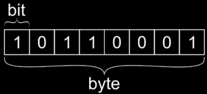{fig-alt="Diagram comparing a single bit with a byte, showing that one bit stores one binary value while one byte contains eight bits." style="width: 50%; height: auto;"}

## String data {style="font-size:0.7em"}

+ String data contains characters.
+ Strings can be stored with different encodings.  The more characters exist in the encoding set, the more memory the characters require.

{fig-alt="Image showing examples of string encoding." style="width: 50%; height: auto;"}

## Numerical Data {style="font-size:0.6em"}

::: { .r-stack}

::: {.fragment .absolute .fade-out data-fragment-index="1" style="font-size:0.7em"}
[Integer]{style="font-size:1.5em"}

<table style="width: 100%; border-collapse: collapse;">
  <thead>
    <tr>
      <th style="text-align: left; width: 22%;">Integer Type</th>
      <th style="text-align: right; width: 10%;">Bytes</th>
      <th style="text-align: left; width: 68%;">Range of Values Stored</th>
    </tr>
  </thead>
  <tbody>
    <tr><td><code>int8</code></td><td style="text-align: right;">1</td><td>-128 to 127</td></tr>
    <tr><td><code>uint8</code></td><td style="text-align: right;">1</td><td>0 to 255</td></tr>
    <tr><td><code>int16</code></td><td style="text-align: right;">2</td><td>-32,768 to 32,767</td></tr>
    <tr><td><code>uint16</code></td><td style="text-align: right;">2</td><td>0 to 65,535</td></tr>
    <tr><td><code>int32</code></td><td style="text-align: right;">4</td><td>-2,147,483,648 to 2,147,483,647</td></tr>
    <tr><td><code>uint32</code></td><td style="text-align: right;">4</td><td>0 to 4,294,967,295</td></tr>
    <tr><td><code>int64</code></td><td style="text-align: right;">8</td><td>-9,223,372,036,854,775,808 to 9,223,372,036,854,775,807</td></tr>
    <tr><td><code>uint64</code></td><td style="text-align: right;">8</td><td>0 to 18,446,744,073,709,551,615</td></tr>
  </tbody>
</table>
:::

::: {.fragment .absolute .fade-in-then-out data-fragment-index="1"}
[Floating Point]{style="font-size:1.5em"}

<table style="width: 100%; border-collapse: collapse;">
  <thead>
    <tr>
      <th style="text-align: left; width: 22%;">Data Type</th>
      <th style="text-align: right; width: 10%;">Bytes</th>
      <th style="text-align: left; width: 68%;">Approximate Range of Values Stored</th>
    </tr>
  </thead>
  <tbody>
    <tr><td><code>float32</code></td><td style="text-align: right;">4</td><td>about 1.2 x 10-38 to 3.4 x 1038 (about 7 decimal digits precision)</td></tr>
    <tr><td><code>float64</code></td><td style="text-align: right;">8</td><td>about 2.2 x 10-308 to 1.8 x 10308 (about 15 to 16 decimal digits precision)</td></tr>
  </tbody>
</table>
:::

:::

## Continuous vs Discrete Data {.smaller}

::: { .r-stack}
::: {.fragment .absolute .fade-out data-fragment-index="1"}
+ **Continuous** data consists of numerical values that can be measured with an arbitrary level of precision
+ **Discrete** data consists of a limited number of possible values
:::

::: {.fragment .absolute .fade-in-then-out data-fragment-index="1"}
+ **Continuous** data consists of numerical values that can be measured with an arbitrary level of precision
  + e.g., Distance, temperature, elevation, reflectance
  + i.e. a distance can be 1 km,  0.5 km, or 0.00000000000001 km
:::

::: {.fragment .absolute .fade-in-then-out data-fragment-index="2"}
+ **Discrete** data consists of a limited number of possible values
  + Count data
  + Number trees in a sample plot, number of houses on a block
:::

:::
## Levels of Measurement

::: {.r-stack}

::: {.fragment .absolute .fade-out data-fragment-index="1" style="font-size:0.7em"}
+ **Nominal** - Names or identifiers of objects
+ **Ordinal** - Ranked categories based on a measure
+ **Ratio** - have a 0 value that indicates absence of the quantity of interest
+ **Interval** - have a regular scale, but not a meaningful 0 value
:::

::: {.fragment .absolute .fade-in-then-out data-fragment-index="1" style="font-size:0.7em"}

[__Nominal and ordinal data are types of _categorical_ data__]{style="font-size:1.1em"}

+ **Nominal** - Names or identifiers of objects

e.g. Land Cover: "Oak Woodland", "Grassland", "Forest", etc...

+ **Ordinal** - Ranked categories based on a measure

e.g. Fire Hazard: "Low", "Medium", "High"

:::

::: {.fragment .absolute .fade-in-then-out data-fragment-index="2" style="font-size:0.6em"}

[__Ratio and interval data can be _continuous_ or _discrete___]{style="font-size:1.1em"}

**Ratio** -
Multiplication makes sense, e.g. 200 K is twice as hot as 100 K
$$
2 \times 100 \mathrm{K} = 200 \mathrm{K} 
$$

**Interval** -
Multiplication __does not__ make sense, e.g. 200°C is __not__ twice as hot as 100°C
$$
2 \times 100°\mathrm{C} \neq 200°\mathrm{C} 
$$
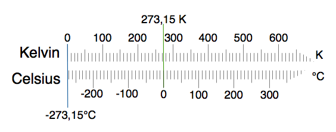{style="display: block; margin: 0 auto; width: 45%; height: auto;"}

::: {.attribution style="font-size:0.4em; width:45%; margin:0 auto; text-align:left;"}
Image Source: [wikimedia](https://upload.wikimedia.org/wikipedia/commons/c/3/Kelvin_og_Celsius_temperaturskalaer.png)
:::

:::

:::

::: notes
Which of these do you think would be discrete?  Which are Continuos? 
:::

## Geospatial Data Types: Vector vs. Raster {style="font-size:0.7em"}

::: {.figure style="text-align: center; margin: 0 auto;"}
  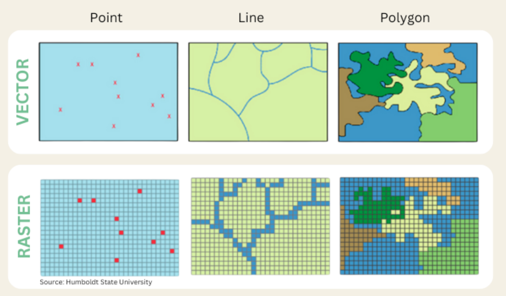{style="height: 500px;"}
:::

## Vector Data

::: {.r-stack}
::: {.fragment .fade-in-then-out}
::: {.columns}

::: {.column width = "40%"}
::: {style="font-size:0.7em"}
+ Can be described by points, lines, polygons
  + Ex: roads, rivers, train tracks, hiking trails, sidewalks, building footprints, county boundaries
+ NOT images, do NOT contain any pixels
+ The kind of data we've been working with so far
:::
:::

::: {.column width = "50%"}
::: {.figure style="text-align: right; margin: 0 auto;"}
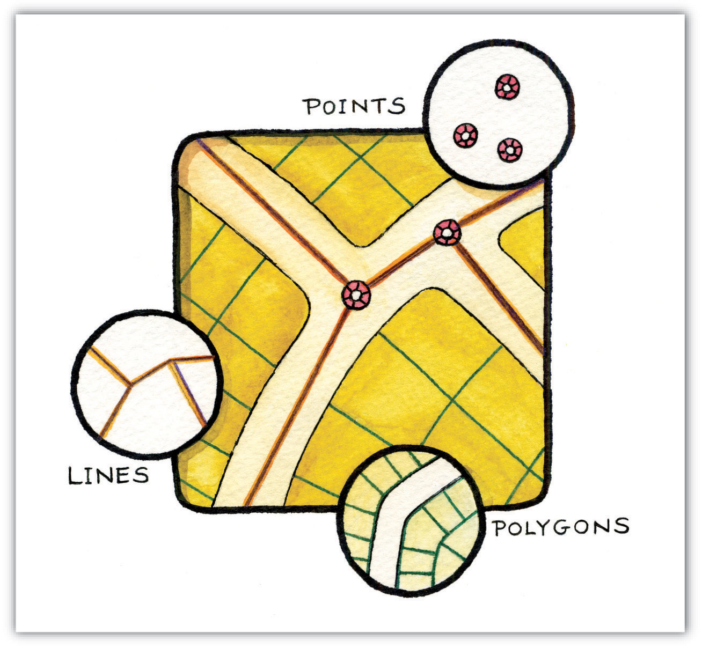{style="height: 500px;"}
:::
:::

:::
:::

::: {.fragment .fade-in-then-out}
::: {.columns}

::: {.column width = "40%"}
::: {style="font-size:0.7em"}
+ Often stored as tabular data files with geographic metadata
+ Points, lines, and polygons represent the spatial features
+ Topology describes the connectivity, area definition, and contiguity of interrelated points, lines, and polygon
:::
:::

::: {.column width = "50%"}
::: {.figure style="text-align: right; margin: 0 auto;"}
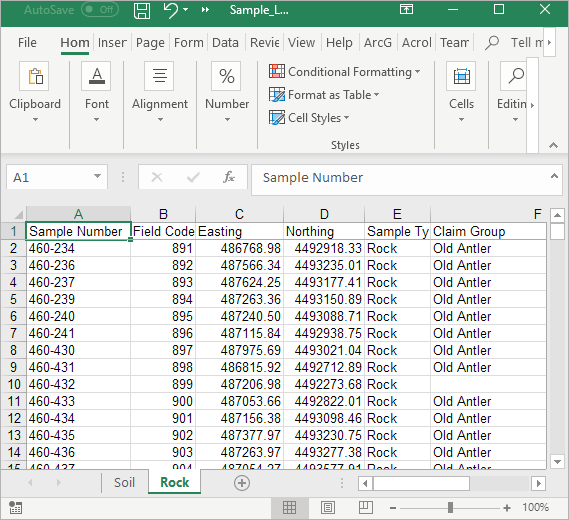{style="height: 500px;"}
:::
:::

:::
:::

::: {.fragment .fade-in-then-out}
::: {.columns}

::: {.column width = "40%"}

**Points**

::: {style="font-size:0.7em"}
+ Zero-dimensional objects containing a **single coordinate pair.**
  + Ex: Lat, Lon (sometimes elevation) coordinates denoting a city, building, address, etc
+ X,Y (,Z) coordinates on a Cartesian plane (or Euclidean space)

:::

:::

::: {.column width = "50%"}
::: {.figure style="text-align: right; margin: 0 auto;"}
{style="height: 500px;"}
:::
:::

:::
:::

::: {.fragment .fade-in-then-out}
::: {.columns}

::: {.column width = "40%"}

**Lines**

::: {style="font-size:0.7em"}
+ One-dimensional objects composed of multiple, explicitly connected points. 
+ Lines have the property of length. 
+ Also called an “arc.”
:::

:::

::: {.column width = "50%"}
::: {.figure style="text-align: right; margin: 0 auto;"}
{style="height: 500px;"}
:::
:::

:::
:::

::: {.fragment .fade-in}
::: {.columns}

::: {.column width = "40%"}

**Polygons**

::: {style="font-size:0.7em"}
+ Two-dimensional features created by multiple lines to create a “closed” feature. 
+ First point on the first line segment is the same as the last point on the last line.
+ Can represent city boundaries, buildings, lakes, soils, etc. 
+ Have the properties of area and perimeter. 
:::
:::

::: {.column width = "50%"}
::: {.figure style="text-align: right; margin: 0 auto;"}
{style="height: 500px;"}
:::
:::

:::
:::
:::

## Structuring Vector Data

::: {.r-stack}
::: {.fragment .fade-in-then-out}

+ There are several ways to define relationships between vector data:
  + Feature based: The **“Spaghetti Model”**

    ::: {style="font-size:0.8em"}
    + Each feature is a long string of coordinates
    + No relationships between features
    :::

  + Structured: The **“Topological Model”**

    ::: {style="font-size:0.8em"} 
    + Enforced relationships between features
    :::

:::

::: {.fragment .fade-in}

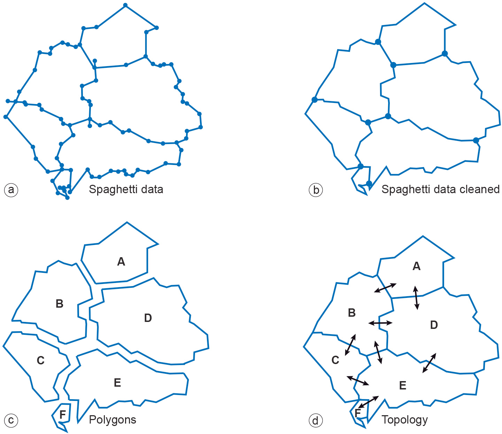{style="height: 600px;"}

:::
:::

## Some Common Vector File Formats {style="font-size:0.4em"}

| Format | File Extension | Stores Topology | Binary / Human Readable | Notes |
|--------|---------------|-----------------|------------------------|-------|
| Shapefile | .shp (+ .shx, .dbf, .prj) | No | Binary | Common, but aging |
| GeoJSON | .geojson, .json | No | Human Readable | Web-friendly, text-based |
| GeoPackage | .gpkg | No | Binary | Modern SQLite-based format |
| KML/KMZ | .kml, .kmz | No | Human Readable (.kml) / Binary (.kmz) | Google Earth format |
| TopoJSON | .topojson | Yes | Human Readable | json, Encodes topology |
| PostGIS | (database) | Yes (optional) | Binary | PostgreSQL spatial extension |
| File Geodatabase | .gdb | Yes (optional) | Binary | ESRI proprietary format, annoying to use in other software |
| GeoParquet | .parquet | No | Binary | Column-oriented, efficient |

## How to open gdb in QGIS {.smaller}
1. Download  3D Hydrography Program data for the CONUS

    [gdb](https://prd-tnm.s3.amazonaws.com/StagedProducts/Hydrography/3DHP/Annual/GDB/3dhp_all_GDB_FY25_CONUS_20250313/3dhp_all_CONUS_20250313_GDB.zip)   
    [metadata](https://thor-f5.er.usgs.gov/ngtoc/metadata/waf/hydrography/3dhp/annual/3dhp_all_CONUS_20250313_GDB.xml)(Optional)

2.  Unzip the zip. (Unless you plan to use it later, you can just unzip it into the Downloads folder where the zip sits)

3. Press `ctrl-shift-v` (`cmd-shift-v` on Mac)  
    a. At the top, under "source type", check the directory box.  
    b. Browse for and select `3dhp_all_CONUS_20250313_GDB.gdb` where you unzipped it.
    c. Click Add

## Discussion

::: {.incremental}
::: {style="font-size:0.7em"}
+ What vector type (point, line, or polygon) best represents the following features: 

  ::: {.incremental}
  ::: {style="font-size:0.8em"}
  + state boundaries, 
  + telephone poles, 
  + buildings, 
  + cities, 
  + stream networks, 
  + mountain peaks, 
  + soil types,
  + flight tracks?
  :::
  :::

+ Which of these features can be represented by multiple vector types? 
+ What conditions might lead you choose one vector type over another?

:::
:::

## Raster Data

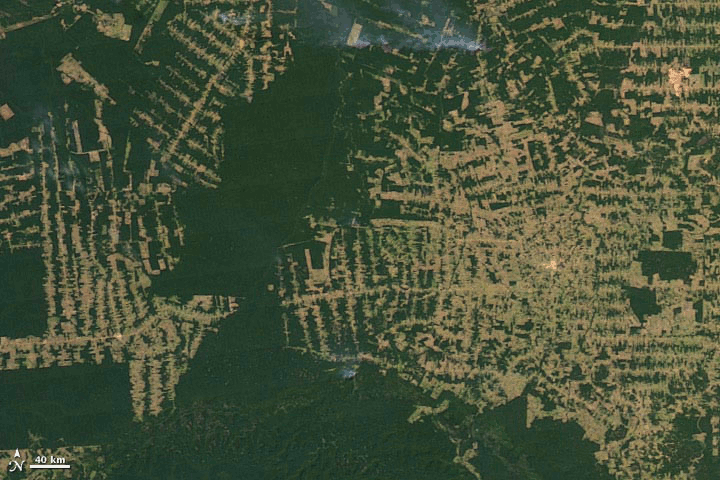

## Raster Data

::: {.r-stack}

::: {.fragment .fade-in-then-out}
::: {.columns}

::: {.column width = "40%"}
::: {style="font-size:0.7em"}
+ Images, stacks of images (satellite / drone image)
  + _Rastrum_, Latin meaning “scraper” --> _Raster_, German meaning "screen"
+ Grids of numbers
+ Things with pixels! 

:::
:::

::: {.column width = "50%"}

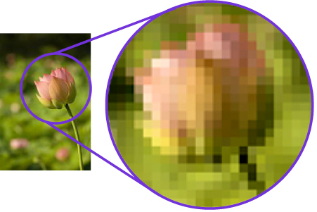{width=600px}

:::

:::
:::

::: {.fragment .fade-in-then-out}
::: {.columns}

::: {.column width = "40%"}
::: {style="font-size:0.7em"}
+ Images, stacks of images (satellite / drone image)
  + _Rastrum_, Latin meaning “scraper” --> _Raster_, German meaning "screen"
+ Grids of numbers
+ Things with pixels! 

:::
:::

::: {.column width = "50%"}

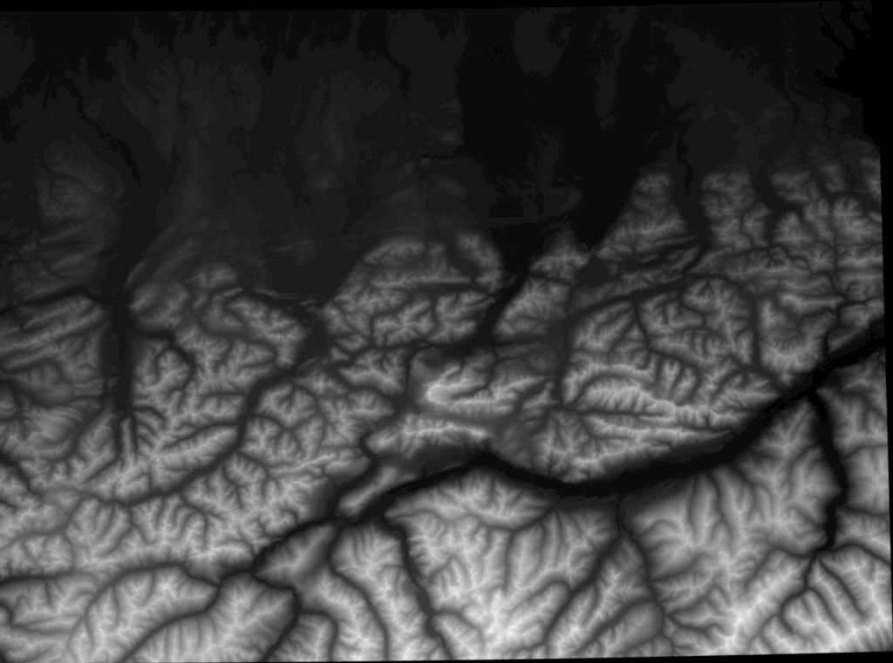{width=600px}

:::

:::
:::

::: {.fragment .fade-in}
::: {.columns}

::: {.column width = "40%"}
::: {style="font-size:0.7em"}
+ The **spatial resolution** of a raster dataset represents a measure of the precision or detail of the displayed information.
  + a.k.a. pixel size
  + Ex: 1mm, 1cm, or 1m
+ So when you hear that a camera has N megapixels - this just means it has many millions of pixels 

:::
:::

::: {.column width = "50%"}
::: {.figure style="fig-align: center;"}
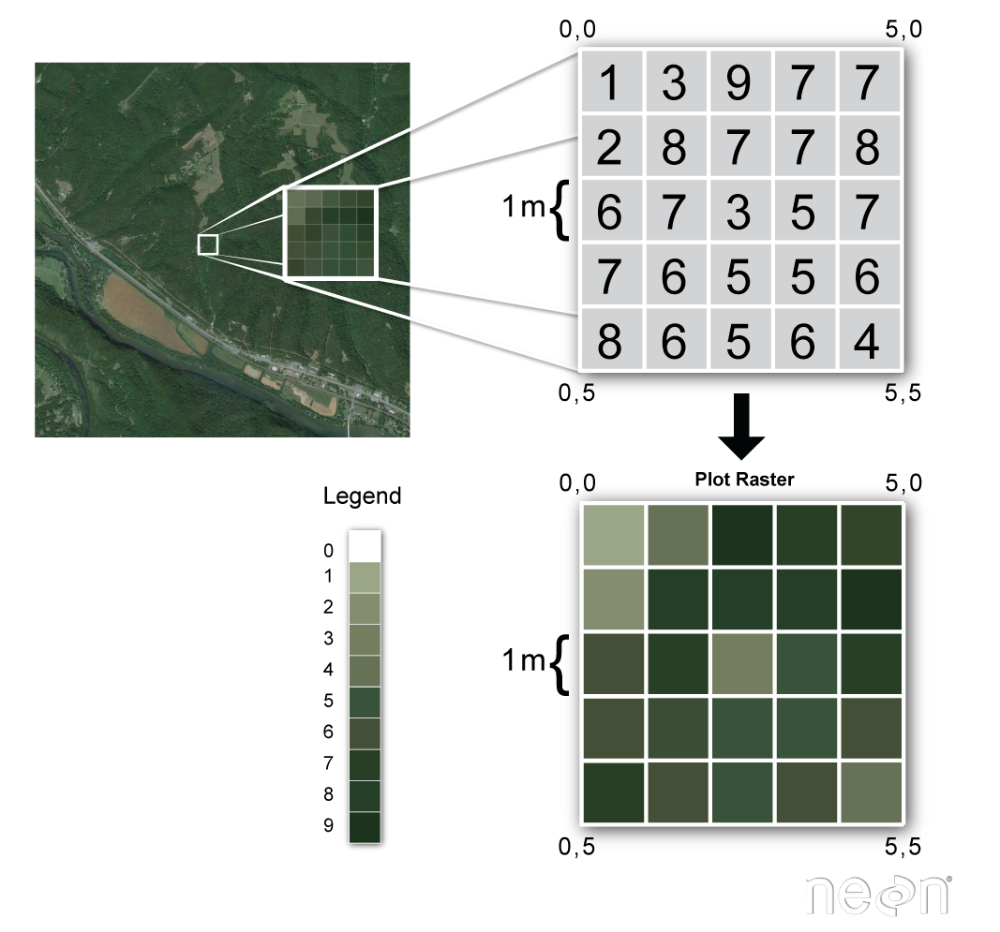{style="background-color:white;"}
:::
:::

:::
:::

:::

## Spatial Resolution

::: {.r-stack}
::: {.fragment .fade-in-then-out}

::: {style="font-size:0.7em"}
The **spatial resolution** of a raster dataset represents a measure of the precision or detail of the displayed information.
:::

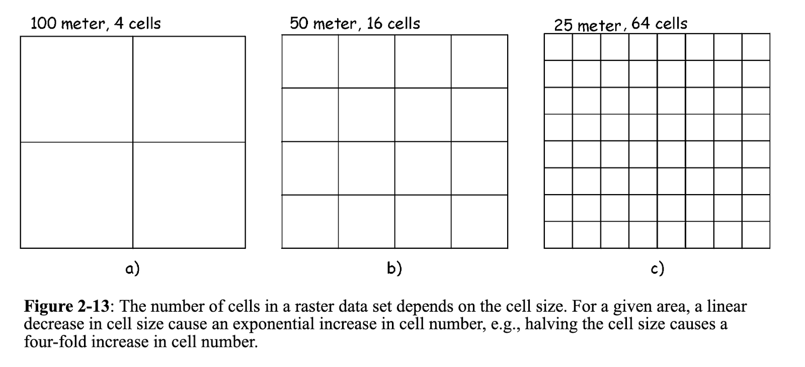{fig-align="center"}

:::

::: {.fragment .fade-in}

::: {style="font-size:0.7em"}
The **spatial resolution** of a raster dataset represents a measure of the precision or detail of the displayed information.
:::

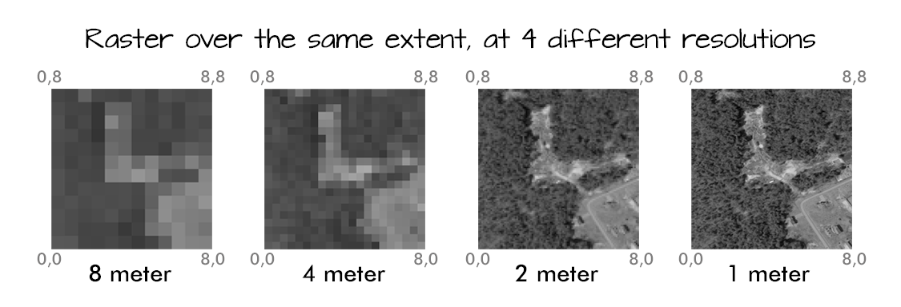{fig-align="center"}

:::
:::

## 

## Stop here, below is incomplete

## Spectral Resolution

::: {.r-stack}
::: {.fragment .fade-in-then-out}
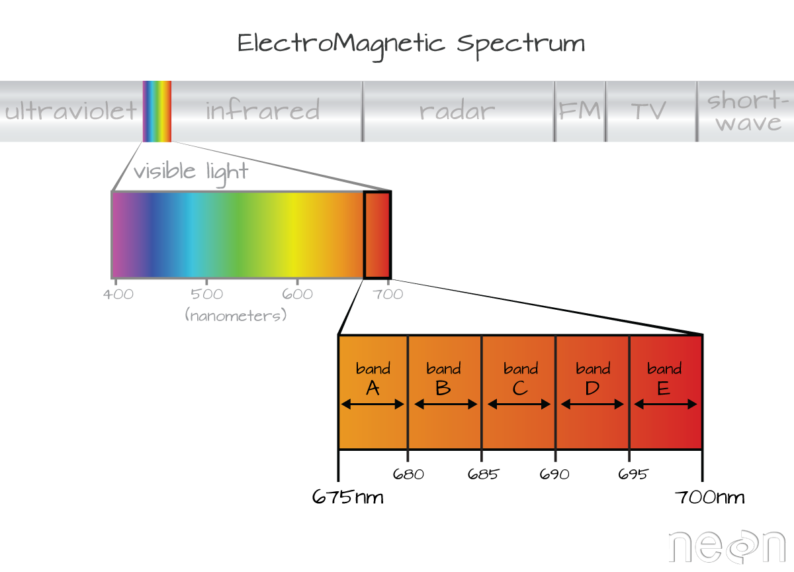

::: {.attribution style="font-size:0.4em"}
Image Source: [Neon](https://www.neonscience.org/resources/learning-hub/tutorials/hyper-spec-intro)
:::
:::

::: {.fragment .fade-in-then-out}
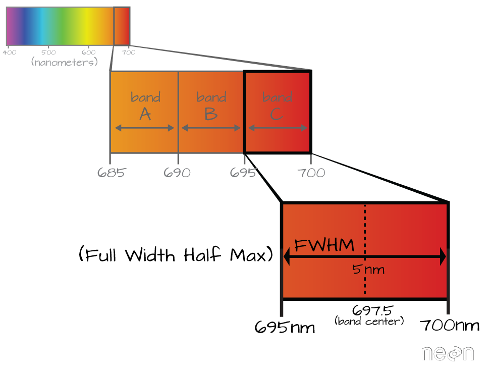

::: {.attribution style="font-size:0.4em"}
Image Source: [Neon](https://www.neonscience.org/resources/learning-hub/tutorials/hyper-spec-intro)
:::
:::

::: {.fragment .fade-in-then-out}

::: {.attribution style="font-size:0.4em"}
Image Source: [Neon](https://www.neonscience.org/resources/learning-hub/tutorials/hyper-spec-intro)
:::
:::

::: {.fragment .fade-in-then-out}
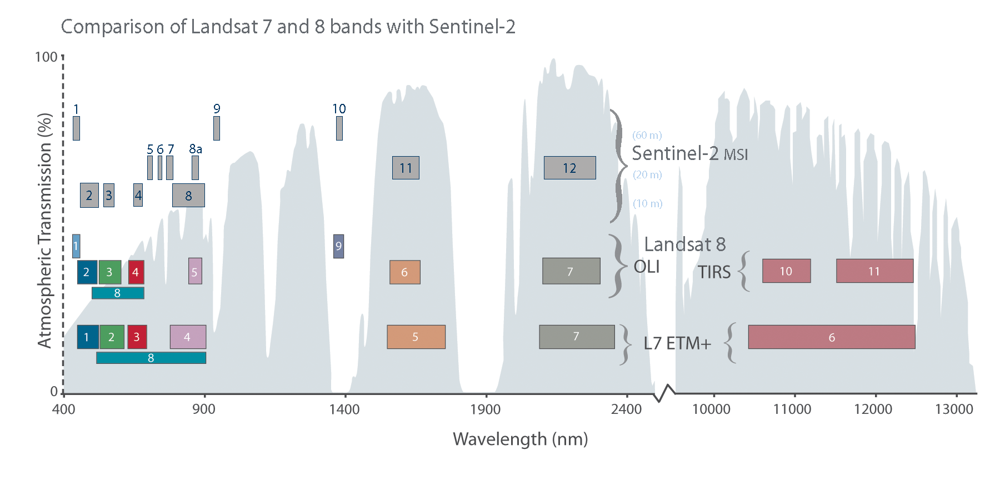

::: {.attribution style="font-size:0.4em"}
Image Source: [NASA](https://landsat.gsfc.nasa.gov/article/sentinel-2a-launches-our-compliments-our-complements/)
:::
:::

::: {.fragment .fade-in-then-out}
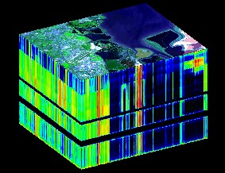{style="width: 70%; max-width: 95%; max-height: 70vh;"}

::: {.attribution style="font-size:0.4em"}
Image Source: University of Texas at Austin, Center for Space Research via [ESA](https://www.esa.int/ESA_Multimedia/Images/2014/04/Hyperspectral_image_data_cube)
:::
:::

:::
