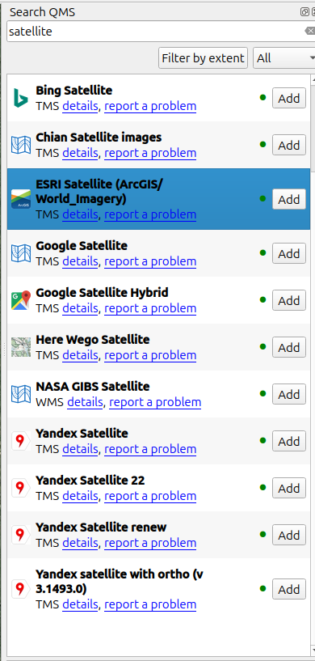

# Data Creation, Editing, and Topology

## Goals {.smaller}

By the end of this exercise, you should be able to:

+ Add a basemap with QuickMapServices (which, you should already be a ble to do)
+ Digitize features from imagery
+ Add and edit attribute values
+ Use snapping to prevent topology errors
+ Create new line and polygon layers in a GeoPackage
+ Find and fix undershoots and overshoots in a line layer

## Data

Download the [Cal Poly stream network GeoPackage](https://github.com/kulpojke/nr218/raw/refs/heads/main/assets/cal_poly_stream_network.gpkg).

::: {style="font-size:0.7em"}
Save it somewhere stable, such as your course data folder. This GeoPackage already contains:

+ `campus_boundary`: the Cal Poly campus boundary
+ `stream_network`: NHD stream lines clipped to campus, with two intentional topology errors
:::

## About GeoPackages (`.gpkg`) {.smaller}

+ A GeoPackage is a single-file spatial database.
+ It can store multiple layers in one file.
+ It can store points, lines, polygons, rasters, and non-spatial tables.
+ It preserves coordinate reference system information.
+ It supports longer field names than shapefiles.
+ It is easier to move and submit than a folder full of shapefile sidecar files.
+ QGIS can create, edit, and save directly to GeoPackages.

## Exercise Overview {.smaller}

Today you will build a small campus editing dataset:

1. Open `cal_poly_stream_network.gpkg`
2. Add satellite imagery with QuickMapServices
3. Digitize five buildings as polygons
4. Digitize walking paths between those buildings as lines
5. Edit attributes for each new feature
6. Save the new layers into the same GeoPackage
7. Find and fix topology errors in `stream_network`

## Step 1: Open the GeoPackage {.smaller}

1. Open QGIS.
2. Drag `cal_poly_stream_network.gpkg` into the QGIS map window.
3. Add both layers:
   + `campus_boundary`
   + `stream_network`
4. Set the project CRS to `EPSG:26910`.

::: {style="font-size:0.6em"}
`EPSG:26910` is NAD83 / UTM zone 10N, a projected coordinate system with meter units.
:::

## Step 2: Add Satellite Imagery {.columns}

::: {.column width="50%"}
::: {style="font-size:0.55em"}
1. Click _Plugins_ --> _Manage and Install Plugins_.
2. Search for _QuickMapServices_.
3. Install the plugin if needed.
4. Use the _Search QMS_ bar to search for satellite imagery.
5. Add an imagery layer such as ESRI Satellite or Bing Satellite.
6. Zoom to the campus boundary.
:::
:::

::: {.column width="50%"}
{height="550px"}
:::

## Step 3: Turn on Snapping {.smaller}

Before digitizing:

1. Open _Project_ --> _Snapping Options_.
2. Turn snapping on.
3. Set snapping to:
   + `All layers`
   + `Vertex and segment`
   + tolerance around `10 px`
4. Turn on topological editing if available.

::: {style="font-size:0.7em"}
Snapping helps line endpoints and polygon boundaries connect exactly, not just visually.
:::

## Step 4: Create a Buildings Layer {.smaller}

Create a new layer inside `cal_poly_stream_network.gpkg`.

1. Go to _Layer_ --> _Create Layer_ --> _New GeoPackage Layer_.
2. For _Database_, browse to `cal_poly_stream_network.gpkg`.
3. Set _Table name_ to `buildings`.
4. Set _Geometry type_ to `Polygon`.
5. Set CRS to `EPSG:26910`.
6. Add fields:

| Field name | Type | Example |
|---|---|---|
| `bldg_name` | Text | Library |
| `bldg_use` | Text | academic |
| `stories` | Whole number | 3 |

## Step 5: Digitize 5 Buildings {.smaller}

1. Select the `buildings` layer.
2. Toggle editing on.
3. Use _Add Polygon Feature_.
4. Trace five building footprints from the satellite imagery.
5. Fill in attributes for each building.
6. Save edits.

::: {style="font-size:0.7em"}
Choose buildings that are close enough to connect with walking paths in the next step.
:::

## Step 6: Create a Walking Paths Layer {.smaller}

Create another new layer inside the same GeoPackage.

1. Go to _Layer_ --> _Create Layer_ --> _New GeoPackage Layer_.
2. Use `cal_poly_stream_network.gpkg` as the database.
3. Set _Table name_ to `walking_paths`.
4. Set _Geometry type_ to `Line`.
5. Set CRS to `EPSG:26910`.
6. Add fields:

| Field name | Type | Example |
|---|---|---|
| `path_name` | Text | path_01 |
| `surface` | Text | concrete |
| `accessible` | Text | yes |

## Step 7: Digitize Walking Paths {.smaller}

1. Select `walking_paths`.
2. Toggle editing on.
3. Use _Add Line Feature_.
4. Digitize walking paths connecting your five buildings.
5. Snap path endpoints to building edges or nearby path vertices.
6. Add attribute values for each path.
7. Save edits.

::: {style="font-size:0.7em"}
Try to create a connected mini-network rather than five unrelated line segments.
:::

## Step 8: Attribute Editing Check {.smaller}

Open the attribute tables for `buildings` and `walking_paths`.

Check that:

+ Every feature has attribute values.
+ `stories` contains numbers, not text.
+ `surface` uses consistent categories.
+ `accessible` uses consistent values, such as `yes` and `no`.

Then edit at least two attribute values using the attribute table.

## Step 9: Confirm Everything Is in the GeoPackage {.smaller}

In the Browser panel, expand `cal_poly_stream_network.gpkg`.

You should now see:

+ `campus_boundary`
+ `stream_network`
+ `buildings`
+ `walking_paths`

::: {style="font-size:0.7em"}
The goal is one portable file containing the original data plus the layers you created.
:::

## Step 10: Find Stream Topology Errors {.smaller}

The `stream_network` layer contains intentional line topology errors:

+ one undershoot
+ one overshoot

Use:

+ snapping
+ vertex editing
+ the Topology Checker plugin
+ visual inspection at stream junctions

to find the bad endpoints.

::: {style="font-size:0.65em"}
Some real stream endpoints occur at headwaters or where streams leave the campus boundary. The errors you are looking for are near stream junctions.
:::

## Topology Checker Setup {.smaller}

1. Click _Plugins_ --> _Manage and Install Plugins_.
2. Search for _Topology Checker_.
3. Enable it if needed.
4. Open the Topology Checker panel: 
5. Click the configure button: 
6. Add a rule for `stream_network`:
   + `must not have dangles`
7. Click _Validate All_: 

## Fix the Stream Network {.smaller}

Use the Vertex Tool to repair the errors.

+ For the undershoot: move the dangling endpoint until it snaps to the junction.
+ For the overshoot: move or delete the extra endpoint so the line ends at the junction.
+ Save edits after fixing each error.
+ Run Topology Checker again.

::: {style="font-size:0.7em"}
The goal is not just to make the map look right. The stream endpoints should actually connect.
:::

## Deliverable {.smaller}

Submit your edited `cal_poly_stream_network.gpkg`.

It should contain:

+ `campus_boundary`
+ `stream_network` with fixed topology
+ `buildings` with five digitized polygons
+ `walking_paths` connecting the buildings

Also submit brief answers:

1. What topology errors did you find?
2. Which editing tools did you use to fix them?
3. Why can two lines that look connected still fail a topology check?
