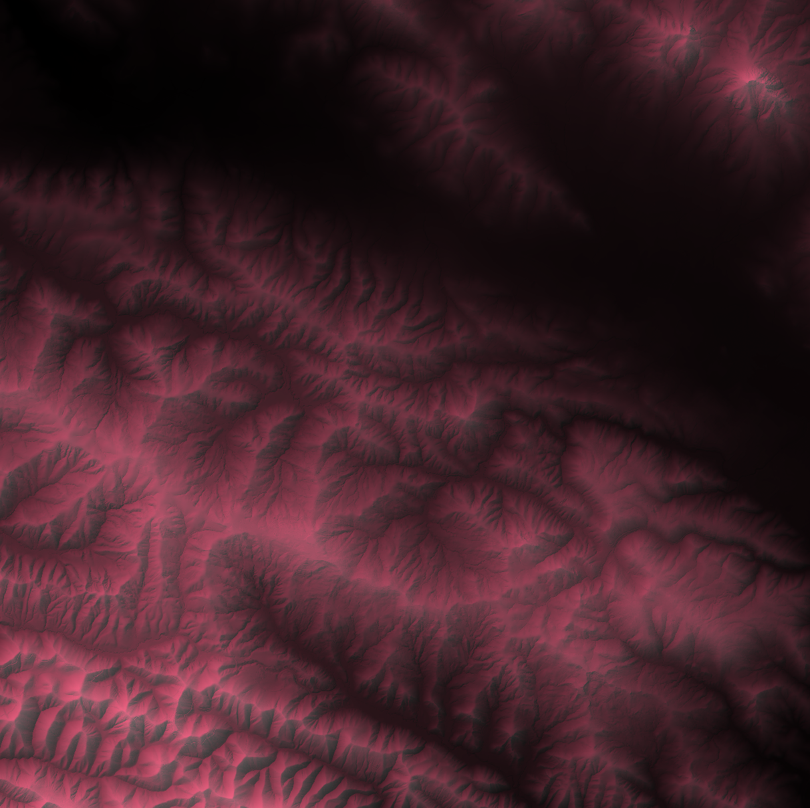
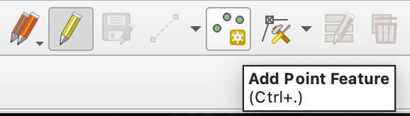

# Stop here for today!
```
### Combining DEM Visualizations

You should have two new layers on your map. We can now combine all of our DEM layers together to create an aesthetically pleasing map.

1. Open up the Symbology window for our original DEM and change the Render Type to `Singleband pseudocolor`. Choose any of the color ramps from the dropdown.
2. Make sure your hillshade layer is the second layer in the stack. In the Symbology window, change the `blending mode` to `multiply`. Locate the Transparency tab (one below Symbology), and adjust the layer opacity to your liking.
3. Make sure your contour layer is the topmost layer. Go to the Symbology window and adjust the color and thickness of your lines to your liking.


__Another Option: Red Relief__

Alternatively, we can combine our DEM and hillshade layers to create the red relief visualization that we talked about in lecture.

1. Change the render type of the original DEM back to `singleband gray`.
2. Change the render type of the hillshade layer to `singleband pseudocolor`.
3. Under the color ramp dropdown, choose `Create new color ramp`. Set the first color to black, and choose a shade of red for the second.
4. Go back to the transparency tab and adjust the opacity to your liking.

{#fig-dem_red fig-alt="Image showing a DEM with hillshade render changed to a red gradient" fig-cap="Base DEM with Red Relief Hillshade. Contour lines removed."}

Nice! Something like this can be a great base for displaying other data layers (foreshadowing).


## Task 3: Extracting Information from DEMs

There are many uses for DEMs beyond elevation, and many tools that we can use to extract additional information from them!

For the rest of this exercise, you'll need to download [this zip file](https://github.com/kulpojke/nr218/blob/main/assets/spr_lab_8.zip "Follow the link and click download raw file button on upper left")(Open the link in a new tab and click "download raw file" button on upper right). Unzip the file and move the newly generated folder to `data`.

Add all of the files in the unzipped folder to your project in QGIS. You can remove the DEM layers used above .

::: {#tip-spr_prep .callout-tip}
## Layer Preparation

Take a quick look through the layers from the folder. What types of data are we dealing with? Are they all in the same CRS? If not, we should take a moment to reproject.

:::

### Slope and Aspect

`Slope` tells us how steep the terrain is (in degrees or percent change from horizontal). `Aspect` tells us which compass direction each slope of the terrain faces.

We can generate layers for slope and aspect similarly to how we created our hillshade and contour layers. For slope, go to Raster > Analysis > Slope. Make sure your input layer is `spr_DEM`, and keep all other parameters at their default. Save the output to a file, like we did above, and hit `Run`. Do the same for aspect (Raster > Analysis > Aspect).

Examine the outputs of each analysis tool. What might you use a map of slope for? What about aspect?

__Write down your thoughts and add screenshots of your slope and aspect layers to your submission doc.__

::: {#tip-terrain_analysis .callout-tip}
## Terrain Analysis

Together with hillshade and contours, slope and aspect are often categorized as `terrain analysis`. We can generate other layers of information in a similar way, such as `topographic position index (TPI)`, which classifies each pixel in relation to the altitude of its neighboring cells. Other terrain indices you might encounter include the `topographic wetness index (TWI)` and `topographic ruggedness index (TRI)`.

:::


## Sampling Raster Values

We can do this using a tool called `Sample Raster Values`. First, we'll need to add some points to our map.

1. Go to Layer > Create Layer > New Temporary Scratch Layer
2. Name the layer something useful, change the geometry type to to point, and make sure the CRS is 26910. Hit `Ok`.
3. Editing should be toggled on by default, but if it's not, click on the pencil icon. Then select `add point feature` and add ~4 points to the map (click on the map to add a point). Make sure they are on areas of overlap between both DEMs, and try to cover different levels of elevation (lighter/darker gray).

{#fig-feature_icon}

4. Once you're satisfied with your points, hit the save icon (next to the pencil) and toggle editing off.

Now let's check out the `sample raster values` tool using our 1 meter DEM.

1. In the processing tools window, search for `sample raster values`.
2. Select our newly created point layer as the input, and our DEM_1_meter as the raster layer.
3. If you'd like, change the `output column prefix` to something more informative. Then hit `Run`.

Examine the output of the tool. What did it do? Before we move on, rename the output layer (called `Sampled` by default) to something more useful.

Now run the same steps as above, but use the output layer as your input and the 30 meter DEM as your raster. You should now have a new point layer that includes the elevation attributes from both DEMs. Open the attribute table and look at the values - why do you think the values are different? Are there certain areas where they're closer than other areas? Why might that be?

__Take a screenshot of your final attribute table and add it to your submission doc.__

Now let's talk about visualizing elevation. By default, the numerical values of each pixel in a DEM are symbolized on a scale of black and white, also known as `Singleband gray`. In this state it's pretty difficult to gain any information from the image, so let's change it to something more useful.

## Task 4: Putting It All Together

Oh no! Hydrologists at Swanton Pacific Ranch have lost track of all of their rain gauges! Luckily, we have the point layer open in QGIS right now. Since we have it open, they've asked for our help identifying one specific rain gauge. The rain gauge they're looking for is:

- On a slope that's facing Northwest
- Above 200 meters of elevation
- On a relatively flat area (less than 5 degrees of steepness)

> Note! the pixel values for the Swanton Pacific Ranch DEM are in meters.

Using the layers that you've created, and the tools we've practiced with in this lab (OR tools that we've used in past labs... hint hint...), identify which rain gauge the team is looking for.

__Once you have your answer, note which rain gauge the hydrologists are looking for, what the associated values are for slope, aspect, and elevation, and explain how you reached your conclusion on your submission doc.__

### Bonus: Exporting a Map

Great! Now that we've found the rain gauge, the hydrologists need a way to navigate to it. Let's make them a couple maps to use as a reference. First, we'll make a `GeoPDF`, or a georeferenced PDF.

__Exporting a GeoPDF__

Re-run the steps above to generate hillshade and contour layers for the SPR DEM. You can either do this using the Symbology tab, or generate two new layers. Once you have a map image that you're satisfied with, go to `Project > Import/Export > Export Map to PDF`.

In the popup window, you can leave everything at its default, but make sure to check the box next to `Create Geospatial PDF`. Hit Save, and then navigate to your `lab_8/docs` folder and choose an appropriate name for the file.

Let's take a look at what we just exported! Locate the file on your computer and open it in Adobe or a similar PDF viewer. Look for a `Layers` icon, and see what you can do - you should be able to toggle the map layers on and off. Pretty cool!

::: {#tip-avenza .callout-tip}
## Using a GeoPDF in the Field

If you have the app `Avenza` on your phone, or something similar, you can import GeoPDFs from QGIS and use them as your base map! In this case, someone could in theory travel to Swanton and use the PDF we just exported to locate the missing rain gauge.

:::

__Exporting a Print Layout__

It's good practice for us to also export the map as a flattened PDF.

1. Create a new map layout by clicking the `New Print Layout` icon or hitting `Ctrl/Cmd + P`. Name it something useful.

::: {#tip-grids .callout-tip}
## Using Guidelines for Easier Map Making

When setting up a map layout, we can make our lives easier by putting down guide lines for map items to automatically snap to. Let's try it now - select the `Guides` tab on the right panel and add some horizontal and vertical lines. You can click on the side rulers, or manually type in the values that you'd like your lines to appear at.

:::

2. Now add a new map to the layout (Add Item > Add Map or click the Add Map Icon on the left side panel). Adjust the map to your liking by selecting `Move Item Contents` or hitting the `C` key. You can also manually set the scale of the map in the Item Properties window. Do that now, and change it to a round number large enough to view the entire extent of the layers.
3. Next we'll add a legend. Once you've created one, go to the Item Properties tab on the right and do some clean-up. Remember we can adjust which layers are included in our legend by un-checking `Auto-update`, and then removing unwanted entries. We can also rename the entries we _are_ keeping by double clicking on their names.
4. Next let's add a scale bar. Play around with the number and width of each segments - you want to end up with a value that will be informative to your viewers. Place a second scale bar next to the first, and change the `Style` to `Numeric`. What does this number mean? Think back to step 1 - why is it helpful to set the scale to be a round number?
5. Lastly, add a map title.
6. Click the `Export as PDF` icon, or go to Layout > Export as PDF.
7. Save your pdf in your `lab_8/docs` folder, and name it something useful.
8. In this case, you can leave all of the parameters as-is and just hit save.

__Use `tree` to show the directory structure for the project so far.  Include it in your submission doc.__

__Upload your final map in addition to your submission doc.__
```