# Scale, Coordinate systems, and Map Projections

## Map Conventions

Mapping conventions facilitate effective conveyance of information.  In most cases using them is a good idea ([but not necessarily always](https://www.storybench.org/mapbreaking-why-cartographic-flaws-can-sometimes-be-a-good-thing/))

:::: {.columns}
::: {.column width="30%"}
::: {.figure style="text-align: center; margin: 0 auto;"}
  

::: {.figure-caption style="font-size: 0.4em; color: #888;"}
[The Blue Marble photograph](https://en.wikipedia.org/wiki/The_Blue_Marble) in its original orientation.
:::
:::
:::

::: {.column width="70%"}
::: {.figure style="text-align: center; margin: 0 auto;"}
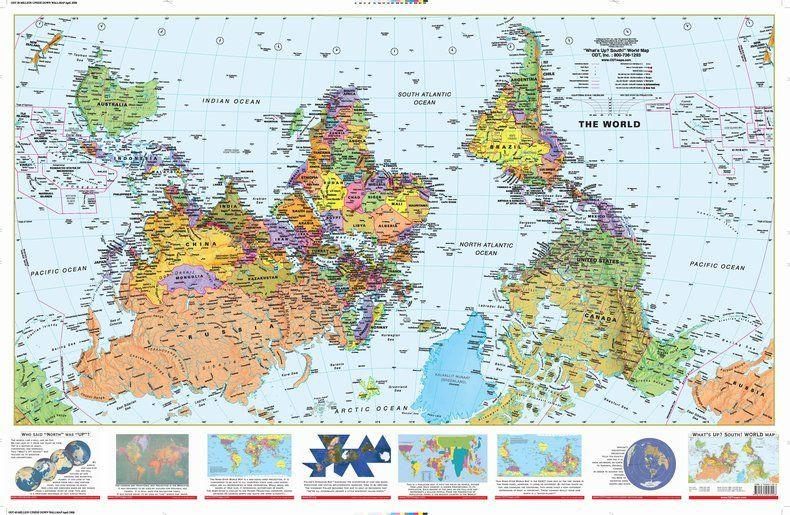{style="height: 250px;"}

::: {.figure-caption style="font-size: 0.4em; color: #888;"}
South's up!  
:::
:::
:::

::::

## Map Scale {style="font-size:0.5em"}
The factor of reduction of the world so it fits on a map  

::: {.incremental}
  + You need to shrink things to make a map
  + On reference maps it is generally important to include scale  
  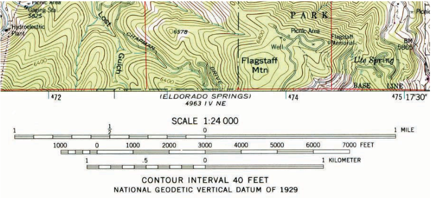{style="height: 175px;"}
  + Representative fraction (RF) describes scale as a simple ratio 
    

    + The numerator, which is always unity (i.e., 1), denotes map distance.  
    The denominator denotes ground or “real-world” distance.
    + unit neutral
    + Large vs small, 1:1,000 > 1:1,000,000
    + Large shows more detail
:::

## Map Scale {style="font-size:0.5em"}

::: {.figure style="text-align: center; margin: 0 auto;"}
  {style="height: 400px;"}
:::

::: {.incremental}
+ 

  
Scale Bars
+ 

  
On contour maps, contour interval is also included
:::

## Coordinate systems {.smaller}

+ Frameworks that are used to define unique positions
+ A ___geographic coordinate system___ (GCS) is  for defining locations on three dimensional models of  Earth
  + GCS is based on a sphere or spheroid (a.k.a. ellipsoid)
  + GCS units are degrees
    + Latitude $\in 0^\circ, 90^\circ$ (or $-90^\circ, 90^\circ$)
    + Longitude $\in 0^\circ, 180^\circ$ (or $-180^\circ, 180^\circ$)
+  A projected coordinate system is used on a flat map and uses units of length (e.g. meters) 

## DMS to DD conversion {.smaller .columns}
 Degrees can be written in degrees-minutes-seconds (DMS) or in decimal
degrees (DD).  

::: {.column width="40%"}

::: {r-stack}
::: {.fragment .absolute .fade-in-then-out data-fragment-index=1 style="text-align: center; font-size:1.2em"}
128° 40' 52.0428" W
:::

::: {.fragment .absolute .fade-in-then-out data-fragment-index=2 style="text-align: center; font-size:1.2em"}
128° 40' 52.0428" W
:::

::: {.fragment .absolute .fade-in-then-out data-fragment-index=3 style="text-align: center; font-size:1.2em"}
128°  40' 52.0428" W
:::

::: {.fragment .absolute  .fade-in-then-out data-fragment-index=4 style="text-align: center; font-size:1.2em"}
128° 40'  52.0428" W
:::

::: {.fragment .absolute  .fade-in-then-out data-fragment-index=5 style="text-align: center; font-size:1.2em"}
128° 40' 52.0428" W
:::

::: {.fragment .absolute .fade-in-then-out data-fragment-index=6 style="text-align: center; font-size:1.2em"}
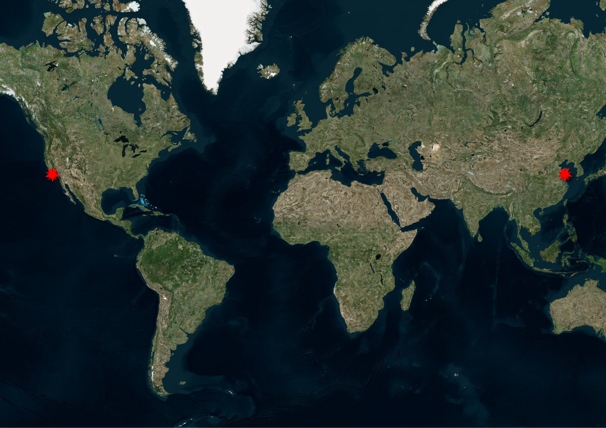
:::

:::

:::

::: {.column width="60%"}

::: {r-stack}
::: {.fragment .absolute .fade-in-then-out data-fragment-index=2 style="text-align: center; font-size:1.2em"}
128
:::

::: {.fragment .absolute .fade-in-then-out data-fragment-index=3 style="text-align: center; font-size:1.2em"}
128  + (40 / 60)
:::

::: {.fragment .absolute .fade-in-then-out data-fragment-index=4 style="text-align: center; font-size:1.2em"}
128  + (40 / 60) + ( 52.0428 / 60$^{2}$ )
:::

::: {.fragment .absolute .fade-in-then-out data-fragment-index=5 style="text-align: center; font-size:1.2em"}
-128.68112299
:::

:::
:::

::: {.fragment  .fade-in-then-out data-fragment-index=6 style="text-align: center; font-size:1.5em"}
The negative is important! SLO vs. off the coast of Shandong
:::

## Spheroids / Ellipsoids {.columns .smaller style="font-size:0.6em"}

::: {.column width="45%"}

To define a geographic coordinate system, one must decide on a reasonable geometric shape for the Earth.

The shape of Earth is approximated using a _spheroid_ (also called an ellipsoid of revolution).

::: {.fragment .fade-in data-fragment-index=1}
A geographic coordinate system (GCS) uses the spheroid as its reference surface.
:::

::: {.fragment .fade-in data-fragment-index=1}
Latitude and longitude form an angular grid on that model of the Earth.
:::

:::

::: {.column width="55%"}
::: {.r-stack}

::: {.fragment .fade-out data-fragment-index=1}
{style="width: 300px; height: auto;"}
:::

::: {.fragment .fade-in-fade-out data-fragment-index=1}
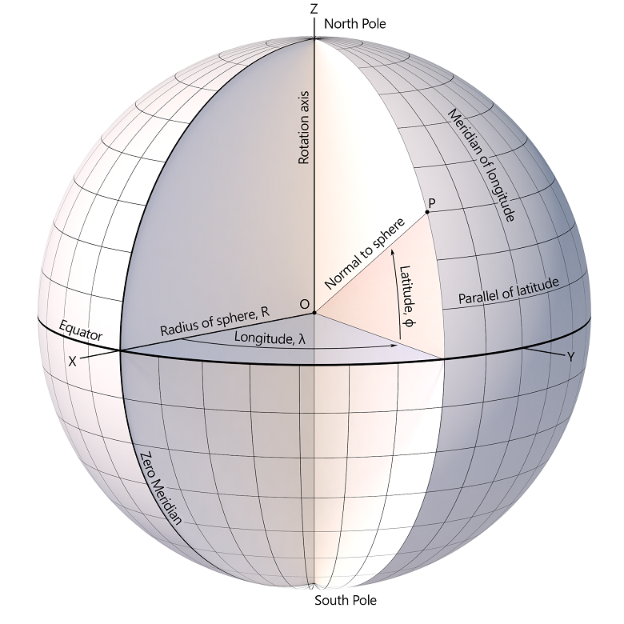{style="width: 360px; height: auto;"}

::: {.attribution style="font-size:0.4em"}
Image Source: [UCGIS GIS&T Body of Knowledge](https://gistbok-topics.ucgis.org/DM-05-047)
:::
:::

::: {.fragment .fade-in data-fragment-index=2}
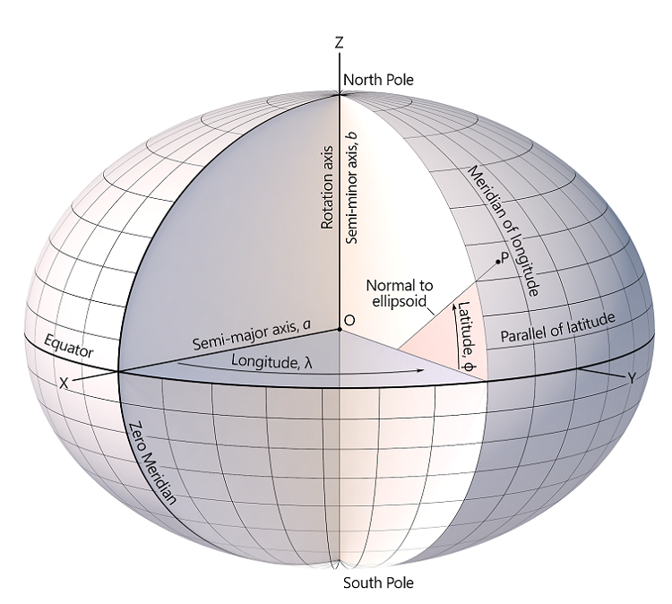{style="width: 360px; height: auto;"}

::: {.attribution style="font-size:0.4em"}
Image Source: [UCGIS GIS&T Body of Knowledge](https://gistbok-topics.ucgis.org/DM-05-047)
:::
:::

:::
:::

## Geoids {.columns .smaller style="font-size:0.6em"}

::: {.column width="52%"}

::: {.fragment .fade-in data-fragment-index=1}
A __geoid__ is an approximation of the true shape of the Earth.
:::

::: {.fragment .fade-in data-fragment-index=2}
+ Defined by Earth's gravitational field rather than its topography [^2]
:::

::: {.fragment .fade-in data-fragment-index=3}
+ Gravitational fields are described using equipotential surfaces
:::

::: {.fragment .fade-in data-fragment-index=4}
+ _The_ geoid is the equipotential surface that best approximates mean sea level (MSL) globally
:::

::: {.fragment .fade-in data-fragment-index=5}
+ MSL diverges from the geoid by up to 2 m in places
:::

:::

::: {.column width="48%"}
::: {.r-stack}

::: {.fragment .fade-in-then-out data-fragment-index=3}
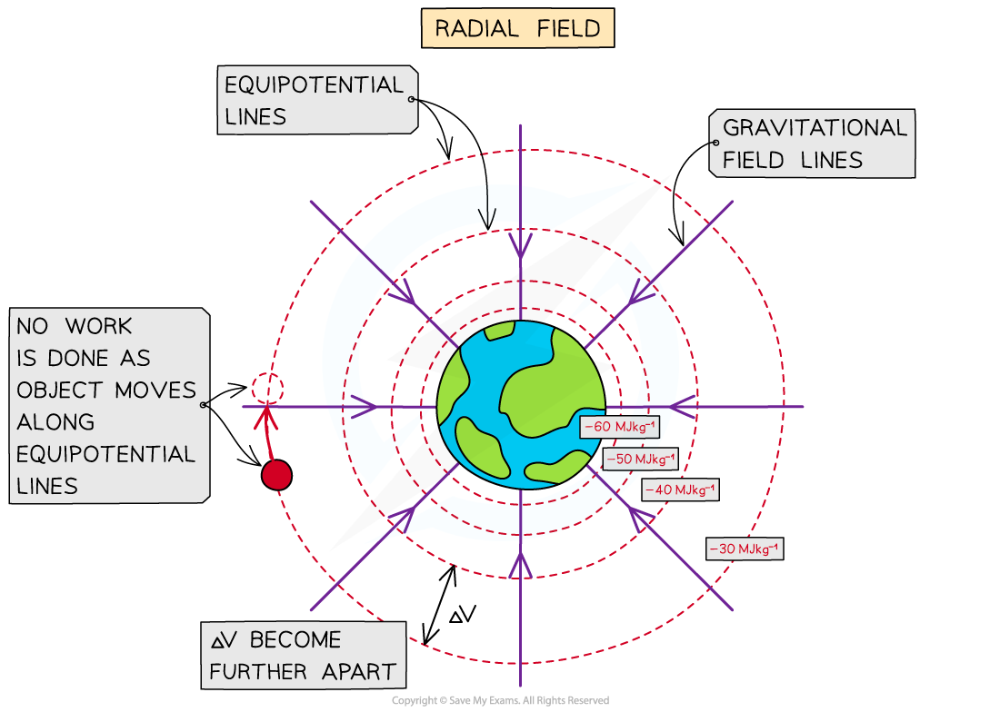{style="width: 360px; height: auto;"}
:::

::: {.fragment .fade-in data-fragment-index=4}
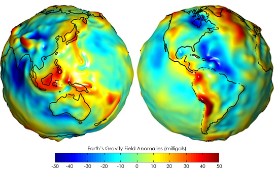{style="width: 360px; height: auto;"}
:::

:::
:::

[^2]: [Janssen, Volker. "Understanding coordinate reference systems, datums and transformations." (2009).](https://figshare.utas.edu.au/articles/journal_contribution/Understanding_coordinate_reference_systems_datums_and_transformations/22873136/1?file=40609577)

## Elevation: Ellipsoid and Geoid {.columns .smaller style="font-size:0.6em"}

::: {.column width="52%"}

__Ellipsoidal height__ ($h$) is measured above the reference ellipsoid.

::: {.fragment .fade-in data-fragment-index=1}
+ GNSS positions are commonly referenced this way
+ It is a geometric height, not a sea-level elevation
:::

::: {.fragment .fade-in data-fragment-index=2}
__Orthometric height__ ($H$) is measured above the geoid.
:::

::: {.fragment .fade-in data-fragment-index=2}
+ This is the elevation usually meant on maps and DEMs
+ The geoid approximates mean sea level
:::

::: {.fragment .fade-in data-fragment-index=3}
The difference between the ellipsoid and geoid is the __geoid height__ or __geoid undulation__ ($N$).
:::

::: {.fragment .fade-in data-fragment-index=3}
+ Geoid height converts ellipsoidal height to elevation
+ Elevation above the geoid: $H = h - N$
:::

::: {.fragment .fade-in data-fragment-index=3}
$$h = H + N \qquad H = h - N$$
:::

:::

::: {.column width="48%"}

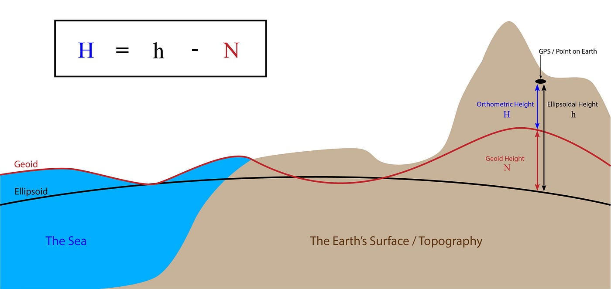{style="width: 400px; height: auto;"}

:::

## Datums {.columns .smaller style="font-size:0.6em"}

A __datum__ defines the reference frame that makes coordinates line up with the real Earth.

::: {.column width="50%"}
::: {.r-stack style="position: relative; width: 100%; height: 330px;"}

::: {.fragment .absolute .fade-out data-fragment-index=1 style="top: 0; left: 0; width: 100%; max-width: 100%; box-sizing: border-box; overflow-wrap: break-word; text-align: left;"}
__Horizontal datums__

+ Anchor an ellipsoid to the Earth for latitude/longitude or projected coordinates
+ Define the origin, orientation, scale, and realization of the horizontal reference frame
+ Used for _where_ something is on the Earth's surface
+ A local horizontal datum aligns an ellipsoid to best fit the geoid over a particular region.
+ Examples: NAD27, NAD83, WGS84
:::

::: {.fragment .absolute .fade-in data-fragment-index=1 style="top: 0; left: 0; width: 100%; max-width: 100%; box-sizing: border-box; overflow-wrap: break-word; text-align: left;"}
__Vertical datums__

+ Define the zero-height surface for elevations or depths
+ Often tied to mean sea level through a geoid model, leveling network, or tidal observations
+ Used for _how high_ or _how deep_ something is
+ Examples: NAVD88 (original leveling based), EGM96/EGM2008 (geoid based), local tidal datums
:::

:::
:::

::: {.column width="50%"}
::: {.r-stack style="position: relative; width: 100%; height: 330px;"}

::: {.fragment .absolute .fade-out data-fragment-index=1 style="top: 0; left: 0; width: 100%; max-width: 100%; box-sizing: border-box;"}
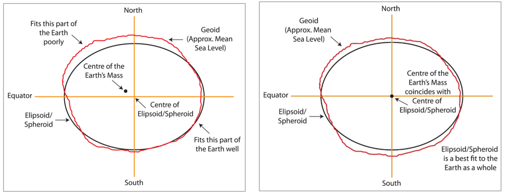
:::

::: {.fragment .absolute .fade-in data-fragment-index=1 style="top: 0; left: 0; width: 100%; max-width: 100%; box-sizing: border-box;"}
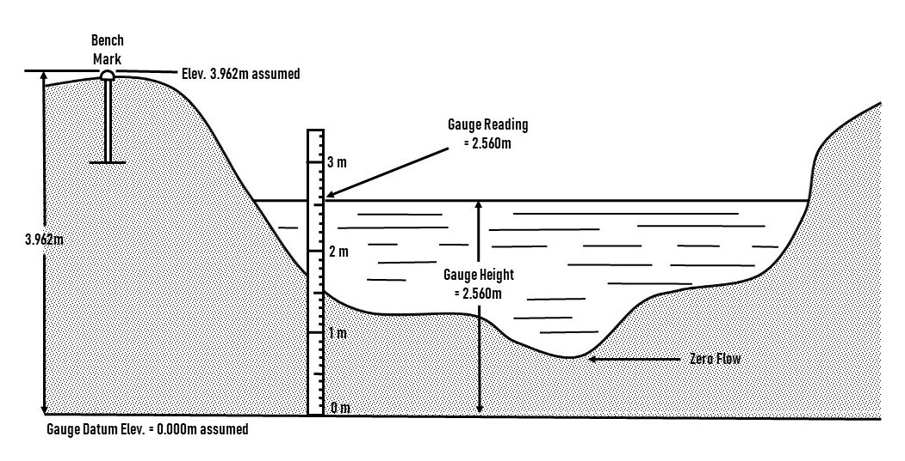
:::

:::
:::

## Horizontal Datum Types

::: {.fragment .absolute .fade-out data-fragment-index="1"}
+ A _horizontal datum_ anchors a spheroid/ellipsoid with an origin and orientation for a particular use.

::: {.attribution style="font-size:0.4em"}
Image Source: [Manny Gimond](http://mgimond.github.io/)
:::
:::

::: {.fragment .absolute .fade-in-then-out data-fragment-index="1"}
+ A local datum matches a geoid to an ellipsoid to fit a local context, e.g.
  + NAD27 (North American Datum of 1927) is widely used in the U.S., especially in older maps.
  + ED50 (European Datum of 1950) is common in Western Europe.

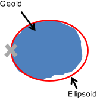

::: {.attribution style="font-size:0.4em"}
Image Source: [Manny Gimond](http://mgimond.github.io/)
:::
:::

::: {.fragment .absolute .fade-in-then-out data-fragment-index="2"}
+ A geocentric datum places the ellipsoid's center at Earth's center of mass, supporting global positioning

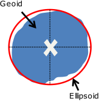

::: {.attribution style="font-size:0.4em"}
Image Source: [Manny Gimond](http://mgimond.github.io/)
:::
:::

::: {.fragment .absolute .fade-in data-fragment-index="3"}

::: {style="font-size:0.6em"}
+ Common datums used in North America

| Datum | Type | Typical use in North America |
|---|---|---|
| NAD27 | Local | Legacy U.S., Mexico, and Central America maps |
| NAD83 | Regional geocentric* | Standard for most modern U.S. and Canadian mapping |
| NAD83 (2011) | Regional geocentric | High-accuracy modern U.S. realization of NAD83 |
| WGS84 | Global geocentric | GPS and global web mapping |

[* NAD83 is Earth-centered in concept, but regionally realized and not identical to a fully global geocentric frame.]{style="font-size:0.5em"}
:::
:::

## Projections {.columns}

::: {.column width="50%"}

+ Mathematical transform for transforming 3D Earth to 2D map
+ i.e. project the latitude and longitude to x any coordinates on a plane
+ There are infinite ways to do this, they all cause distortion

:::

::: {.column width="50%"}
{style="max-height: 60vh; width: auto; object-fit: contain;"}
:::

## Projections {.columns}

::: {.column width="50%" .smaller}
::: {r-stack}
::: {.fragment .absolute style="width: 50%" .fade-in-then-out data-fragment-index=1}
Imagine a lightbulb inside of the earth, shining out and projecting the shadows of the continents onto a __developable surface__ (flattenable surface).

[(This is called a gnomonic projection. There are [stereographic](https://en.wikipedia.org/wiki/Stereographic_map_projection) and [orthographic](https://en.wikipedia.org/wiki/Orthographic_projection) projections too, but that is too much for this class.)]{style="font-size:0.5em"}
:::

::: {.fragment .absolute style="width: 50%" .fade-in-then-out data-fragment-index=2}
There are three commonly used developable surfaces 

+ plane
+ cone
+ cylinder
:::

::: {.fragment .absolute style="width: 50%" .fade-in-then-out data-fragment-index=3}
+ The developable surface can be oriented in many ways.   
+ Each developable surface can be in one of two __cases__ _tangent_ and _secant_
:::

::: {.fragment .absolute style="width: 50%; font-size:0.8em" .fade-in-then-out data-fragment-index=4}
+ The __aspect__ of the projection is the orientation of the developable surface relative to the axis of the earth
:::

::: {.fragment .absolute style="width: 50%" .fade-in-then-out data-fragment-index=5}
Tissot's indicatrix

    Shows linear, angular, and areal distortions of maps
:::

::: {.fragment .absolute style="width: 50%" .fade-in-then-out data-fragment-index=6}
Equidistant projections

::: {style="font-size:0.7em"}
+ Maintains distance between points in one direction (usually north-south)
+ Angles and shapes are not preserved
+ Good for small-scale maps that cover large areas
+ Often used  for global thematic maps
:::
:::

::: {.fragment .absolute style="width: 50%; font-size:0.8em" .fade-in-then-out data-fragment-index=7}
Conformal map projections

::: {style="font-size:0.7em"}
+ Preserve angles (also known as bearings) between locations
+ Used for navigational purposes
+ Areas tend to be quite distorted
+ Shapes are more or less preserved over small areas, at small scales areas become wildly distorted
+ e.g. Mercator projection (with normal aspect) is famous for distorting Greenland
:::
:::

::: {.fragment .absolute style="width: 50%; font-size:0.8em" .fade-in-then-out data-fragment-index=8}
Equal area or equivalent projections

::: {style="font-size:0.7em"}
+ Preserve area
+ Distort angles
:::

:::

::: {.fragment .absolute style="width: 50%; font-size:0.8em" .fade-in-then-out data-fragment-index=9}
Weird projections

::: {style="font-size:0.7em"}
+ Often made as compromises between types of distortion
+ Like the Waterman Butterfly
:::

:::

::: {.fragment .absolute style="width: 50%; font-size:0.8em" .fade-in-then-out data-fragment-index=10}
[Examine the size distortions on a Mercator Projection](https://www.thetruesize.com)
:::

:::
:::

::: {.column width="50%"}
:::{r-stack}
::: {.fragment .fade-in-then-out .absolute data-fragment-index=1}
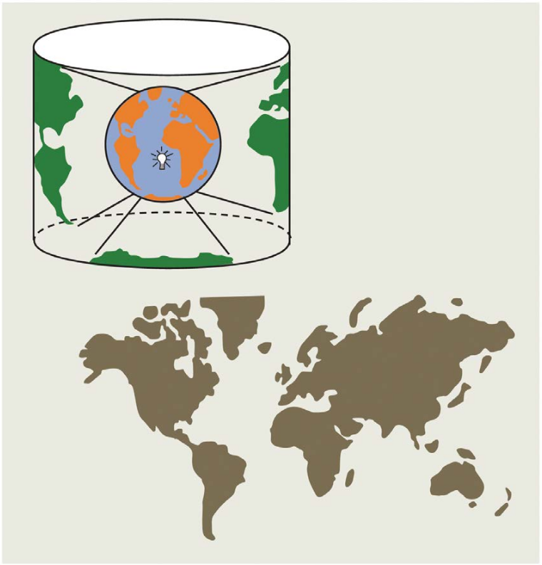{style="max-height: 80vh; width: auto; object-fit: contain;"}
:::

::: {.fragment .fade-in-then-out .absolute data-fragment-index=2}
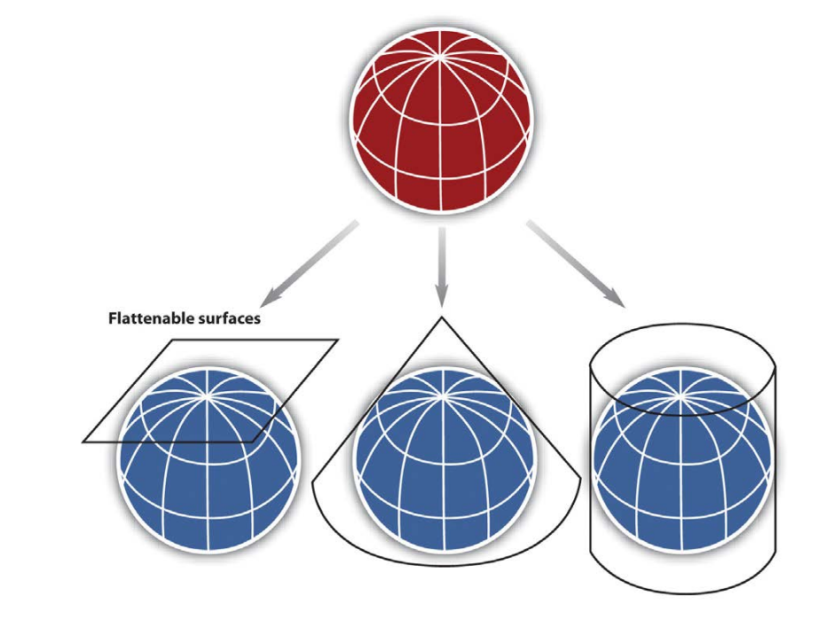{style="max-height: 80vh; width: auto; object-fit: contain;"}
:::

::: {.fragment .fade-in-then-out .absolute data-fragment-index=3}
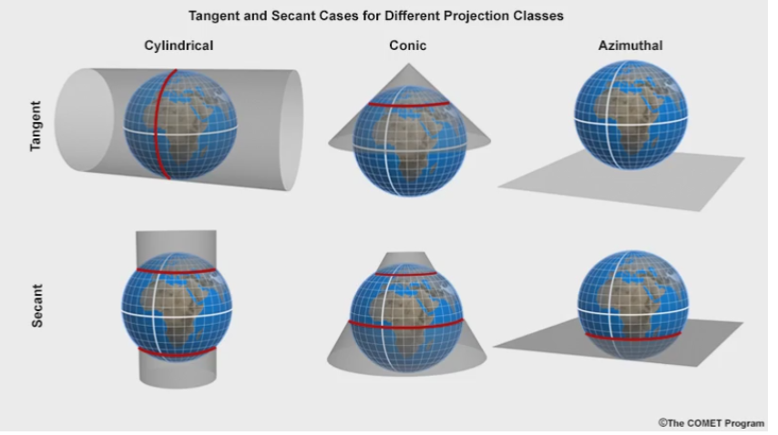{style="max-height: 80vh; width: auto; object-fit: contain;"}
:::

::: {.fragment .fade-in-then-out .absolute data-fragment-index=4}
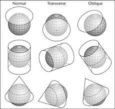{style="max-height: 80vh; width: auto; object-fit: contain;"}
:::

::: {.fragment .fade-in-then-out .absolute data-fragment-index=5}
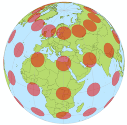{style="max-height: 80vh; width: auto; object-fit: contain;"}
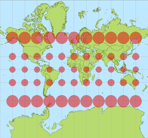{style="max-height: 80vh; width: auto; object-fit: contain;"}
[Left: circles of equal area on globe. Right: same circles on Mercator projection.]{style="font-size:0.3em"}
:::

::: {.fragment .fade-in-then-out .absolute data-fragment-index=6 style="display: flex; flex-direction: column; align-items: center; justify-content: flex-start; gap: 10px; width: 50%; height: 75%; top: 10%;"}
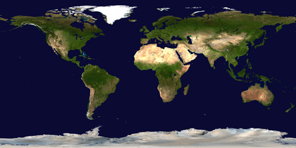{style="max-height: 40vh; width: auto; object-fit: contain;"}
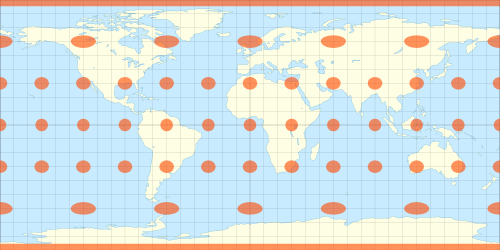{style="max-height: 40vh; width: auto; object-fit: contain;"}
[Top: True-color satellite image of Earth in equirectangular projection.  
Bottom: Equirectangular projection with Tissot's indicatrix.]{style="font-size:0.3em"}
:::

::: {.fragment .fade-in-then-out .absolute data-fragment-index=7}
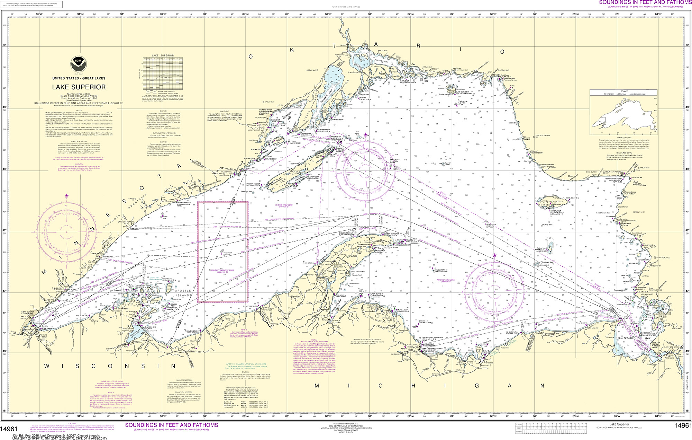{style="max-height: 25vh; width: auto; object-fit: contain;"}
{style="max-height: 30vh; width: auto; object-fit: contain;"}  
[Top: Nautical Chart of Lake Superior in Mercator projection. Bottom: Mercator projection.]{style="font-size:0.3em"}
:::

::: {.fragment .absolute style="width: 50%; font-size:0.8em" .fade-in-then-out data-fragment-index=8}
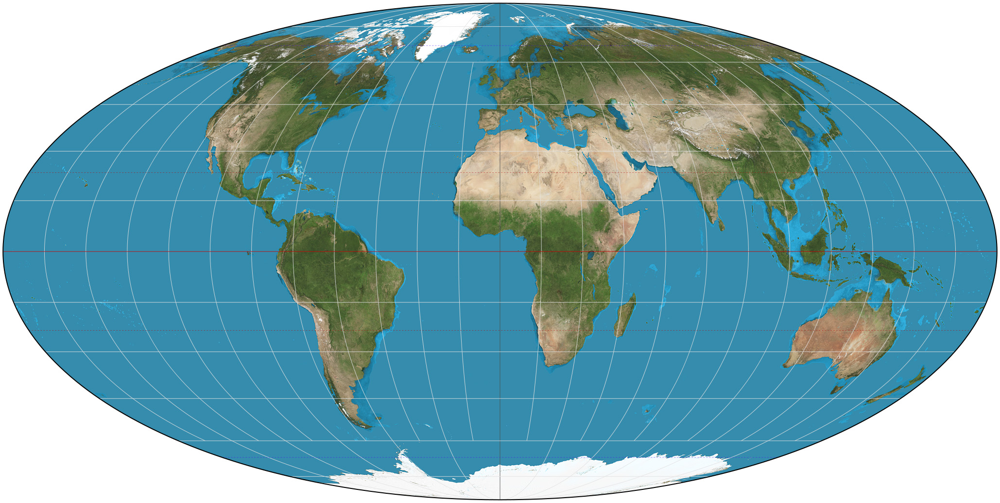
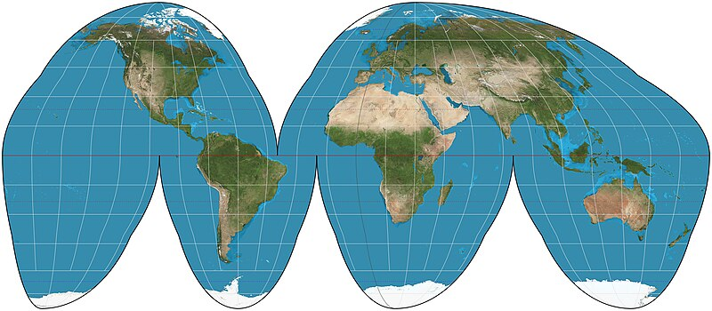
:::

::: {.fragment .fade-in-then-out .absolute data-fragment-index=9 style="display: grid; grid-template-columns: 1fr 1fr; grid-template-rows: 1fr 1fr; gap: 10px; margin-top: 20px;"}
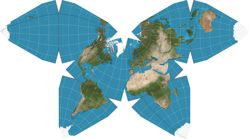{style="width: 175%; height: auto; object-fit: contain;"}
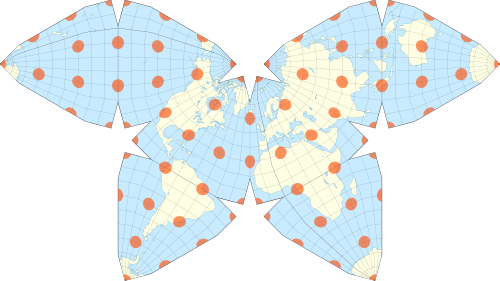{style="width: 175%; height: auto; object-fit: contain;"}

:::

:::
:::

##  
Real-time Waterman Wind Map

::: {style="width: 100%; height: 90vh;"}
<iframe src="https://earth.nullschool.net/#current/wind/surface/level/waterman" 
        style="width: 80%; height: 80%; border: none;" 
        title="Real-time Wind Map">
</iframe>  

:::

## Grids {.smaller}

+ A __grid__ is a regular coordinate system laid over a projected map
+ Locations are measured as $x,y$ distances, usually in meters or feet
+ GIS often calls these coordinates __easting__ and __northing__
+ Grid coordinates are not latitude/longitude; they are coordinates on the flat map

## Coordinate Reference Systems {.smaller}

+ A __CRS__ is the complete definition that makes coordinates meaningful
+ A geographic CRS uses a datum/reference frame, ellipsoid, axes, and angular units
+ A projected CRS adds a map projection and planar grid to a geographic CRS
+ A vertical CRS defines heights or depths; a compound CRS combines horizontal and vertical CRSs
+ 3D geographic CRS: lon/lat plus ellipsoidal height; compound CRS: horizontal CRS plus separate vertical CRS

## Ways to define a CRS {.smaller}

+ EPSG code
  + Short numeric identifier from a standard registry
  + Example: `EPSG:4326`
+ Well known text (WKT)
  + Verbose text definition of the full CRS
  + Good for storing exact CRS metadata
+ proj
  + Compact parameter string used by PROJ/GDAL tools
  + Example: `+proj=utm +zone=10 +datum=NAD83 +units=m`

## UTM {.columns style="font-size:0.7em"}

::: {.column width="50%"}

Universal Transverse Mercator (UTM)

+ a projection and accompanying projected coordinate system
+ Divided into 60 narrow zones
+ Does not cover polar regions*
+ Large north-south extent with low distortion

[*Polar Stereographic is for used for conformal polar]{style="font-size:0.5em"} 
:::

::: {.column width="50%"}
::: {.r-stack}

::: {.fragment .absolute .fade-in-then-out data-fragment-index="1"}
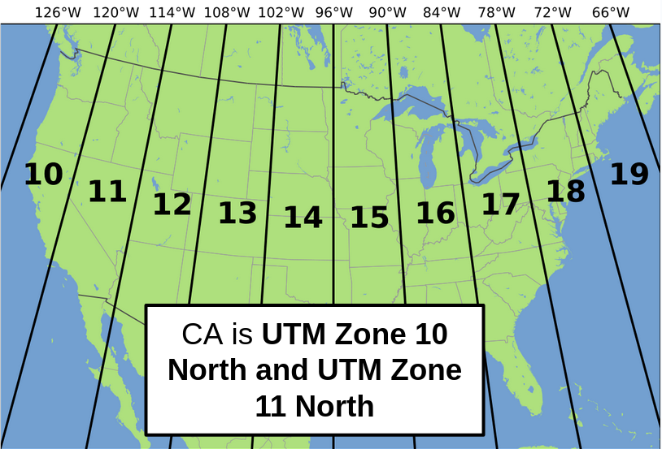
:::

::: {.fragment .absolute .fade-in-then-out data-fragment-index="2"}
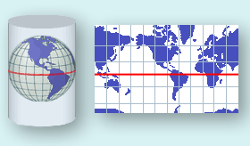

::: {.attribution style="font-size:0.4em"}
Image Source: [wikimedia](https://commons.wikimedia.org/wiki/File:National_Atlas_Mercator.gif)
:::
:::

::: {.fragment .absolute .fade-in-then-out data-fragment-index="3"}

:::

::: {.fragment .absolute .fade-in-then-out data-fragment-index="4"}
1. Open QGIS
2. Use QuickMapServices to add a global Satellite coverage layer.
3. In the drop down menus, go to _Project --> Preferences_ then select the CRS tab on the left 
4. In the filter box type "26910"
5. Under __Predefined Coordinate Reference Systems__ select __NAD83 / UTM zone 10N__
6. Click __Apply__ and __OK__
:::

:::
  
:::

## State Plan System {.columns style="font-size:0.7em"}

Each State Plane Coordinate System zone uses a map projection based on its geographic orientation.  
e.g.

::: {.column width="50%"}
::: {.r-stack}

::: {.fragment .absolute .fade-in-then-out data-fragment-index="1"}
+ Transverse Mercator Projection
:::

::: {.fragment .absolute .fade-in-then-out data-fragment-index="2"}
+ Lambert Conformal Conic Projection
:::

::: {.fragment .absolute .fade-in-then-out data-fragment-index="3"}
+ Hotine Oblique Mercator Projection
:::

:::
:::

::: {.column width="50%"}
::: {.r-stack}

::: {.fragment .absolute .fade-in-then-out data-fragment-index="1"}
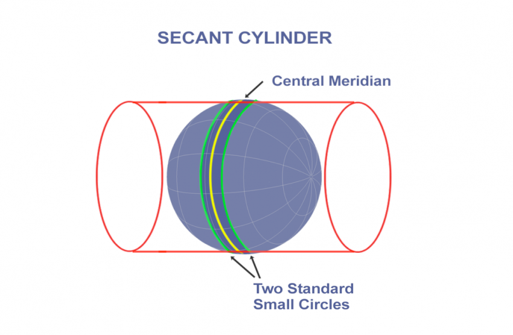
:::

::: {.fragment .absolute .fade-in-then-out data-fragment-index="2"}
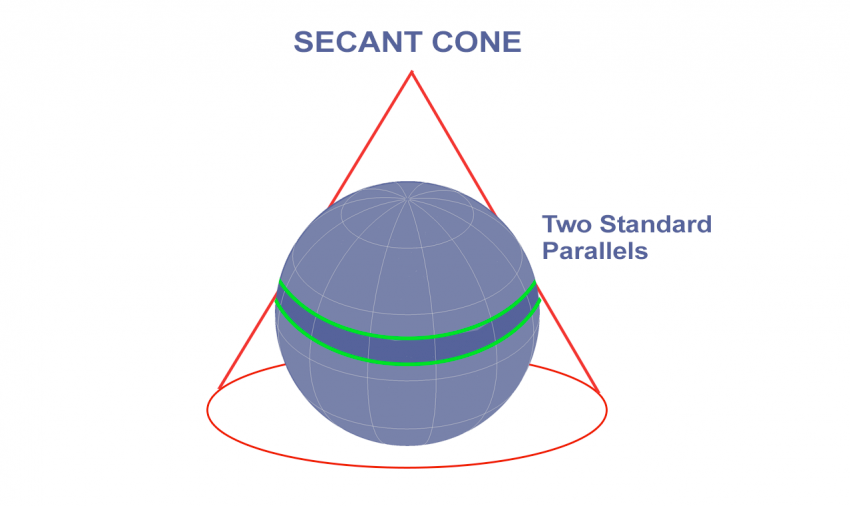
:::

::: {.fragment .absolute .fade-in-then-out data-fragment-index="3"}
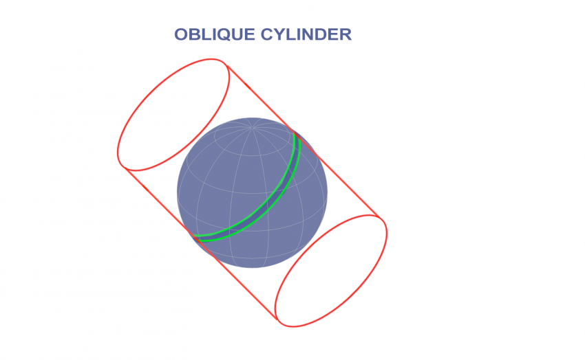
:::

::: {.fragment .absolute .fade-in-then-out data-fragment-index="4"}
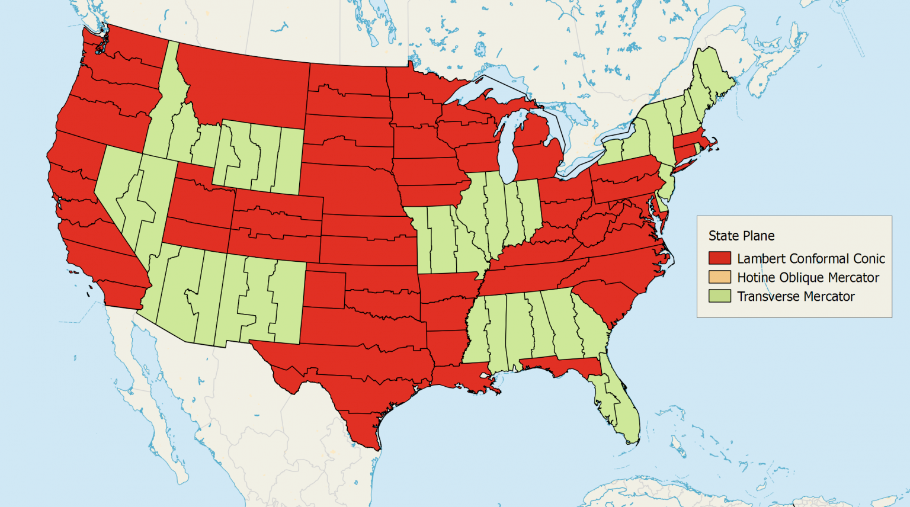
:::

::: {.fragment .absolute .fade-in-then-out data-fragment-index="5"}
+ Reproject the global satellite image from the last slide to EPSG:2227 (California zone 3)
+ Scroll to zoom in on South Africa.  What do you notice?
:::

:::
  
:::

## Maps displayed in GCS {style="font-size:0.5em"}

+ When a map is shown in a CGS, the GCS coordinate system is projected along with the features on to the map.  There is an implicit map projection being used to position both the latitude-longitude grid and the geographic features on the flat map.
+ When software simply plots lon on x and lat on y, it behaves like a plate carree/equirectangular display which maps longitude to and latitude to, creating a simple 2:1 ratio cylindrical grid where meridians and parallels are evenly spaced, straight lines.

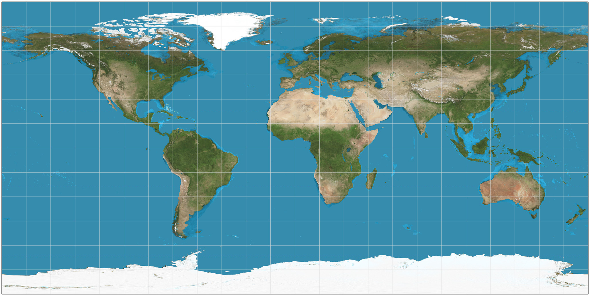
