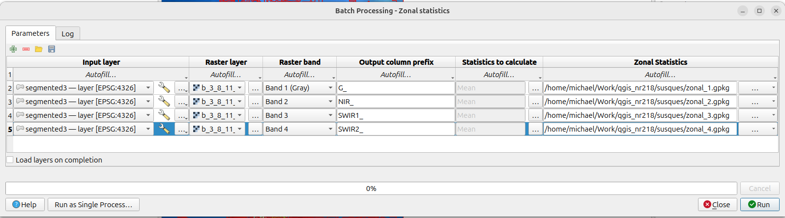

## Map

### Band reduction
Keep only useful bands
    + use GDAL Translate (Convert format) and pass band flags in the extra parameters box, `-b 3 -b 8 -b 11 -b 12`.

### Segmentation

Use the OTB `Segmentation` tool with `filter = meanshift` and `mode = vector`. This groups neighboring pixels into image objects based on both spectral similarity and spatial proximity, then writes the results out as polygons. For the Susques brine pond example, using the reduced 4-band image (`B3`, `B8`, `B11`, `B12`) makes the tool much faster and focuses the segmentation on bands that are useful for separating wetter pond surfaces from the dry surrounding desert.

Before choosing parameters, check the band values in QGIS with the Identify tool or layer statistics. This matters a lot. If your raster values are scaled from `0` to `1`, then a `range radius` like `15` or even `0.3` is enormous and can cause the whole image to collapse into one polygon. If values are `0-1`, you generally need much smaller spectral thresholds.

The settings below worked well for this image:

+ `spatial radius = 1`
    + This tells mean shift to look only in a very small pixel neighborhood. A small spatial radius helps preserve narrow pond edges and prevents over-smoothing.
+ `range radius = 0.02`
    + This controls how different pixel values can be and still be grouped together. Because the band values are `0-1`, `0.02` is a small, conservative threshold that allows similar pixels to merge without collapsing the entire scene into one object.
+ `mode convergence threshold = 0.01`
    + This controls when the iterative mean shift search stops. A small value gives a stable result without being excessively strict.
+ `maximum number of iterations = 100`
    + This gives the algorithm enough chances to converge, while still being a reasonable cap.
+ `minimum region size = 10`
    + Very tiny regions are usually noise. This removes or merges the smallest segmented patches while keeping real pond objects.
+ `minimum object size = 1`
    + This is used during vector output. Setting it very low avoids accidentally throwing away small but meaningful polygons during vectorization.
+ `stitch polygons = False`
    + This keeps the run simpler while testing and avoids extra processing at tile boundaries.
+ `simplify polygons = 0`
    + This preserves the full polygon shape so you can inspect the raw segmentation result before applying any geometry simplification.

If the result is one large polygon covering the whole extent, first check whether you are writing to a new output file, and then check the pixel value scale. In this workflow, the key idea is that the `range radius` must match the numeric scale of the raster values.

### Zonal Stats

Use QGIS `Processing Toolbox -> Raster analysis -> Zonal statistics` in **batch mode** to calculate one summary field per band for the segmented polygons. The goal here is to write the mean value from each raster band into the polygon layer so every segment carries its own band-level attributes.

Set the polygon input to the segmentation layer (`segmented3.gpkg|layername=layer`) for every batch row, and use the reduced 4-band raster (`b_3_8_11_12.tif`) as the raster input each time. Then create one row per band:

+ band `1` with prefix `G_`
+ band `2` with prefix `NIR_`
+ band `3` with prefix `SWIR1_`
+ band `4` with prefix `SWIR2_`

For the statistic, select **Mean** so QGIS appends fields such as `G_mean`, `NIR_mean`, `SWIR1_mean`, and `SWIR2_mean` to the polygon layer. In this batch workflow, do **not** leave the output as scratch or temporary output. Instead, specify an explicit output file name for each row, because QGIS needs a real file to carry the updated attributes forward from one band to the next.

A simple pattern is:

+ row 1 output: `segmented3_G.gpkg`
+ row 2 output: `segmented3_G_NIR.gpkg`
+ row 3 output: `segmented3_G_NIR_SWIR1.gpkg`
+ row 4 output: `segmented3_G_NIR_SWIR1_SWIR2.gpkg`

That way each step writes a new polygon layer with the previous statistics already saved, and the last file contains all four mean fields together. The screenshot below shows the batch table layout for this exact setup.

### K means clustering

### K means pixel based classification

### Supervised Classification

Supervised classification means that we give the computer examples of each class, then ask it to classify every pixel in the image based on those examples. In this workflow, each pixel is classified using its band values from the reduced raster stack (`B3`, `B8`, `B11`, `B12`). This is different from segmentation: segmentation groups neighboring pixels into objects, while pixel-based classification assigns a class label to each individual pixel.

First, make a training polygon layer. Digitize small polygons over clear examples of each class you want to map, such as brine pond, dry salt, bare ground, shadow, or vegetation. Add an integer field named something like `class_id`, and use one number for each class:

+ `1 = brine pond`
+ `2 = dry salt`
+ `3 = bare ground`
+ `4 = shadow`

Try to collect training polygons from different parts of the image, not just one easy area. The classifier learns from the pixel values inside these polygons, so bad or unrepresentative training data will usually produce a bad classification.

In QGIS, use the OTB tools in this order:

+ `Processing Toolbox -> OTB -> Learning -> ComputeImagesStatistics`
    + Input image: the reduced 4-band raster.
    + Output: an XML statistics file, for example `susques_stats.xml`.
+ `Processing Toolbox -> OTB -> Learning -> TrainImagesClassifier`
    + Input image list: the reduced 4-band raster.
    + Input vector data list: the training polygon layer.
    + Class label field: `class_id`.
    + Input XML image statistics file: `susques_stats.xml`.
    + Classifier: `Random forests`.
    + Output model: for example `susques_rf_model.txt`.
    + Output confusion matrix: for example `susques_confusion.csv`.
+ `Processing Toolbox -> OTB -> Learning -> ImageClassifier`
    + Input image: the same reduced 4-band raster.
    + Model file: `susques_rf_model.txt`.
    + Statistics file: `susques_stats.xml`.
    + Output image: for example `susques_classified.tif`.

The output from `ImageClassifier` is a single-band raster where each pixel value is the predicted class number. For example, pixels with value `1` are class `1`, pixels with value `2` are class `2`, and so on.

### ClassificationMapRegularization

Pixel-based classifications often look speckled because each pixel is classified separately. OTB's `ClassificationMapRegularization` tool cleans this up using majority voting: it looks at the class labels around each pixel and replaces the center pixel with the most common nearby class.

Use:

+ `Processing Toolbox -> OTB -> Learning -> ClassificationMapRegularization`
    + Input classification image: the output from `ImageClassifier`, such as `susques_classified.tif`.
    + Output regularized image: for example `susques_classified_regularized.tif`.
    + Structuring element radius: start with `1`.
    + Label for the NoData class: usually `0`, unless you used a different NoData label.
    + Set tie pixels to undecided: usually leave this off at first, so tied pixels keep their original class.
    + Process isolated pixels only: turn this on if you only want to remove tiny isolated pixels instead of smoothing the whole classification.

A radius of `1` is a conservative cleanup. It removes many single-pixel errors without changing large class boundaries too aggressively. A radius of `2` or `3` creates a smoother map, but it can also erase narrow features or small ponds, so compare the result against the original imagery before deciding which version is better.
